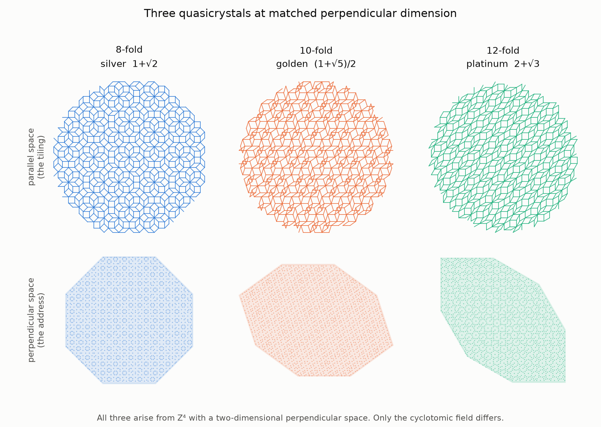
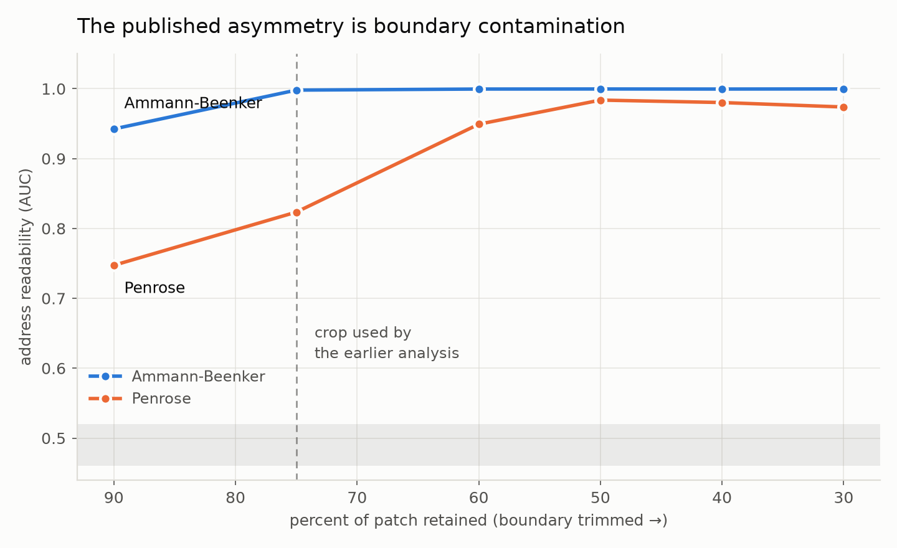
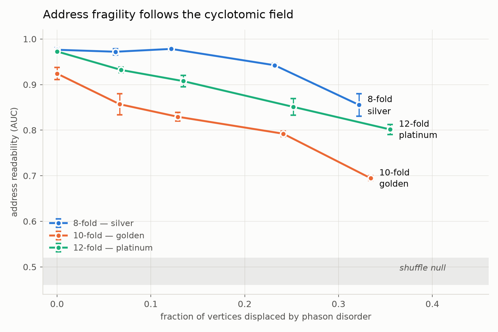

# Address Fragility in Quasicrystals is Determined by the Cyclotomic Field

K. T. Niedzwiecki
Independent Researcher, South Australia
Version 2.0 — August 2026

---

## Abstract

A cut-and-project quasicrystal carries two independent descriptions of the same
vertex set: a relational one, the graph of tile edges, and an addressed one, the
coordinates in the perpendicular space the projection discards. We ask how
robustly the addressed description survives perturbation, and find that the
answer is fixed by arithmetic.

Holding lattice rank, perpendicular dimension, window construction and edge rule
identical, and varying only which cyclotomic field the quasicrystal is built
from, address readability under phason disorder orders **silver > platinum >
golden**: at 10% of vertices displaced, 0.976 for the 8-fold substrate against
0.920 for the 12-fold and 0.842 for the 10-fold, with shuffle nulls at chance.
The ordering holds at every damage level tested. The direction of this result was
predicted and recorded before the measurement was made.

Three quasicrystal families exist at perpendicular dimension 2 — φ(N) = 4 has
solutions N = 5, 8, 10, 12, and N = 5 and N = 10 generate the same field — so
this is a complete enumeration rather than a sample.

We also report a correction. A previous paper by this author [1] attributed a
large asymmetry between Ammann-Beenker and Penrose to the presence or absence of
an address channel. That conclusion does not survive its own controls: the effect
was produced by a linear classifier reading a nonlinear boundary, by unmatched
positive rates, and dominantly by boundary contamination penetrating the two
substrates to different depths. In clean bulk both substrates address their sites
almost perfectly (0.9996 and 0.9816). The real distinction is fragility, and this
paper identifies what governs it.

---

## 1. Introduction

An aperiodic tiling produced by cut-and-project is a shadow. A periodic lattice
in n dimensions is cut by a two-dimensional plane at an irrational angle, and the
lattice points falling inside an acceptance window are projected onto it. The
result has no translational symmetry but retains long-range order, and every
vertex carries a second coordinate: its position in the perpendicular space that
the projection threw away.

This gives such a substrate two descriptions of the same sites. The **relational**
description is the graph of tile edges. The **addressed** description is the
perpendicular coordinate. Neither is derivable from the other by a local rule, so
their relative robustness under perturbation is a well-posed question, and a
perturbation that destroys one need not touch the other.

This paper reports that the robustness of the addressed description is governed
by the quasicrystal's underlying cyclotomic field, demonstrated across the
complete family of such substrates at perpendicular dimension 2. Section 4
corrects an earlier analysis by this author; Sections 5–7 give the positive
result. The correction is reported in full, with the mechanism of each error,
because the errors are general to substrate comparison rather than specific to
quasicrystals.

---

## 2. Background

### 2.1 Cut-and-project and the cyclotomic family

An N-fold symmetric quasicrystal's natural module has rank φ(N), Euler's
totient. Since φ(8) = φ(10) = φ(12) = 4, the 8-, 10- and 12-fold quasicrystals
all live in **Z⁴ with a two-dimensional perpendicular space**. Parallel space
uses the basis ζᵏ for ζ = exp(2πi/N), k = 0..3; perpendicular space uses the
Galois conjugate ζ ↦ ζᵍ. The acceptance window is the projection of the unit
4-cube, and an edge joins vertices whose integer lifts differ by one unit along a
single axis.

The three fields carry the three quadratic irrationals:

| N | field | ratio |
|---|---|---|
| 8 | Q(√2) | silver, 1 + √2 |
| 10 | Q(√5) | golden, (1+√5)/2 |
| 12 | Q(√3) | platinum, 2 + √3 |

φ(N) = 4 has exactly the solutions N = 5, 8, 10, 12, and N = 5 and N = 10
generate the same field. **These three are therefore the complete set** of
quasicrystal families at perpendicular dimension 2.

**Figure 1.** The three substrates. Top row: a patch of each tiling in parallel
space. Bottom row: the acceptance window in perpendicular space, with accepted
vertices' addresses shown, all on a common scale. Every construction parameter is
shared — lattice Z⁴, rank 4, perpendicular dimension 2, window as the projected
unit 4-cube, and the same edge rule. Only the cyclotomic field differs.

Note that the conventional Penrose construction uses Z⁵ rather than Z⁴, carrying
a redundant fifth direction. Section 6.3 measures that direction and finds it
inert, consistent with the rank-4 account.

### 2.2 Phason degrees of freedom

Quasicrystals admit a deformation with no periodic analogue. A **phason**
rearrangement shifts perpendicular coordinates while leaving the tiling locally
valid. Two cases must be distinguished:

- A **uniform shift** of the window is a rigid phason translation, mapping the
  tiling to a locally isomorphic one. It is a symmetry of the construction, not a
  perturbation. Section 6.1 confirms it leaves address readability entirely
  intact even when 60% of edges have changed.
- **Phason disorder** — independent perturbation of each candidate's
  perpendicular coordinate before the acceptance test — scatters flips through
  the patch and generates genuine defects. This is the perturbation used
  throughout.

Note that window *size* is not available as a perturbation. The edge rule
requires both endpoints of a lattice step to be accepted, so shrinking the window
deletes edges wholesale: mean degree falls from 3.95 to 2.39 at window scale 0.70,
with half of all vertices below degree 3. Window size is pinned by the tiling
requirement.

---

## 3. Methods

### 3.1 Substrates

All substrates are generated from scratch by cut-and-project. The Ammann-Beenker
generator reproduces the original substrate of [1] exactly: rebuilding the edge
list from that file's K0–K3 lift coordinates using the same adjacency rule returns
44,126 edges and matches its own degree column on all 22,663 vertices with zero
mismatches. An independent Z⁵ Penrose generator produces single-edge-length
tilings with coordination numbers 3–7 and mean degree 3.92 against the original's
3.81. Both reproduce the published figures of [1] to within 0.005 (Section 4.1).

The cyclotomic family is verified before use: at extent 16 all three substrates
give mean degree 3.94, a single edge length, and fewer than 2.2% of vertices
below degree 3.

### 3.2 Privileged sites at matched positive rate

Privilege is scored from three graph retention measures — a radius-2 graph ball,
a Euclidean ball at three median edge lengths, and the closed neighbourhood —
combined as a rank-averaged composite and thresholded at a fixed fraction, so all
substrates carry identical positive rates by construction.

This replaces the three-way top-quartile intersection of [1], which fixed the
per-criterion threshold and left the positive rate free: 4.4% on Ammann-Beenker
against under 1% on Penrose, so any comparison built on it differed in positive
rate as well as in substrate.

### 3.3 Evaluation and nulls

Address readability is the cross-validated AUC of a gradient-boosted classifier
predicting the privilege label from perpendicular coordinates alone. A **shuffle
null** — perpendicular coordinates permuted across vertices, preserving the value
distribution and destroying only the correspondence — accompanies every
measurement in this paper. No figure is quoted without one.

Because a fixed nominal disorder amplitude does not inflict equal damage on
different substrates, all cross-substrate comparisons are reported against
**measured damage**, the flipped-vertex fraction.

---

## 4. Correction to the earlier analysis

### 4.1 Reproduction

At the earlier analysis's own interior-75% crop and intersection labels:

| quantity | published [1] | reproduced |
|---|---|---|
| AB identity / address | 0.9790 | 0.9792 |
| AB identity / weave | 0.9914 | 0.9910 |
| Penrose identity / address | 0.661 | 0.6535 |
| Penrose identity / weave | 0.830 | 0.8322 |
| Penrose identity / hybrid | 0.855 | 0.8534 |

### 4.2 The weave figures are the preserved degree sequence

The earlier analysis perturbed by degree-preserving edge rewiring, which drives
edge Jaccard to 0.0001 while leaving every vertex degree intact. Its "weave"
features are local degree summaries, and its label is degree-driven: on a
locally tree-like rewired graph the closed-neighbourhood retention score reduces
to 2/(1 + mean neighbour degree), a monotone function of a feature supplied to
the classifier (AUC 0.9991 on AB, 0.9993 on Penrose).

Identity weave therefore scores 0.9910 on AB with the degree family present,
0.9910 with the degree family alone, and 0.5002 with it removed; on Penrose,
0.8322, 0.8349 and 0.4964. Those figures measure the one property the
perturbation was designed not to destroy.

The fresh-reconstruction result of [1] fails a stronger test: it reproduces at
0.8977 on a degree-matched configuration model with no tiling ancestry, against
0.8886 on the rewired tiling, and falls to 0.4967 under degree-family ablation.
It carries no substrate information and is withdrawn.

### 4.3 The address gap is boundary contamination

Sweeping the interior crop at matched positive rates:

| interior retained | AB | Penrose | gap |
|---|---|---|---|
| 90% | 0.9424 | 0.7473 | +0.195 |
| 75% | 0.9980 | 0.8234 | +0.175 |
| 60% | 0.9995 | 0.9492 | +0.050 |
| 50% | 0.9996 | 0.9837 | **+0.016** |
| 30% | 0.9997 | 0.9738 | +0.026 |

**Figure 3.** Address readability against how much of the patch is retained, at
matched positive rates. The dashed rule marks interior-75%, the crop used by the
earlier analysis. Shaded band: shuffle null. Ammann-Beenker is already saturated
there; Penrose is not, and the apparent asymmetry closes as the boundary is
trimmed further.

Ammann-Beenker is saturated from 75% inward; Penrose requires trimming to ~50%.
The earlier analysis ran at interior-75%, inside one substrate's saturated regime
and outside the other's, so it measured how far boundary contamination penetrates
each substrate rather than whether each has an address channel.

### 4.4 Cumulative effect

| analysis | AB | Penrose | gap |
|---|---|---|---|
| as published (linear, intersection label, 75%) | 0.986 | 0.661 | +0.325 |
| nonlinear model | 0.992 | 0.786 | +0.206 |
| matched positive rate | 0.998 | 0.823 | +0.175 |
| bulk crop | 0.9996 | 0.9837 | **+0.016** |

The claim that Penrose lacks a perpendicular-space address channel is withdrawn.

---

## 5. Fragility under phason disorder

At bulk crop and matched positive rate, Ammann-Beenker and Penrose are nearly
equivalent when pristine and separate immediately under disorder (~16,800 and
~17,500 vertices, 4 seeds):

| disorder | AB | Penrose | gap |
|---|---|---|---|
| 0.00 | 0.9996 ± 0.0001 | 0.9816 ± 0.0021 | +0.018 |
| 0.05 | 0.9929 ± 0.0010 | 0.8525 ± 0.0073 | +0.140 |
| 0.10 | 0.9818 ± 0.0028 | 0.7810 ± 0.0140 | +0.201 |
| 0.20 | 0.9511 ± 0.0092 | 0.7406 ± 0.0282 | +0.211 |
| 0.40 | 0.8436 ± 0.0051 | 0.6286 ± 0.0131 | +0.215 |

At the first disorder step Ammann-Beenker loses 0.0067 and Penrose loses 0.1291 —
a factor of nineteen. Shuffle nulls run 0.484–0.517 throughout.

The distinction between these substrates is therefore one of resilience, not of
possession. Section 6 identifies what determines it.

---

## 6. The cyclotomic result

### 6.1 A uniform window shift is a symmetry

Sweeping the window offset on Ammann-Beenker leaves readability unchanged —
0.9955 at zero shift, 0.9960 at the largest — while edge Jaccard against the
reference patch falls to 0.398. The address channel re-registers rather than
degrading, confirming that the degradation reported here is a property of
disorder rather than of perpendicular motion as such.

### 6.2 Fragility follows the field

All three substrates at matched perpendicular dimension, lattice rank, window
construction and edge rule. Address AUC at matched measured damage,
interior-50%, matched 5% positive rate, 3 seeds. Shuffle nulls 0.46–0.52 across
all fifteen cells.

| vertices displaced | 8-fold (silver) | 10-fold (golden) | 12-fold (platinum) |
|---|---|---|---|
| 10% | **0.9759** | **0.8421** | 0.9203 |
| 20% | 0.9528 | 0.8057 | 0.8760 |
| 30% | 0.8765 | 0.7304 | 0.8279 |

**Figure 2.** Address readability against measured damage for the complete
rank-4 cyclotomic family. Error bars are standard deviations over 3 disorder
seeds; the shaded band is the shuffle null. The ordering is strict at every
damage level.

**Silver > platinum > golden, at every damage level.**

The direction of this result was predicted and committed to version control
before the measurement completed: that the 10-fold substrate, sharing Penrose's
field, would be fragile, and the 8-fold, sharing Ammann-Beenker's, robust. The
12-fold substrate carried no prediction.

The 10-fold substrate here shares nothing with Penrose but its cyclotomic field —
different lattice (Z⁴ against Z⁵), different window (a zonotope against four
pentagons), different perpendicular dimension, different edge structure. That
golden-ratio arithmetic reproduces Penrose's fragility in an otherwise unrelated
construction eliminates window topology, lattice dimension and construction as
causes.

### 6.3 Penrose's redundant dimension is inert

Penrose's conventional Z⁵ construction indexes four pentagonal windows by lift
sum, suggesting its address might carry a discrete component alongside a
continuous one. It does not. The lift-sum index scores AUC 0.5398 at zero
disorder and 0.5696 at disorder 0.20 — barely above chance, and neither carrying
the signal nor collapsing. Penrose's readability is entirely in its continuous
coordinates, which run 0.9517 to 0.6726 across the same range.

Its live address space is therefore two-dimensional, as the rank-4 account
predicts.

---

## 7. Discussion

The property that determines how robustly a quasiperiodic structure carries
positional information under strain is its underlying quadratic irrational. This
is measured across the complete set of such structures at perpendicular dimension
2, with the direction predicted in advance, and it survives elimination of every
alternative we could construct: presence of an address channel, classifier model
class, positive rate, boundary crop, window topology, a discrete address
component, and the dimensionality of the continuous part.

We decline to offer a mechanism. One reading is available and tempting — the
golden ratio is the most badly approximable irrational, its continued fraction
being all 1s, and it is the most fragile, which would invert the intuition from
KAM theory that greater irrationality brings greater stability. Three fields
cannot establish a relation to any approximation-theoretic quantity, and this
work has repeatedly found that mechanisms fitted to existing data do not survive
their first genuine control. The observation is recorded; the explanation is not
claimed.

For the error-correction motivation that prompted the original work, the relevant
consequence is that resilience is the figure of merit rather than readability. A
channel that reads perfectly on a pristine patch and collapses at first strain is
not a resource. Where an addressed layer is wanted, the arithmetic of the
substrate is a design parameter.

---

## 8. Limitations

- Three disorder seeds; one privileged-site definition. Cross-validation against
  an independent definition is outstanding.
- Disorder amplitude is in perpendicular-space units specific to these
  generators and does not convert to a physical phason strain measure without
  calibration.
- The separation between platinum and silver is smaller than that between either
  and golden, and rests on three seeds.
- The next family, φ(N) = 6 with N ∈ {7, 9, 14, 18}, has perpendicular dimension
  4. It supplies new fields but changes dimension, so it is a second comparison
  rather than an extension of this one.
- This is a classical substrate diagnostic. It simulates no quantum
  error-correcting code, and no claim is made about the performance of any.

---

## 9. Conclusion

Address fragility in cut-and-project quasicrystals is determined by the
cyclotomic field. Across the complete family at perpendicular dimension 2, and
holding every other construction parameter fixed, readability under phason
disorder orders silver > platinum > golden at every damage level, with the
direction predicted in advance.

An earlier analysis by this author reported the Ammann-Beenker/Penrose asymmetry
as a difference in whether an address channel exists. That was produced by a
linear classifier reading a nonlinear boundary, unmatched positive rates, and
measurement at a crop lying inside one substrate's saturated regime and outside
the other's. All three artefacts are general to substrate comparison, none is
specific to quasicrystals, and each is caught by a null costing a few lines.

---

## References

[1] K. T. Niedzwiecki, *Silent Corruption in Aperiodic Substrates: A Relational
Integrity Diagnostic for Error-Correcting Architectures*, v3 matched-scale, 2026.
Zenodo record 15560880. The present paper supersedes its central result.

---

## Data and code availability

All substrates are generated from scratch by the accompanying code; no external
data files are required. Generators, audit scripts, null controls, the
prospective prediction in its original commit, and per-run outputs are at
`github.com/kekekatie/geometric-impedance` under `substrates/`. Figures are
regenerated by `address_fragility/figures/make_figures.py`.
