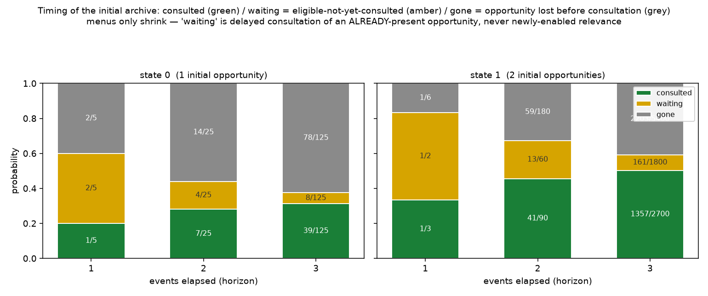

# CONTACT timing — delayed consultation vs newly enabled relevance

*Register: speculative exploration; **a proof + one tiny exact timing enumeration**, no
model change. Isolated under `exploratory/accretion_pilot/endogenous_contact_timing/`;
previous results preserved. No merges, publishing, sealed-study access, large enumeration,
or stochastic sweeps. Checks in `contact_timing_checks.py` are exact (rational
probabilities), with `assert`s and a **nonzero exit** on any failure.*

Rules are unchanged: **BUD** at k=1 and the local **CONTACT(a,q,b)** event, one step =
uniform selection over the union `{directed BUD} ∪ {CONTACT}`.

## The menu, and the claim

For a quiet vertex `q`, its **CONTACT menu** is
`C_q(G) = { {a,b} : a,b distinct ACTIVE neighbours of q in G, and edge a–b is ABSENT }`
— the set of CONTACT opportunities that `q` currently mediates.

**Theorem (monotone non-increasing menu).** For any single event `G → G'` (BUD or
CONTACT), and any `q` already quiet in `G` (its deposition complete),
`C_q(G') ⊆ C_q(G)`.

**Proof.** Two standing facts of the present rules:
1. *A quiet vertex's incidence is frozen* (once `q` is quiet it is never a keeper, a
   depositor, or a new tip, so no event adds or removes an edge at `q`). Hence `q`'s
   neighbour **set** is fixed. A neighbour's **label** can only go `A → Q` (via BUD as
   depositor) and never `Q → A` (there is no reactivation). So `q`'s set of **active**
   neighbours can only **shrink**.
2. *Edges are only ever added* (BUD adds `x–z_i`, `y–z_1`; CONTACT adds `a–b`); none are
   removed. So an **absent** `a–b` can only become **present**, never the reverse.

A pair `{a,b}` is in `C_q` iff (a,b are active neighbours of `q`) **and** (edge `a–b`
absent). By (1) the first condition can only fail over time; by (2) the second can only
fail over time. Neither can newly hold. Therefore no pair enters `C_q`, i.e.
`C_q(G') ⊆ C_q(G)`. ∎

*(Verified exactly: `2458` (transition, pre-existing quiet `q`) checks over `924`
enumerated transitions within 3 events of the matched pair — all inclusions hold.
Persistent vertex identities are used **only** to track this observable, never as inputs to
event selection or as a memory decoder.)*

## Consequences (all following from the theorem)

- **An existing quiet trace cannot gain a newly eligible CONTACT pair** — `C_q` never grows.
- **An empty menu stays empty** — once `C_q = ∅`, it is `∅` forever (`∅` is the minimum, and
  it cannot grow).
- **Consultation can occur after waiting, but the eligibility was already present** — a
  CONTACT mediated by `q` at a later step consumes a pair that was *already* in `C_q` at
  `q`'s deposition. Waiting is *delay*, not *new enablement*.
- **New menus come only from newly deposited quiet vertices** — the global stock of
  opportunities can grow, but only by *fresh* archive (a new `q` with its own `C_q`), which
  is categorically different from *re-enabling an old trace*.

## Exact timing table (next 3 events; initial archive tracked)

Matched pair (from `../endogenous_local_contact/`): **state 0** has one initial opportunity
`{0,2}` mediated by quiet `q=1`; **state 1** has two, `{0,2}` and `{2,4}`, both mediated by
`q=1`. Each path is weighted by its exact product of uniform per-step probabilities. At each
horizon the probability is partitioned into three disjoint categories:

- **consulted** — at least one CONTACT *mediated by an initially-quiet vertex* has fired
  (CONTACT via a *newly* deposited quiet vertex does **not** count);
- **waiting** — none consulted yet, but at least one initial opportunity **remains**;
- **gone** — none consulted, and all initial opportunities have **disappeared**.

| state | horizon | P(consulted) | P(waiting) | P(gone) | Σ |
|---|---|---|---|---|---|
| 0 | 1 | 1/5 | 2/5 | 2/5 | 1 |
| 0 | 2 | 7/25 | 4/25 | 14/25 | 1 |
| 0 | 3 | 39/125 | 8/125 | 78/125 | 1 |
| 1 | 1 | 1/3 | 1/2 | 1/6 | 1 |
| 1 | 2 | 41/90 | 13/60 | 59/180 | 1 |
| 1 | 3 | 1357/2700 | 161/1800 | 2203/5400 | 1 |

`P(consulted)` is non-decreasing; `P(waiting)` shrinks as opportunities are either consulted
or lost. *(Full log: `results/timing_report.txt`, `results/timing_table.txt`.)*



## How an opportunity is removed (without consultation)

A structural dichotomy, exact under the present rules:

- **Endpoint quieting** — a BUD quiets an endpoint `a` or `b`; the pair leaves `C_q`.
  *(Exhibited: state 0, `{0,2}` removed when `0` is quieted — path `BUD(0,5); BUD(0,6);
  BUD(7,0)`.)*
- **Direct edge added** — the `a–b` edge is created. Because **BUD never adds an edge
  between two pre-existing active vertices**, this can only happen via a **CONTACT**; if that
  CONTACT's mediator is a *different* quiet vertex, the opportunity is removed **without
  selecting the original mediator `q`**. *(Not observed within the 3-event horizon for this
  pair — reported as-is; a new mediator bridging `{0,2}` needs more than 3 events here.)*

So an initial opportunity's fate is: **consumed by its own mediator (consulted), stolen by
another mediator's edge, or closed by an endpoint going quiet** — and it never regenerates.

## Plain-language verdict

An old quiet vertex's set of "things it could still bring together" can only get smaller.
It never grows. So when the past *does* speak — a CONTACT through an original quiet vertex —
it is always speaking a line it already had at the moment it fell silent; the delay is just
waiting for that line's turn in the lottery, not the world handing the trace a new line. Any
genuinely *new* relevance in this model arrives only with a *freshly* deposited quiet vertex
— new archive, not an old trace waking up. And an old opportunity can also simply close,
unspoken, if an endpoint goes quiet or another vertex makes the connection first.

## Which notion of dormancy the unchanged model supports

Precisely this: **dormancy = an already-eligible opportunity that has not yet been
consulted** ("waiting"). The model supports **delayed consultation** of such an opportunity.
It does **not** support **newly enabled relevance** of an existing trace — an old `q` cannot
acquire an opportunity it lacked at deposition. The "long-dormant-then-reactivated" story
(a trace ineligible for a while, then becoming eligible later) is therefore **impossible for
a fixed quiet vertex** under the present rules; only fresh depositions create new eligibility.

## Scope

The **theorem** (menu monotonicity, and hence the dormancy characterisation) holds for all
events, not just three. The **probabilities** are a 3-event observation on one matched pair:
we **do not** infer eventual consultation, nor permanent loss of all historical influence,
from this horizon — those are asymptotic questions this bounded enumeration does not answer.
We **stop before** proposing or implementing any new coupling.

## Files

- [`contact_timing_checks.py`](contact_timing_checks.py) — proof-as-checks (monotonicity),
  the exact timing partition, removal-mode analysis, normalisation + relabelling asserts.
- `results/timing_report.txt`, `results/timing_table.txt`, `results/timing_partition.png`.

## Reproduce

```bash
python3 contact_timing_checks.py   # exact; exit 0 iff all checks pass
python3 make_figure.py             # writes the partition figure
```
