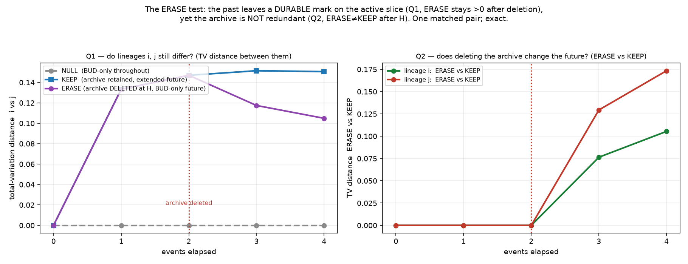

# The ERASE test — is the past *baked into* the active slice, or does it live in the archive?

*Register: **speculative exploration**. Exact rational enumeration on **one matched pair**; a
**mechanism test**, not a sample of growing worlds. Isolated under
`exploratory/accretion_pilot/endogenous_erase_test/`; all earlier work preserved. No merges,
publishing, sealed-study access. All results from [`erase_test.py`](erase_test.py) (exit 0).*

**The proposal (Fable).** We had shown the archive can *influence* the active layer. Fable
asked the sharper question: take the matched pair, evolve under BUD + CONTACT to a horizon,
then **delete the entire archive** (every quiet vertex), and test whether the two lineages
**still differ in their archive-free future active law**. If they do, the past's influence has
been *baked into the active "slice of now"* rather than living only in the quiet record.

## Where this sits relative to what we already proved (stated honestly)

- [`../endogenous_active_projection/`](../endogenous_active_projection/): under **BUD only**,
  the active front is a **closed** transition system — the quiet archive is causally **inert**.
- [`../endogenous_local_contact/`](../endogenous_local_contact/): adding **CONTACT** (which
  reads a quiet mediator) makes the archive **influence** the active layer. Its "projected
  active successor distribution" is *exactly the erased slice*, and it already **differs**
  between the two matched lineages at 1 and 2 events — **while the archive is present**.
- **This test adds the step `local_contact` did not take:** it **actually deletes** the
  archive at a chosen horizon and runs the future **forward with no archive** (BUD only, so
  CONTACT is inert — there are no quiet mediators left). Two questions are kept distinct:
  - **Q1 (durable mark).** With the archive deleted, do the lineages **still** differ?
  - **Q2 (redundancy).** Is the archive **redundant** for the active future — does deleting it
    leave the future active-law distribution unchanged versus **keeping** it?

Q1 tests Fable's "baked into the slice of now." Q2 is the honest check on the stronger phrase
"the archive is redundant": if deleting the archive *changes* the future, the archive is **not**
redundant, and the durable mark and a still-live influence simply **coexist**.

## Setup (frozen)

**Matched pair** (reconstructed exactly as in `local_contact`): two classes reachable by two
BUDs from an all-active path of 4, with **isomorphic active projections** but **different
archives** (quiet-degree signatures `(3,3)` vs `(2,3)`). Verified in code.

**Rules & scheduler** (unchanged): directed BUD at `k=1`; CONTACT with unordered endpoint
pair and distinct quiet mediators distinct; one step = uniform over **individual** eligible
events. `extended = BUD+CONTACT`; `bud-only = BUD` alone. **ERASE(G)** deletes every quiet
vertex, keeping the active vertices and active–active edges (the active projection).

**Three processes**, each run exactly to `H+K` events with `H = 2` (pre-phase) and `K = 2`
(future), recording the distribution over the **erased-slice iso-class** at every step:

| process | pre-phase (`H=2`) | at `H` | future (`K=2`) | tests |
|---|---|---|---|---|
| **NULL** | BUD-only | ERASE | BUD-only | matched null (archive never mattered) |
| **ERASE** | extended | **ERASE** | BUD-only (archive-free) | **Q1** durable mark |
| **KEEP** | extended | — | extended (archive retained) | **Q2** redundancy |

## Results (exact; [`results/erase_tables.txt`](results/erase_tables.txt))

Distance between the two lineages, and between deleting vs keeping, summarised as
total-variation distance (0 = identical distributions):



**Q1 — the durable mark (ERASE process, archive deleted at `H=2`):**

- **NULL control:** lineages `i` and `j` are **identical at every step** — under BUD-only the
  archive is inert, so erasure has nothing to reveal. (The matched null: any later difference
  is attributable to CONTACT alone, since the archives are the *only* difference between the
  lineages.)
- **ERASE at step 0:** identical (matched active layer), as required.
- The erased slices **already differ by step 1** and at the erase horizon `H=2`
  (`{0:59/75, 1:11/75, 2:1/15}` for `i` vs `{0:403/630, 1:137/630, 2:2/21, 5:1/21}` for `j`):
  the archive's influence is transcribed into the active layer **before** deletion.
- **After the archive is deleted**, the two lineages **still differ at the final step 4**
  under archive-free (BUD-only) evolution
  (`i`: `{0:23/27, 1:11/675, 2:31/540, 3:67/900}` vs `j`: `{0:27107/36288, …}`). **The past
  left a durable mark on the active slice; future active law differs with no archive present.**

**Q2 — redundancy (ERASE vs KEEP, per lineage):**

- At the erase horizon `H`, ERASE and KEEP **agree** per lineage (ERASE of the state = active
  projection of the kept state) — as they must.
- **After `H`, ERASE ≠ KEEP** (e.g. lineage `i`, step 3: ERASE `{0:188/225, 1:11/225,
  2:37/450, 3:1/30}` vs KEEP `{0:293/375, 1:257/2250, 2:16/225, 3:1/45, 4:1/90}`). **Deleting
  the archive changes the active-future distribution**: a retained archive keeps feeding the
  active layer through CONTACT. **The archive is not redundant.**

All distributions are exact rationals summing to 1; the ERASE-process distributions are
invariant under a nontrivial relabelling (identities used for measurement/erasure only, never
for event selection).

## Reading (with the enthusiasm turned into cautious-scientist)

Both things are true at once, and that is the interesting part:

1. **Yes, the past is (partly) baked into the "slice of now."** Because CONTACT writes a new
   *active–active* edge whenever it reads a quiet mediator, the archive's influence is
   **transcribed into active structure that survives the archive's deletion**. Two lineages
   with identical active layers but different archives become **distinguishable in the active
   slice alone**, and therefore in **all** archive-free future active law. The active present
   is *not* a clean screen that forgets the history the moment the record is removed.

2. **No, the archive is not therefore redundant.** Deleting it still changes the active future
   (ERASE ≠ KEEP): a retained archive keeps being *re-read* by future CONTACT events, feeding
   the active layer with structure that the erased slice no longer carries. "Baked in" and
   "still live" are **not** exclusive — some of the past prints through into the slice, and
   some remains latent in the archive, available to be expressed later.

The precise, defensible statement is therefore **not** "the archive is redundant," but: *under
this designed CONTACT coupling, the archive's influence is durably recorded in the active layer
(it survives erasure) while also remaining a live resource (deleting it changes the future).*

## Scope & honest limits

- **One matched pair, `H=2`, `K=2`, one scheduler** (uniform over individual events — a
  modelling choice). A mechanism test that these effects **can** and **do** occur, **not** a
  measurement of how typical they are, nor a claim about generic or large worlds.
- "Durable mark" is a statement about **distinguishability**: enough of the archive prints
  through to keep the lineages distinct. It does **not** claim the active slice preserves
  *all* archived information — erasure generally loses information; we only test whether the
  lineages remain distinguishable, and (Q2) confirm the archive still carries more.
- CONTACT is a **designed-in** coupling, not an emergent discovery; the whole effect is
  contingent on it (the NULL control has exactly zero).

## Files

- [`erase_test.py`](erase_test.py) — reconstruct+verify the matched pair; ERASE operator;
  the three processes with exact rational distributions over erased-slice iso-classes; the
  NULL/Q1/Q2 checks; normalisation; relabelling invariance. Asserts + nonzero exit.
- [`results/erase_report.txt`](results/erase_report.txt),
  [`results/erase_tables.txt`](results/erase_tables.txt);
  [`figures/erase_test.png`](figures/erase_test.png).

## Reproduce

```bash
python3 erase_test.py    # exact; exit 0 iff all checks pass
python3 make_figure.py   # writes the two-panel figure
```
