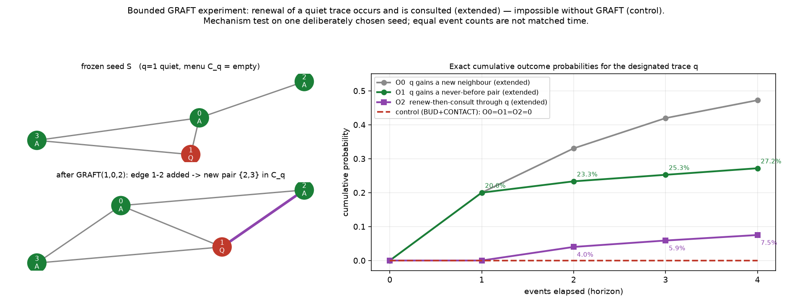

# The bounded GRAFT experiment — renewal of a quiet trace, and its consultation

*Register: **speculative exploration**. A **mechanism test** on one deliberately chosen seed,
computed **exactly** (rational path probabilities over the full event tree). **Not** a
representative sample of growing worlds, not a claim that renewal is typical. Isolated under
`exploratory/accretion_pilot/endogenous_graft_experiment/`; all earlier work preserved. No
merges, publishing, sealed-study access. **No weighting sweep, no additional seeds, no
automatic extension** — this is the single experiment Astra specified, and we stop after it.
All results from [`graft_experiment.py`](graft_experiment.py) (exit 0).*

This experiment closes the renewed-contact thread. The design
([`../endogenous_renewed_contact_design/`](../endogenous_renewed_contact_design/)) proposed
**GRAFT** as the one append-only way to break the CONTACT-menu monotonicity proved in
[`../endogenous_contact_timing/`](../endogenous_contact_timing/), and verified its *legality*
on a hand fixture. The open question was **empirical**: in *reachable* dynamics, does renewal
actually **occur**, and is the renewed opportunity actually **consulted**?

## Frozen specification (fixed before any probability was computed)

**Rules** (unchanged from the prior folders):

- **BUD(x, y)** at `k=1`, **directed**: needs an active–active edge `x–y`; effect `y→Q` plus
  one fresh active tip `z` with edges `x–z`, `y–z`. `(x,y)` and `(y,x)` are distinct events.
- **CONTACT(a, q, b)**: distinct active neighbours `a, b` of a quiet `q` with edge `a–b`
  **absent**; effect adds only `a–b`; the pair `{a,b}` is **unordered**; **distinct quiet
  mediators are distinct events**.
- **GRAFT(q, a, w)**: `q:Q`, `a:A` adjacent to `q`, `w:A` adjacent to `a`, edge `q–w`
  **absent**, `w≠q`; effect adds only `q–w`; **distinct bridges `a` for the same `(q,w)` are
  distinct events**.

**Scheduler.** One step = **uniform selection among individual eligible events** (*not*
uniform among the three rule families); each individual event has weight 1 (a modelling
assumption, stated as such). **Control** = BUD + CONTACT with GRAFT absent, same scheduler.

**Horizon.** Exact cumulative outcomes after **0, 1, 2, 3, 4** events, by **full path-tree
enumeration** (no state merging — so the designated `q` and all eligibility history are
preserved trivially). A node-visit guard would report completed horizons if tripped; it was
**not** tripped (1209 extended / 345 control node-visits).

**Seed (frozen).** All-active seed `A0` = the path `y–x–q0` on vertices `{2, 0, 1}` (`2=y`,
`0=x`, `1=q0`), edges `0–1, 0–2`, all `A`. Apply the single legal **BUD(x=0, q0=1)**: vertex
`1→Q`, fresh active tip `3` with edges `0–3, 1–3`. Resulting seed `S`:

> nodes `0:A, 1:Q, 2:A, 3:A`; edges `0–1, 0–2, 0–3, 1–3`.
> **Designated quiet trace `q = 1`.** Active neighbours `{0, 3}`; edge `0–3` present, so
> **`C_q(S) = ∅`** — an empty menu, hence **no delayed-consultation opportunities exist by
> construction**. Active neighbour `0` can still bud (active edges `0–2`, `0–3`), so a wedge
> can form. A deliberately selected mechanism test.

At the seed the only GRAFT eligible is `GRAFT(1, 0, 2)` (bounded wedge `2–0–1`); no CONTACT is
eligible.

## Outcomes measured (about the designated `q = 1` only; cumulative = "by step *t*")

- **O0** — `q` merely gains a new active **neighbour** (a GRAFT adding `q–w`).
- **O1** — `q` gains a **CONTACT pair it has never previously had** (a *newly enabled*
  eligibility). Because `C_q` starts empty and a pair, once gone, never returns (edges are
  never deleted; labels never go `Q→A`), **every** pair that ever appears at `q` is newly
  enabled the one time it appears. Kept **distinct** from O0.
- **O2** — a **subsequently selected CONTACT through this same `q`** consumes such a
  newly-enabled pair (**renew-then-consult**).
- **menu size** `|C_q|` distribution at each horizon, reported **separately** (a menu can gain
  a new pair even if its total size does not increase).

Tracking uses persistent vertex identities and full eligibility history **for measurement
only, never for event selection** (verified by relabelling invariance). First-created
eligibility is distinguished from consultation of an already-existing opportunity; since the
seed menu is empty, this seed offers **no** delayed-consultation opportunities — the two types
are **not** presented on equal terms.

## Results (exact; [`results/outcome_tables.txt`](results/outcome_tables.txt))

**Extended rule set (BUD + CONTACT + GRAFT):**

| step | O0 new-neighbour | O1 new-pair (newly enabled) | O2 renew-then-consult | menu-size dist `P(|C_q|)` |
|---|---|---|---|---|
| 0 | 0 | 0 | 0 | `{0:1}` |
| 1 | `1/5` (20.00%) | `1/5` (20.00%) | 0 | `{0:4/5, 1:1/5}` |
| 2 | `347/1050` (33.05%) | `7/30` (23.33%) | `1/25` (4.00%) | `{0:133/150, 1:17/150}` |
| 3 | `123367/294000` (41.96%) | `1273/5040` (25.26%) | `53/900` (5.89%) | `{0:22951/25200, 1:1913/25200, 2:1/75}` |
| 4 | `1649731597/3492720000` (47.23%) | `42627/156800` (27.19%) | `3029/40320` (7.51%) | `{0:1934501/2116800, 1:11597/141120, 2:149/37800}` |

**Control rule set (BUD + CONTACT; GRAFT absent):** `O0 = O1 = O2 = 0` and `|C_q| = 0` with
probability 1 at **every** horizon.



### What the numbers say

- **Renewal is impossible without GRAFT (control, exact 0).** With GRAFT absent, the
  designated `q`'s incidence is frozen and its menu is monotone non-increasing; an empty menu
  stays empty. So O0 = O1 = O2 = 0 at every horizon — not "small", **exactly zero**. This is
  the menu-monotonicity theorem of `../endogenous_contact_timing/`, reconfirmed numerically as
  the matched null.
- **Renewal occurs with GRAFT (O1 > 0).** The designated trace acquires a *never-before*
  CONTACT pair with probability rising `20% → 23.3% → 25.3% → 27.2%` across the horizon. This
  is **newly enabled relevance**: the pair involves a vertex that was **not** a neighbour of
  `q` at deposition, so it could not have been in `C_q` before.
- **The renewed opportunity is actually consulted (O2 > 0).** A CONTACT *through the same `q`*
  consumes a newly-enabled pair with probability rising `0 → 4.0% → 5.9% → 7.5%`. O2 is 0 at
  steps 0–1 (a renew-then-consult needs at least two events) and becomes possible from step 2.
- **O0 and O1 are genuinely different.** `q` gains a **neighbour** more often than it gains a
  **pair** (e.g. at step 4, `47.2%` vs `27.2%`): a grafted neighbour that is already adjacent
  to all of `q`'s other active neighbours adds incidence without adding an opportunity. Both
  are reported; neither is a proxy for the other.
- **Menu size is reported separately.** `|C_q|` reaches 2 with positive probability by step 3,
  confirming that "gained a new pair" (O1) and "menu grew in size" are tracked independently.

An explicit witnessing path: **`BUD(0,2) ; GRAFT(1,0,4) ; CONTACT({3,4},1)`** has exact
probability **`1/180`** — a tip `4` grows on the bridge `0`, grafts onto the old trace `1`
creating the pair `{3,4}` that did not exist at the seed, and is then consulted through `1`.

## Invariants checked (exact, over every state reachable in ≤ 4 events; 1209 states)

- Every reachable state is a simple, connected, `A/Q`-labelled graph.
- **GRAFT** preserves **all labels, all vertices, and all existing edges** and adds **exactly
  one previously-absent `Q–A` edge** `q–w`. The pre-event archive embeds in the post-event
  archive as a **subgraph — *not* an induced subgraph** (the induced subgraph on the old
  vertices changes, since `q–w` is a new edge among old vertices; the correct statement is the
  non-induced subgraph embedding: labels equal, every old edge kept, one edge added).
- **CONTACT** preserves `Q` labels and `Q`-incident edges **exactly** (identity
  correspondence) and adds exactly one `A–A` edge, no vertex, no label change.
- **Normalisation:** path probabilities sum to exactly 1 at every horizon.
- **Relabelling invariance:** outcome probabilities and menu-size distributions are unchanged
  under a nontrivial vertex relabelling — identities are used for measurement only.

## Interpretation and scope (honest limits)

- Adding GRAFT changes **both** the available transitions **and** the scheduler's allocation
  of events. Equal event counts across the two rule sets are **not** matched physical time and
  **not** equal numbers of BUD events; the extended and control processes are two different
  event-count processes, compared as such.
- A positive result **demonstrates** that renewal and consultation of a quiet trace **can and
  do occur** under this **designed** coupling on this **deliberately chosen** seed. It does
  **not** show renewal is typical, frequent, or inevitable in generic growth — that is out of
  scope and was not measured. The seed was selected to make the mechanism reachable.
- GRAFT remains a **designed-in** coupling, not an emergent discovery, and (as noted in the
  design) it forfeits the closed-active-front / archive-inertness property of
  `../endogenous_active_projection/` by construction: renewal is possible only at the
  live/archive interface (a trace all of whose neighbours have gone quiet can never be grafted
  onto).

## Files

- [`graft_experiment.py`](graft_experiment.py) — frozen seed + BUD-only history; individual
  eligible-event enumerators for BUD/CONTACT/GRAFT; exact full-tree cumulative enumeration of
  O0/O1/O2 and the menu-size distribution (extended vs control); per-rule preservation +
  graph invariants; normalisation; relabelling invariance; an explicit witnessing path.
  Asserts + nonzero exit.
- [`results/graft_report.txt`](results/graft_report.txt),
  [`results/outcome_tables.txt`](results/outcome_tables.txt);
  [`figures/graft_experiment.png`](figures/graft_experiment.png).

## Reproduce

```bash
python3 graft_experiment.py   # exact; exit 0 iff all checks pass
python3 make_figure.py        # writes the two-panel figure
```
