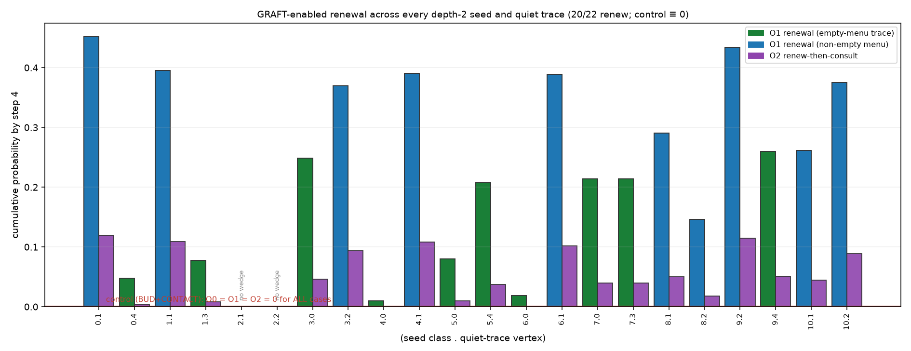

# How prevalent is GRAFT-enabled renewal across the whole seed set?

*Register: **speculative exploration**. Exact rational enumeration over every depth-2 seed and
quiet trace; a mechanism / prevalence study, not a sample of growing worlds. Isolated under
`exploratory/accretion_pilot/endogenous_graft_prevalence/`; earlier work preserved; no merges,
publishing, sealed-study access. Results from [`graft_prevalence.py`](graft_prevalence.py)
(exit 0). Reuses the verified machinery of `../endogenous_graft_experiment/`.*

**Fable's request (transmission-paper data).** The GRAFT experiment showed renewal on **one**
hand-built seed. Does renewal generalise? Here we run the same test — **extended**
(BUD+CONTACT+GRAFT) vs **control** (BUD+CONTACT), scheduler uniform over individual events,
horizons 0–4 — on **every** depth-2 class, for **every** quiet trace in it: **22 cases**.

**Outcomes** (about the designated quiet trace `q`; cumulative "by step 4"):
`O0` q gains a new active neighbour (a GRAFT adds `q–w`); `O1` q gains a CONTACT pair it has
**never** had (newly-enabled relevance / **renewal**); `O2` a later CONTACT through `q` consumes
such a pair (**renew-then-consult**).

## Result ([`results/prevalence_table.txt`](results/prevalence_table.txt))



- **Control is exactly 0 everywhere.** `O0 = O1 = O2 = 0` for **all 22** traces — the
  menu-monotonicity theorem (`../endogenous_contact_timing/`) holds across the **entire** depth-2
  seed set, not just one seed. **Renewal is impossible without GRAFT, universally.**
- **With GRAFT, renewal is prevalent.** Renewal (`O1 > 0`) is reachable in **20/22 traces (91%)**
  and consultation (`O2 > 0`) in **20/22**. Split by starting menu: **12 empty-menu** traces
  (like the original seed) → 10 renew; **10 non-empty-menu** traces (which also have
  delayed-consultation opportunities) → all 10 renew.
- **Aggregate (exact).** Mean renewal probability by step 4 = `632783738747885237/2850962888277504000`
  ≈ **0.222**; mean consultation ≈ **0.049**; strongest single trace class 0 · q1 (`O1 ≈ 0.452`).
- **`O2 ≤ O1 ≤ O0` on every trace** — you gain a neighbour, which may create a never-before pair
  (renewal), which may then be consulted; the three are reported separately.

### The structural exception (class 2)

The only two non-renewing traces are **class 2's** quiet vertices (`O1 = 0` even with GRAFT):
in that class no bounded GRAFT wedge is ever reachable for either quiet trace, so renewal is
structurally impossible there — a clean reminder that GRAFT renews **only at the live/archive
interface** (a trace needs an active bridge with an eligible tip). Prevalence is high but **not**
universal, and the exception is exact and identifiable.

## Reading

Across the whole depth-2 seed set the picture the single experiment suggested holds broadly and
exactly: **without GRAFT a quiet trace can never be newly made relevant (0/22), and with GRAFT it
usually can (20/22), and usually the renewed opportunity is then consulted.** Renewal was not an
artefact of one hand-picked seed; it is a prevalent — though not universal — property of the
rule on this seed set.

## Scope & limits

The depth-2 class set, one scheduler (uniform over individual events), the designed GRAFT
coupling, horizon 4. A mechanism/prevalence study on a specific finite seed set — **not** a
frequency estimate over "natural" or larger worlds, and not a claim that renewal is typical in
generic growth. The `20/22` is prevalence within this exact, enumerated set.

## Files

- [`graft_prevalence.py`](graft_prevalence.py) — the sweep over all 22 (seed, trace) cases,
  extended vs control, exact cumulative O0/O1/O2 at horizon 4; control-zero, prevalence, and
  `O2 ≤ O1 ≤ O0` checks; asserts + nonzero exit.
- [`results/graft_prevalence_report.txt`](results/graft_prevalence_report.txt),
  [`results/prevalence_table.txt`](results/prevalence_table.txt);
  [`figures/graft_prevalence.png`](figures/graft_prevalence.png).

## Reproduce

```bash
python3 graft_prevalence.py   # exact; exit 0 iff all checks pass  (~6 s)
python3 make_figure.py        # writes the figure
```
