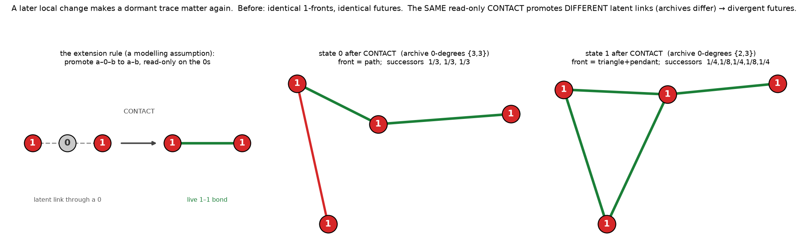

# Latent relevance — can a later local change make a dormant trace matter? (bounded)

*Register: speculative exploration; **one minimal extension of M1 + tiny exact
enumeration**, not a production experiment. Isolated under
`exploratory/accretion_pilot/endogenous_latent_relevance/`, on the existing branch;
previous models and results preserved. No merges, publishing, sealed-study access, large
simulations, or parameter sweeps. Checks in `active_latent_checks.py` use exact
state-preserving isomorphism (A/Q matched), rational probabilities, `assert`s and a
**nonzero exit** on any failure (printed text is not a gate).*

## The idea being tested

We proved earlier (`../endogenous_active_projection/`) that under uniform selection over
directed active bonds, M1's **active front is a closed system** and the **quiet archive is
causally inert** — write-only. So two states with isomorphic active projections but
different archives evolve their active fronts identically.

Katie & Astra's target: *"subsequent changes can make latent relationships matter again."*
We add **one** local structural change and ask whether it can flip a dormant trace from
inert to relevant — with the original archive-blind M1 kept as the control.

## The extension rule — a modelling assumption (not emergent)

We considered two candidate triggers and **chose one before running any outcome**:

- **R_bridge — CONTACT (selected).** Promote every latent *active–quiet–active* path to an
  active bond: for each active `a`, each quiet neighbour `q` of `a`, and each active
  neighbour `b≠a` of `q`, **add the active bond `a–b`.** It is **read-only on the archive**
  (never changes a `Q` label or a `Q`-incident edge, creates no vertices; it only adds
  `A–A` edges among pre-existing active vertices). This is a *changed local relationship*:
  the archive's stored adjacency (which actives a quiet vertex links) is turned into a live
  bond.
- **R_react — REACTIVATE (rejected).** Flip a targeted quiet vertex back to `A`. Rejected
  because it **rewrites the trace** (mutating the archive muddies the "made relevant" claim
  — it risks *transcribing* a log rather than *consulting* it) and it needs an anchor
  *selection* (which quiet vertex?), reintroducing a choice we would have to justify.

Astra's steer — *prefer a gate based on a changed local relationship over an always-on
scheduler dependence on quiet degree* — points at R_bridge: it is a **one-shot local
promotion of a relationship**, not a permanent scheduler that always weights by quiet
degree. After CONTACT, ordinary archive-blind M1 resumes — but now on an active graph that
has *absorbed* the latent links.

**Provenance of the trigger (fully local, coordinate/ID/history-free).**
*Eligibility:* an active vertex with a quiet neighbour that has another active neighbour.
*Location:* **all** active sites, synchronously (symmetric — no anchor choice, so it is
well-defined under the active-state correspondence between the two compared states).
*Randomness:* none (deterministic). Because we impose its timing ("apply one CONTACT
sweep now"), this is a **controlled intervention**, not spontaneous reactivation — we say
so plainly.

## Required demonstration (all exact, all verified — `active_latent_checks.py`, exit 0)

**Matched pair (reachable, not hand-built).** Among the 11 reachable depth-2 states of
`path(4)` at k=1, full classes **0** and **1**:

| | active projection | quiet archive (Q-degrees) | basic counts (V,E,#A,#Q) |
|---|---|---|---|
| state 0 | two disjoint bonds | **{3, 3}** | (6, 7, 4, 2) |
| state 1 | two disjoint bonds *(isomorphic)* | **{2, 3}** | (6, 7, 4, 2) |

Isomorphic active projections, different quiet arrangements, matching basic counts. *(This
is a genuinely reachable pair under the original dynamics — no fixture needed; the
mechanism's existence and its reachability coincide here.)*

**Before → after (projected active successor distributions, exact rationals):**

| stage | state 0 | state 1 | same? |
|---|---|---|---|
| **before** (original M1) | `{class0: 1}` | `{class0: 1}` | **identical** (archive inert) |
| **after CONTACT** | `{0:⅓, 1:⅓, 2:⅓}` | `{0:¼, 1:⅛, 2:¼, 3:⅛, 4:¼}` | **different** |

CONTACT promotes **different latent links** because the archives differ — state 0 gains
`0–2` (front becomes a **path**); state 1 gains `0–2, 2–4` (front becomes a **triangle +
pendant**). Distinct active fronts ⇒ distinct projected futures. The dormant trace has been
**made relevant by a later local change.** *(Full table: `results/transition_table.txt`;
multiplicities retained, e.g. before-CONTACT 4 directed events all reach one class.)*

## Controls (each an explicit `assert`)

1. **Original archive-blind M1 (no CONTACT).** The pair's projected successor distributions
   are **identical** — no archive-attributable difference. *(The baseline the effect is
   measured against.)*
2. **Coupling disabled.** An intervention of the same "now, everywhere" timing but
   **archive-blind** (add a fresh active leaf to each active vertex; never read `Q`) leaves
   the two states' active projections isomorphic and their successor distributions
   **identical**. So the effect requires *reading the archive*, not merely *intervening*.
3. **Vertex relabelling.** Renaming vertices (shifts of 100 / 500) leaves every outcome
   unchanged (post-CONTACT states isomorphic to the unrelabelled ones).
4. **Trace not rewritten into a new record.** CONTACT leaves the **archive unchanged** (the
   `Q` vertices and all `Q`-incident edges are isomorphic before/after), creates **no new
   vertices**, and adds **only `A–A` edges among pre-existing actives**. So the divergence
   comes from *consulting* the retained trace, not from *transcribing* it into a fresh
   record that carries the answer.

All comparisons are over **active-state isomorphism classes** with rational probabilities —
not mere event counts (though even the eligible-event count moves here: 4 → 6 vs 4 → 8).



## Plain-language verdict

Under the original rule the field of 0s is silent — the 1-front cannot feel it, and two
worlds with different hidden pasts march identically. Add **one** later, local, read-only
move — "wherever two live 1s are quietly linked through a 0, let them touch" — and the past
speaks: because the two worlds stored *different* quiet links, the very same move wires them
into *different* live shapes, and from there they diverge. The archive did not act on its
own and was not rewritten; a subsequent structural change simply **consulted** it, and that
was enough to make a once-irrelevant trace change what happens next.

## Scope (what this does and does not establish)

A positive result establishes **conditional causal relevance of a retained trace under an
explicit, added rule** — nothing more. It does **not** recover the full original history
(CONTACT reads only *which actives a quiet vertex links*, not the event order that built
it), does **not** establish permanent information preservation (later BUDs keep quieting
vertices; the archive still grows and is still inert *between* interventions), and is **not**
a claim about consciousness or any cosmological mechanism. The coupling is **our modelling
assumption**, imposed and labelled as such — the point is that *a* minimal local rule
suffices, not that M1 does this on its own (it provably does not). We stop at this bounded
demonstration for review.

## Files

- [`active_latent_checks.py`](active_latent_checks.py) — the rule, the matched pair, the
  before/after distributions, all four controls; asserts + nonzero exit.
- `results/latent_report.txt`, `results/transition_table.txt`.
- `figures/latent_relevance.png` — before/after diagram.

## Reproduce

```bash
python3 active_latent_checks.py   # exact; exit 0 iff all checks pass
python3 make_figure.py            # writes the diagram
```
