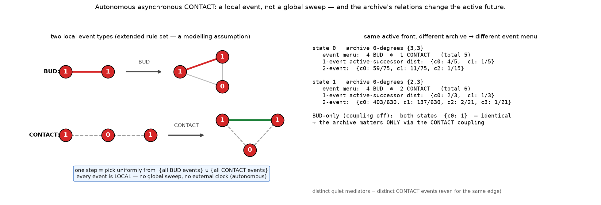

# Autonomous local CONTACT — corrected checks + a bounded async test

*Register: speculative exploration; **corrections + one bounded exact test**, not a
production experiment. Isolated under `exploratory/accretion_pilot/endogenous_local_contact/`,
on the existing branch; previous results preserved (a dated clarification is appended to
`../endogenous_latent_relevance/LATENT_RELEVANCE.md`). No merges, publishing, sealed-study
access, large simulations, or parameter sweeps. Checks in `local_contact_checks.py` use
exact isomorphism (A/Q matched), rational probabilities, `assert`s and a **nonzero exit**
(printed text is not a gate).*

## What changed since the last folder

The previous demonstration used an **externally-timed global CONTACT sweep**. Astra's
review asked for (a) targeted corrections and (b) an **autonomous, asynchronous, local**
CONTACT that competes in the scheduler. Both are here.

### Corrections (verified)

- **C1 — compare rational distributions, not multiplicity dicts.** All comparisons are now
  over exact `Fraction` probability distributions. Fixture: multiplicities `{0:2,1:2}`
  (÷4) and `{0:3,1:3}` (÷6) are *different dicts* but the *same distribution*
  `{0:½,1:½}` — proportional multiplicities must compare equal.
- **C2 — reported additions are actual new edges.** CONTACT is eligible only when `a–b` is
  **absent**; already-present A–A edges are excluded from both eligibility and the reported
  additions.
- **C3 — exact archive preservation under the identity correspondence.** After each
  CONTACT we assert the `Q` labels and the **set of Q-incident edges** are *literally
  identical* (same vertex names), not merely isomorphic.
- **C4 — the leaf-adding comparison was mislabelled.** It is an **archive-blind alternative
  intervention**, not a matched coupling-off ablation. The genuine coupling-off control is
  simply **BUD-only M1** (remove CONTACT), used below.
- **C5 — wording.** The **archive is unchanged**; what changes is that *information about
  its relationships* (which actives a quiet vertex links) is **re-expressed as new active
  edges**. The quiet trace is consulted, not rewritten.
- **C6 — local vs global.** The prior sweep was one externally-timed global operation. The
  rule below is a **local event**; the archive's influence now enters through ordinary
  local event selection, not an imposed sweep.

## The autonomous extended rule set (a modelling assumption)

- **BUD(x,y)** at k=1 — unchanged (directed active bond; keeper `x` stays A, depositor
  `y→Q`, one new tip).
- **CONTACT(a,q,b)** — eligible iff `a,b` are **distinct active neighbours of a quiet `q`**
  and the active edge `a–b` is **absent**. Effect: **add only `a–b`.** The endpoint pair
  `{a,b}` is **unordered** (swapping `a,b` is the same event — no duplicate). **Distinct
  quiet mediators `q` are distinct eligible events**, even when they would add the same edge
  (so a pair bridged by two quiets is weighted twice). *(All verified.)*
- **One step = uniform selection over the union** `{directed BUD events} ∪ {CONTACT
  events}`, each event weight 1. **This relative weighting is a modelling assumption.**
- **No global sweep, no external activation time.** "Autonomous" means only that event
  selection follows the fixed rules — the scheduler, not an outside clock.



## Bounded exact experiment

The reachable matched pair (depth-2 of `path(4)`, k=1): full classes **0** and **1** —
isomorphic active projections (two disjoint bonds), different archives (Q-degrees **{3,3}**
vs **{2,3}**). Their CONTACT menus differ: state 0 has **1** CONTACT event, state 1 has
**2** (because their quiet mediators link different active pairs).

Exact distributions over **projected active successor classes** (probabilities summed when
branches reach the same class):

| rule set | state | after 1 event | after 2 events |
|---|---|---|---|
| **BUD-only** (coupling off) | 0 | `{c0: 1}` | `{c0: 1}` |
| **BUD-only** | 1 | `{c0: 1}` | `{c0: 1}` |
| **extended** | 0 | `{c0: 4/5, c1: 1/5}` | `{c0: 59/75, c1: 11/75, c2: 1/15}` |
| **extended** | 1 | `{c0: 2/3, c1: 1/3}` | `{c0: 403/630, c1: 137/630, c2: 2/21, c3: 1/21}` |

- **BUD-only:** the two archives are **indistinguishable** at 1 and 2 events — the matched
  control (archive causally inert, as proved earlier).
- **Extended:** the distributions **differ at both 1 and 2 events.** The archive now shapes
  the active future — through the local CONTACT coupling and the fixed uniform scheduler.
  *(Full table: `results/transition_tables.txt`.)*

**Controls & invariants (all asserted, exit 0):** legal events and simple/connected/A-Q
invariants over every state reachable in ≤2 extended events; exact archive preservation
during CONTACT (C3); actual-new-edge accounting (C2); CONTACT semantics (unordered pair,
distinct-mediator multiplicity); and **invariance under a nontrivial vertex relabelling**.

## Plain-language verdict

With only BUD, two worlds that hid different pasts behind an identical live front march
identically — the past is silent. Add one **local** move — *"if two live 1s both touch the
same quiet 0 and aren't yet joined, they may join"* — and let it take its turn in the same
lottery as every other move. Now the worlds diverge, exactly, at the very first step and
the next: because their quiet 0s link different pairs of 1s, they offer **different menus of
moves**, and the dice fall differently. The archive is never edited; its *relationships* are
simply eligible, through this one rule, to become live — and that is enough to make the
hidden past change what happens next. This is a **difference under an explicit local
coupling and a fixed scheduler**, computed in exact fractions.

## Scope (what this does and does not establish)

- The coupling is **designed into the model**, not a spontaneous discovery of memory. It is
  not evidence of physical time, and not proof of permanent recoverability.
- **Important honesty about "latent … later".** In this extended model the trace is latent
  *only under the original BUD dynamics*; under the extended rules it is **already eligible
  to influence events wherever CONTACT's motif (`1–0–1` with the `1–1` absent) exists.** So
  this demonstrates *archive-dependent evolution when the coupling is present*, **not** a
  trace that stays ineligible for a long time and then becomes eligible later. That
  genuinely temporal "dormant-then-reactivated" story is a further question, not yet shown.
- Nothing here concerns consciousness or cosmology.

## Files

- [`local_contact_checks.py`](local_contact_checks.py) — corrections + rule + experiment;
  asserts + nonzero exit.
- `results/local_contact_report.txt`, `results/transition_tables.txt`.
- `figures/local_contact_event.png` — the event diagram.

## Reproduce

```bash
python3 local_contact_checks.py   # exact; exit 0 iff all checks pass
python3 make_figure.py            # writes the diagram
```
