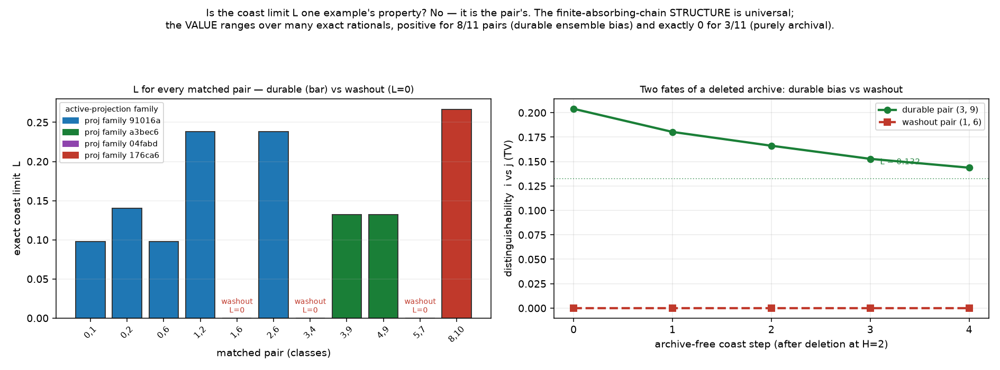

# Is the coast limit `L` one example's property, or the construction's?

*Register: **speculative exploration**. Exact rational computation over **all** matched pairs of
the depth-2 class set; a mechanism study, not a sample of growing worlds. Isolated under
`exploratory/accretion_pilot/endogenous_pair_robustness/`; earlier work preserved; no merges,
publishing, sealed-study access. Results from [`pair_robustness.py`](pair_robustness.py)
(exit 0). Reuses the verified primitives of `../endogenous_present_width/`.*

**Fable's request (transmission-paper data).** The ERASE / ρ(h) / coast-asymptote analysis was
done on **one** matched pair. Was the exact coast limit `L = 4321/44100` a property of that one
example, or of the construction? Here we compute the **exact `L` for every matched pair** among
the 11 depth-2 classes, and analyse a featured second pair (from a different active-projection
family) in full.

> **Ensemble, not record** (carried from `../endogenous_present_width/`): all "distinguishability"
> here is a statement about the **distribution over presents**, never a per-world memory. `L` is
> a bias in the ensemble.

## Setup

A **matched pair** = two depth-2 classes with **isomorphic active projections** but
**non-isomorphic full graphs** (same active layer, different archive). There are **11** such
pairs across **4** active-projection families. For each, `ΔA = 0` at `k=1`, so (Proposition 3 of
`../endogenous_present_width/`) the archive-free coast is a **finite absorbing Markov chain** on
4-active-vertex projections, converging to the exact rational `L = TV(absorption distributions)`.

## Result — `L` for every matched pair ([`results/L_table.txt`](results/L_table.txt))

| pair | proj family | archives (q-deg) | exact `L` | `L` (float) | fate |
|---|---|---|---|---|---|
| (0,1) | 91016ad6 | (3,3) vs (2,3) | `4321/44100` | 0.0980 | durable |
| (0,2) | 91016ad6 | (3,3) vs (3,3) | `7/50` | 0.1400 | durable |
| (0,6) | 91016ad6 | (3,3) vs (2,4) | `4321/44100` | 0.0980 | durable |
| (1,2) | 91016ad6 | (2,3) vs (3,3) | `2099/8820` | 0.2380 | durable |
| **(1,6)** | 91016ad6 | (2,3) vs (2,4) | **`0`** | 0.0000 | **washout** |
| (2,6) | 91016ad6 | (3,3) vs (2,4) | `2099/8820` | 0.2380 | durable |
| **(3,4)** | a3bec69c | (2,3) vs (2,4) | **`0`** | 0.0000 | **washout** |
| **(3,9)** | a3bec69c | (2,3) vs (3,3) | `2333/17640` | 0.1323 | durable *(featured)* |
| (4,9) | a3bec69c | (2,4) vs (3,3) | `2333/17640` | 0.1323 | durable |
| **(5,7)** | 04fabdef | (2,3) vs (2,2) | **`0`** | 0.0000 | **washout** |
| (8,10) | 176ca6f6 | (3,4) vs (3,4) | `4/15` | 0.2667 | durable |



**The answer, in two parts:**

- **The structure is universal.** *Every* matched pair's archive-free coast is a finite absorbing
  chain converging to an exact rational limit `L ≥ 0`, non-increasing (data-processing). That is a
  property of the construction, not of one example.
- **The value — and even whether it is positive — is the pair's.** `L` takes **6 distinct exact
  values**. **8/11** pairs are **durable** (`L > 0`: the archive difference is transcribed into
  the active layer and leaves a lasting ensemble bias; the archive is *not* redundant). **3/11**
  are **washout** (`L = 0`). So `L = 4321/44100` was never a universal constant — it is one
  pair's value, and the original study happened to pick a durable pair.

*(Note the exact-value symmetries: pairs sharing an absorption structure share `L` — e.g. (0,1),
(0,6) both `4321/44100`; (1,2),(2,6) both `2099/8820`; (3,9),(4,9) both `2333/17640`. And `L` is
**not** predictable from the crude degree signature: (8,10) has the *same* signature on both
sides — `(3,4)` vs `(3,4)` — yet the largest `L = 4/15`.)*

## The featured second pair — classes (3,9), a different projection family

A genuinely independent matched pair (family `a3bec69c`, not the original's `91016ad6`; archives
`(2,3)` vs `(3,3)`), exact limit **`L₂ = 2333/17640 ≈ 0.1323`**. It reproduces the whole original
story:

- **ρ(h) rises from 0** (`0 → 0.20 → 0.26 → 0.28`): at `h=0` the present is unbiased by lineage;
  CONTACT then transcribes a bounded share of the archive into a bias over present structure.
- **Q1 (durable bias):** after deleting the archive the lineages still differ (coast `0.166` at
  the last tested step) and converge toward `L₂ > 0` — a durable ensemble bias.
- **Q2 (not redundant):** `KEEP ≥ coast` at every tested step and differs after `H` — deleting the
  archive changes the active future.

So the phenomenon is not peculiar to the first pair or its projection family.

## The featured washout pair — classes (1,6): a *purely archival* difference

Its full-state distinguishability at `H=2` is large (**0.833** — the archives genuinely differ),
yet the **archive-free coast is exactly 0 at every step**, and so is **KEEP**. The archive
difference is **never expressed in the active layer at all** — delete the archive and the active
future is identical from the very first step; keep it and nothing changes either. For this pair
the archive is **redundant to the active future**: its difference is *purely archival*. This is
the exact complement of the durable pairs.

**The dichotomy, then, is the transmission finding:** a matched pair's archive difference is
either **transcribed** into the active layer (durable, `L > 0`, archive not redundant) or
**confined** to the archive (washout, `L = 0`, archive redundant to the active layer) — and which
one is an exact, computable property of the pair, ranging over the whole class set.

## Scope & limits

The depth-2 class set with one scheduler (uniform over individual events) and the CONTACT/BUD
coupling; a mechanism study. It establishes that the coast-limit *structure* is universal and its
*value* (and the durable-vs-washout fate) is pair-specific — **not** a claim about generic or
larger worlds, nor a frequency estimate over "natural" pairs.

## Files

- [`pair_robustness.py`](pair_robustness.py) — exact `L` for all matched pairs (finite absorbing
  chain + exact absorption solve); featured durable pair (ρ(h), Q1, Q2); featured washout pair;
  asserts + nonzero exit.
- [`results/pair_robustness_report.txt`](results/pair_robustness_report.txt),
  [`results/L_table.txt`](results/L_table.txt); [`figures/pair_robustness.png`](figures/pair_robustness.png).

## Reproduce

```bash
python3 pair_robustness.py   # exact; exit 0 iff all checks pass
python3 make_figure.py       # writes the figure
```
