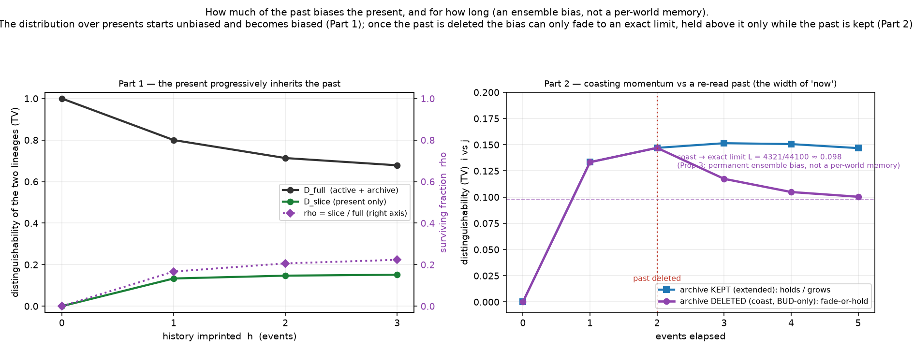

# The width of "now" — how much of the past biases the present, and for how long

*Register: **speculative exploration**. Exact rational distributions on **one matched pair**
(the same one used in `../endogenous_local_contact/` and `../endogenous_erase_test/`); a
**mechanism test**, not a sample of growing worlds. Isolated; earlier work preserved; no
merges/publishing/sealed-study access. Results from [`present_width.py`](present_width.py) and
[`coast_asymptote.py`](coast_asymptote.py) (both exit 0). Distributions are **exact rationals**;
only the bit-valued entropies are floating readouts of those exact numbers.*

> **Read this first — population, not record.** Everything below is a statement about the
> **distribution over presents** (the ensemble across all stochastic histories of a lineage),
> **never** about a single world. After any horizon, a given active graph is a class that
> **both** lineages produce; no individual present "remembers" which lineage made it. What
> differs is only the **probability distribution** over presents. So the "mark of the past" is
> a **tendency — a bias in the ensemble** — exactly the status of AUC in Study A, and never a
> per-world record. In one line: **the present does not remember; the present is biased.**

**Katie's reframing.** Only the **present moment** actually exists; it rides a moving expansion
front and carries an inherited **momentum** from its history — the past itself need not still
exist. The [ERASE test](../endogenous_erase_test/) showed the ensemble of presents stays biased
by lineage after the archive is deleted. This study makes that **quantitative** and asks the two
questions the reframing raises: **how much** of the past biases the present alone, and **how
wide** (how long-lived) is that bias — does it **fade** or **set**?

## The measure

The two lineages differ only in their archive (they start with **isomorphic active
projections**). "How well could an observer tell which lineage a *sample* came from?" is a clean
ensemble measure of how legible the history is. At each moment:

- **D_full** = total-variation distance between the two lineages' distributions over the **full
  state** (active + archive) — *all* the historically-distinguishing signal. (With a uniform
  prior over the two lineages, the best single-shot guess succeeds with probability
  `½ + D_full/2`.)
- **D_slice** = the same distance over the **erased slice** (present only; quiet vertices
  deleted) — the history legible **from the present alone**.
- **ρ(h) = D_slice / D_full ∈ [0, 1]** — the **surviving fraction**: what share of the
  distinguishing signal is legible without the archive.

Also in **bits**: `I = ` Jensen–Shannon divergence between the lineages `=` mutual information
between the lineage label and the observation (uniform prior).

## Part 1 — the ensemble of presents becomes progressively biased by history

Extended dynamics (BUD + CONTACT), no erasure, at imprint horizons `h = 0…3`
([`results/present_width_tables.txt`](results/present_width_tables.txt)):

| h | D_full (TV) | D_slice (TV) | **ρ = slice/full** | I_full (bits) | I_slice (bits) |
|---|---|---|---|---|---|
| 0 | 1.0000 | 0.0000 | **0.0000** | 1.0000 | 0.0000 |
| 1 | 0.8000 | 0.1333 | **0.1667** | 0.7455 | 0.0165 |
| 2 | 0.7133 | 0.1470 | **0.2061** | 0.6236 | 0.0361 |
| 3 | 0.6784 | 0.1514 | **0.2232** | 0.5642 | 0.0287 |

- **At `h = 0` the ensemble of presents is unbiased by lineage** (`ρ = 0`): the slice
  distributions are identical, while the full state distinguishes the lineages with certainty
  (`D_full = 1`). **All** the distinction starts in the archive.
- **As history accumulates, `ρ` rises** (0 → 0.17 → 0.21 → 0.22): each CONTACT writes an
  active–active edge, so a little of the archive's difference shows up as a **bias in the
  distribution over active slices**.
- **`ρ` stays well below 1** (~0.22 at `h = 3`): the lineages remain only *partly* separable
  from the present alone; the rest of the distinction is legible only **with** the archive
  (the quantitative form of the ERASE test's "archive not redundant").
- **`D_slice ≤ D_full` always** — the present's ensemble bias can never exceed the full state's
  (the active slice is a coarsening of active + archive).

## Part 2 — fade or set, and the width of "now"

Imprint history to `H = 2` events (archive present), then **delete the entire archive** and let
the present **coast** under archive-free dynamics (BUD only — no quiet vertices, so CONTACT is
inert). Compare against **KEEP** (archive retained, extended throughout):

| step | archive **deleted** (coast) | archive **kept** (KEEP) |
|---|---|---|
| 2 (delete here) | 0.1470 | 0.1470 |
| 3 | 0.1174 | 0.1514 |
| 4 | 0.1049 | 0.1506 |
| 5 | 0.1003 | 0.1467 |



- **Coasting can only fade or hold — never grow (provable).** After deletion the present evolves
  under a **single fixed kernel applied to both lineages** — and that kernel is the BUD-only
  kernel **on active projections**, which is well-defined *only because of Proposition 1*
  (`../endogenous_active_projection/`: the BUD-only successor of a state's projection depends on
  the projection alone). With one shared kernel, the **data-processing inequality** forces the
  distinguishability to be **non-increasing**: `0.147 → 0.117 → 0.105 → 0.100`. The archive-free
  ensemble bias cannot amplify itself once the past is gone.
- **It converges to an exact positive limit (Proposition 3, below), not to zero.** The earlier
  "positive floor" is now pinned: **`L = 4321/44100 ≈ 0.0980`**.
- **Sustaining the bias needs the past.** With the archive **kept**, distinguishability stays
  **at or above the coast at every step** (`KEEP ≥ coast`, asserted). It is **non-monotone** —
  `0.147 → 0.151 → 0.151 → 0.147`, a single uptick then decline — so we make no "grows" or
  "amplifies" claim; the honest statement is simply that keeping the archive holds
  distinguishability above the archive-free coast, because CONTACT keeps re-reading the past.
- **NULL control:** BUD-only throughout gives distinguishability `0` at every step — no CONTACT,
  no bias to inherit, and erasure has nothing to reveal.

### Proposition 3 (exact asymptote of the coast) — [`coast_asymptote.py`](coast_asymptote.py)

**Setup.** BUD at `k=1` has `ΔA = 0` (budding turns one active vertex quiet and adds one active
tip), so the number of **active vertices is invariant** along the coast — here **4**. By
Proposition 1 the archive-free coast is a **time-homogeneous Markov chain `T`** on the **finite**
set of 4-active-vertex projections (a single fixed kernel, shared by both lineages). A finite
chain has recurrent classes; here **every recurrent class is an absorbing singleton** — verified
computationally: the reachable set has **6** projections, of which **2 are absorbing** —
"**two disjoint bonds**" (2 edges, all degree 1) and "**one bond + two isolated vertices**"
(1 edge) — and every transient state absorbs with total probability 1 (so no other recurrent
class traps mass). Fable's example is exactly the first: the budded vertex there has
active-degree 1, so `ΔB = k − d_A = 0` and the projection returns to two disjoint bonds.

**Proposition 3.** Let `μ_i, μ_j` be the two lineages' erased-slice distributions at the erase
horizon `H`. Then `μ T^t` converges to the absorption distribution `a(μ)` over the absorbing
projections, so the coast `TV(μ_i T^t, μ_j T^t)` is non-increasing in `t` (single shared kernel
⇒ data-processing) and **converges to the exact limit**
`L = TV(a(μ_i), a(μ_j))`, which is **positive iff the two absorption distributions differ.**

*Proof.* An absorbing finite chain has `μ T^t → a(μ)` (standard). Both lineages share `T`, so
the approach is monotone by data-processing. The two absorbing states have disjoint support, so
`TV` of the limits telescopes to `TV(a(μ_i), a(μ_j))`. ∎

**Exact result.** The absorption distributions over (two-bonds, one-bond) are
`a_i = (43/50, 7/50)` and `a_j = (6721/8820, 2099/8820)`; they differ, so

> **`L = 4321/44100 ≈ 0.097982`.**

Validation (all exact): the finite chain reproduces the full-graph coast of `present_width.py`
**exactly** at `t = 0…3` (`463/3150, 4439/37800, 3805/36288, 312041/3110400`), the coast is
non-increasing and stays `≥ L`, and it converges to `L` (residual `< 10⁻³⁰` by `t = 64`; the
limit is the exact rational from absorption, not from finite iteration).

So the temporal "width of now" is precise: the archive-free bias relaxes **monotonically to a
permanent, exactly-known ensemble floor** — it partially fades and then holds forever at `L`.

## Reading (plain language)

Katie's picture comes out sharp, with the ensemble caveat kept front and centre:

1. **The ensemble of presents is born unbiased and *earns* its bias.** History is not
   automatically legible in the "now" — at `h = 0` the two lineages' presents are identically
   distributed; only the CONTACT rule ferries a fraction of the archive's difference into a bias
   over present structure. And it is bounded: most of the distinction (ρ < 1) stays in the past.
2. **Once the past is gone, the present can only spend its bias, never mint more.** The
   archive-free coast decays under one fixed law and **converges to an exact positive floor**
   `L = 4321/44100`; it can be held *above* that only while the past is kept and re-read. The
   "width of now" is this decay-to-a-limit — a short forgetting onto a permanent, quantified
   residual bias — never a memory carried by any single world.

Honest one-liner: *in this model the distribution over presents carries a genuine, permanently
biased imprint of history; the amount is bounded (ρ < 1) and, once the past is deleted, can only
fade toward an exact positive limit — sustaining or sharpening it requires the past to still
exist. No individual present records its lineage.*

## Scope & limits

- One matched pair, small horizons (`h ≤ 3`, coast to the limit), one scheduler (uniform over
  individual events — a modelling choice), one designed CONTACT coupling. A mechanism test that
  these effects **can and do** occur, not a measurement of how typical they are, and not a
  large-world claim. (The asymptote itself, however, is now exact — Proposition 3 — not a
  within-horizon guess.)
- Distinguishability measures *how legible the lineage is from a sample*, not "the archive's
  content"; `ρ < 1` and `L < D_full` mean the lineages stay only partly separable from the
  present, consistent with — but weaker than — a full information-preservation statement.

## Files

- [`present_width.py`](present_width.py) — matched pair; full & slice iso-class distributions
  (exact, WL-bucketed); ρ(h) and bit-measures; coast-vs-keep with the data-processing
  non-increase, the `KEEP ≥ coast` contrast, the NULL control, normalisation and relabelling
  invariance.
- [`coast_asymptote.py`](coast_asymptote.py) — Proposition 3: builds the finite BUD-only
  projection kernel, verifies it is absorbing, cross-checks `Tᵗ` against the full-graph coast,
  and computes the exact limit `L` from the absorption distributions.
- [`results/present_width_report.txt`](results/present_width_report.txt),
  [`results/present_width_tables.txt`](results/present_width_tables.txt),
  [`results/coast_asymptote_report.txt`](results/coast_asymptote_report.txt);
  [`figures/present_width.png`](figures/present_width.png).

## Reproduce

```bash
python3 present_width.py    # exact; exit 0 iff all checks pass  (~12 s)
python3 coast_asymptote.py  # Proposition 3: exact coast limit L = 4321/44100  (~4 s)
python3 make_figure.py      # writes the two-panel figure
```
