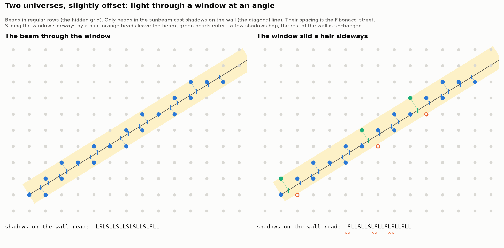

# Explainers — the pictures that made the pennies drop

*Plain-words pictures, kept so they survive the gaps (lost chats, tired days, new instances).
No claims or checks here; the results live in the study folders.*

## 1. Two universes, slightly offset: light through a window

*(Katie's picture, 2026-09-25: "light coming through a window at an angle".)*

- **The room.** Beads hang in perfectly regular rows: the hidden grid, boring and repeating.
- **The window.** Sunlight comes through at an awkward angle (the golden slant), so the beam
  never lines up with the rows.
- **The wall.** Only beads caught in the beam cast shadows. The shadows' spacing, long and
  short, is the Fibonacci street. The awkward angle is why it never repeats.
- **The offset.** Slide the window a hair **sideways, across the beam**. A few beads at the
  beam's edge go dark and neighbours light up. On the wall a few shadows **hop**, and a
  "long-short" becomes "short-long". Everything else is unchanged. That is a **sibling
  universe**: same beads, same light, same local look, different in scattered spots.
- **Why "hidden".** The window moved in a direction the wall cannot show. Someone living on the
  wall sees shadows hop but can never see why; the cause is in the room. There are infinitely
  many window positions, so infinitely many siblings.
- **In 2-D (Penrose)** it is the same scene with more dimensions: a 5-D bead grid, a
  pentagon-shaped window, a flat wall. Sliding the window flips little hexagons of three tiles.

## 2. Roads and cracks

- A **ribbon (road)** is part of the tiling: a chain of tiles joined through parallel edges,
  the shadow of one straight line of the hidden grid. The whole tiling is woven from five
  families of roads.
- A **ribbon walker** is a traveller staying on one road (momentum).
- A **phason flip** is three tiles in a little hexagon swapping to their other legal
  arrangement.
- A **seam** is where two sibling universes disagree: a chain of flips that **runs along a
  road**. So: a road, and sometimes a crack running along it. Measured in
  [`../laying_the_tiling/`](../laying_the_tiling/): the differing regions are thin bands
  11–12× longer than wide, exactly along road directions.

## 3. Building with no map

- **The pre-built town.** Early studies grew through a tiling that already existed, which is
  why seeds had nothing to teach.
- **Laying as you go** (Wallace and Gromit). Look only nearby and you make a mistake or have to
  guess. Copy your same-size twin and you lock into repetition ("1, 1, 1 forever"). **Ask your
  zoomed-out self** ("what does the bigger version of me say goes here?") and the quasicrystal
  builds itself, with nothing brought in from outside.
- **Why the zoomed-out self works.** It builds the one sibling whose window is **perfectly
  centred**, the one that looks the same at every zoom.
- **Mistakes are carried, not erased.** A wrong start stays as a scar or grows with the
  structure.

## 4. "Every process is local in *some* space"

*(From the cheese-wheel chat.)* Cheese ripens by touch: local in ordinary space. A tuning fork
sets off a glass across the room with the same pitch: local in pitch-space, which here is the
hidden window, where twins live. A seed crystal passes on a *shape*: local in shape-space.
Laying the quasicrystal turned out to be local in **scale-space**: small me listens to big me.
"Far away" just means "near in a different space".
