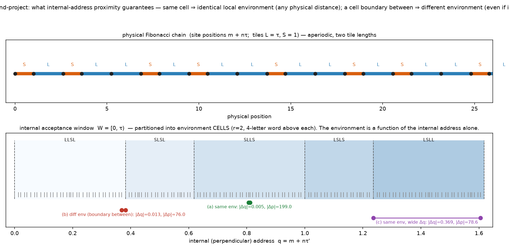

# What perpendicular-address similarity actually guarantees (Fibonacci cut-and-project)

*Register: speculative exploration; **a small static geometric analysis with exact
algebra**, no dynamics. Isolated under
`exploratory/accretion_pilot/fibonacci_address_environment/`; all prior studies preserved
(GRAFT paused). No new dynamics, cosmological identification, or parameter sweep. Checks in
`fibonacci_cutproject.py` use exact Z[τ] comparisons, `assert`s, and a **nonzero exit** on
failure. Framing reference: Baake–Gähler–Mazáč, arXiv:2311.05387.*

## Question

For physically separated sites, how does **internal-coordinate (perpendicular-address)
proximity** relate to **agreement of their local physical environments**?

## 1. Existing work — checked first

The repository's substrate work (`v9`–`v11`) is a **2-D de Bruijn pentagrid** (Penrose)
built directly via strip indices; it computes **no** per-site internal/perpendicular
coordinate and has **no** acceptance-window↔local-patch analysis. The only "Fibonacci"
mentions are a **deferred, never-implemented 2-D periodic-approximant control**. So this
exact 1-D address↔environment question is **not** answered anywhere in the repo. We proceed
with the bounded construction below.

## 2. The Fibonacci model set (stated exactly)

- Golden ratio `τ = (1+√5)/2`; Galois conjugate (star) `τ' = 1−τ = (1−√5)/2`.
- Address lattice: `Z[τ] = { m + nτ : m,n ∈ Z }`.
- **Physical projection** `π∥(m,n) = m + nτ` (position on the line).
- **Internal projection** `π⊥(m,n) = m + nτ'` — the perpendicular address, equivalently the
  star map `(m+nτ)⋆ = m + nτ'`.
- **Acceptance window** `W = [0, τ)` — **half-open, left-closed/right-open** (the endpoint
  convention); `|W| = τ`.
- **Model set** `Λ = { m+nτ : (m,n) ∈ Z², π⊥(m,n) ∈ W }`.
- **Length normalisation:** consecutive positions differ by exactly `τ` (long tile **L**) or
  exactly `1` (short tile **S**). So `L = τ`, `S = 1`.

**Validation against the Fibonacci pattern** (151-site chain, exact):
every gap is exactly `τ` or `1`; **no `SS`** (short tiles isolated), **no `LLL`** (long runs
of 1–2); `#L/#S = 92/58 ≈ 1.586 ≈ τ` (Fibonacci letter frequency). ✔

## 3. The environment (defined before comparing)

The **environment** `E_r(x)` of a site `x` is the ordered L/S word of the `r` tiles on each
side: `E_r = (g_{i−r}, …, g_{i−1}; g_i, …, g_{i+r−1})`, a **2r-letter** word. We use **r = 2**
(4 letters) and **r = 5** (10 letters). Sites whose full neighbourhood is unavailable
(within `r` of a chain end) are **excluded**.

## 4. Internal-window regions ⇒ environment (derived, then checked)

The environment is governed by two **interval-exchange return maps** on `W`:
- forward `f`: from `q`, next gap is `S` and `q ← q+1` if `q < τ−1`, else `L` and `q ← q+τ'`;
- backward `b`: previous gap is `L` and `q ← q−τ'` if `q < 1`, else `S` and `q ← q−1`.

`E_r(x)` is therefore a **function of the internal coordinate `q = π⊥(x)` alone** (iterate
`f` and `b` `r` times). The window splits into **environment cells** whose boundaries are the
exact preimages of the split points `τ−1` (forward) and `1` (backward). We **derive** them
(not fit a classifier):

- **r = 2:** four interior boundaries, all exact points of `Z[τ] ∩ (0,τ)` —
  `2−τ ≈ 0.382`, `τ−1 ≈ 0.618`, `1`, `2τ−2 ≈ 1.236` — giving **5 cells** with environments
  `LLSL, SLSL, SLLS, LSLS, LSLL`.
- **r = 5:** **11 cells**.

**Checked exactly (exit 0):** for every non-truncated site, the environment **predicted from
`q` alone equals the environment read off the generated chain**; **each cell carries exactly
one** environment; **distinct cells carry distinct** environments. This is the
window-region ↔ local-patch correspondence, made concrete.



## 5. Three concrete examples (r = 2; exact separations)

| # | claim | `|Δq|` (internal) | `|Δp|` (physical) | environments |
|---|---|---|---|---|
| **(a)** | distant sites, **close** internal address, **identical** environment | **0.005025** | **199.005** | both `SLLS` |
| **(b)** | **close** internal address, **different** environment (a boundary lies between) | **0.013156** | 76.013 | `LLSL` vs `SLSL` — boundary at `q = 2−τ ≈ 0.382` sits between them |
| **(c)** | **same** environment despite a **noticeably different** internal address | **0.368810** | 78.631 | both `LSLL`; `|Δq|` is bounded by the **cell width** `≈ 0.382` |

All three exist. (a) and (c) come from the same-environment relation; (b) straddles a derived
cell boundary. The physical separations are large and unrelated to the internal ones.

## 6. Short answer — what the similarity does and does not guarantee

**Exact implications (algebraic, hold for the whole model set):**

- The local environment is a **function of the internal address**: `E_r = Φ_r(q)`, where
  `Φ_r` is **constant on each window cell**. Two sites in the **same cell** have **identical**
  environments — **at any physical separation whatsoever** (example a). Physical distance is
  irrelevant to environment agreement; the correspondence is purely address→environment.
- The correspondence has a **finite resolution = the cell width**. Internal proximity
  guarantees environment agreement **only within a cell**. Two addresses arbitrarily close but
  on **opposite sides of a cell boundary** have **different** environments (example b). So
  "closer internal address ⇒ more similar environment" is **conditional on staying inside one
  cell — it is not an unconditional continuity statement.**
- **Converse:** sharing an environment `⇒` sharing a cell `⇒` internal addresses lie **within
  one cell width** of each other — bounded, but **not arbitrarily tight** (example c). Same
  environment does *not* force near-equal addresses; it forces same-cell.
- Larger `r` (bigger environments) `⇒` **finer** cells (5 → 11 → …), so the address predicts
  ever-larger patches at ever-finer address resolution — the standard cut-and-project
  local-derivability.

**Finite-example caveats (not exact):** the specific pairs above are from a 151-site chain;
a longer chain yields example-(a) pairs with even smaller `|Δq|` at even larger `|Δp|`, and
example-(c) pairs approaching the exact cell width. The **cell structure** is exact; the
**particular separations** are finite illustrations.

**Out of scope (explicitly not claimed):** this is **geometry only**. Nothing here implies
interaction, transmission, entanglement, or any dynamical advantage between internally-close
sites. Two sites with identical environments are related by a coincidence of *addresses*, not
by any physical coupling; they may be arbitrarily far apart and never "communicate." The
guarantee is: **the acceptance-window address determines the local pattern, up to the cell
resolution — and nothing more.**

## Files

- [`fibonacci_cutproject.py`](fibonacci_cutproject.py) — exact model set, validation,
  derived window cells, predicted==actual check, the three examples; asserts + nonzero exit.
- `results/fib_report.txt`; `figures/fibonacci_address_environment.png`.

## Reproduce

```bash
python3 fibonacci_cutproject.py   # exact; exit 0 iff all checks pass
python3 make_figure.py            # writes the diagram
```
