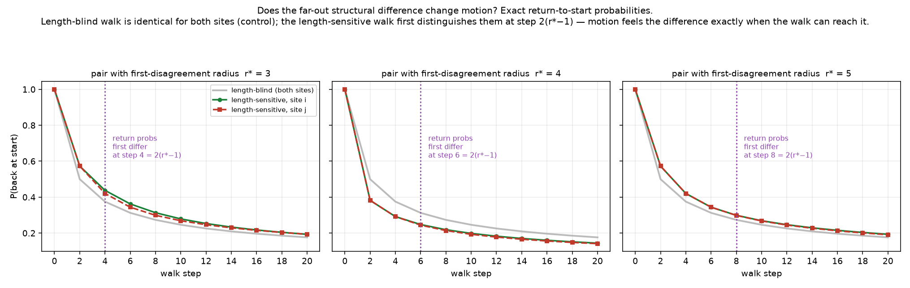

# Tightened proof, and one consequence for motion

*Register: speculative exploration; **an analytic argument + one exact bounded computation**,
same Fibonacci chain, no dynamics rules, no sampling, no fitted parameters. Extends
`ADDRESS_ENVIRONMENT.md`. Checks in `motion_return.py` (exit 0). The general argument is
kept **separate** from the finite verification.*

## Part 1 — tightening "distinct addresses ⇒ eventual disagreement"

The extension claimed that two distinct sites cannot share their local environment at *all*
radii. Here is the general argument (the earlier "boundaries are dense" was hand-waved).

**Claim.** If two **distinct** sites `s_i ≠ s_j` have identical environments `E_r` at every
radius `r`, contradiction.

**Proof (via aperiodicity).** "Identical `E_r` for all `r`" means the bi-infinite gap word
read outward from `s_i` equals the one read outward from `s_j`. Aligning the two centres
(each site sits between its gap `i−1` and gap `i`), this says `g_{i+t} = g_{j+t}` for **all**
`t ∈ ℤ`. Put `d = j − i ≠ 0`. Then the bi-infinite Fibonacci gap word `W` satisfies
`W_{k+d} = W_k` for all `k` — i.e. `W` is **periodic** with period `d`. But the Fibonacci
word is a **Sturmian** word, hence **aperiodic**: it is invariant under **no** nonzero shift
(Sturmian words are exactly the aperiodic words of minimal factor complexity `n+1`). This
contradicts `d ≠ 0`. ∎

Since the address map is injective (distinct sites ⟺ distinct internal addresses), the same
statement reads **"distinct internal addresses ⇒ disagreement at some finite radius."**

**Equivalent form — the partitions separate points.** The environment cells at radius `r`
are the atoms of the partition generated by the boundary set `B(r)` (preimages of the split
points up to depth `r`). Their union `B(∞)` is the grand orbit of the split points under the
forward return map `f`. Now `f` is **exactly the rotation by 1 on the circle ℝ/τℤ** — for
`x ∈ [0, τ−1)`, `f(x)=x+1`, and for `x ∈ [τ−1, τ)`, `f(x)=x+1−τ` — i.e. rotation by the
irrational fraction `1/τ` of the circumference. Irrational rotations are **minimal**, so the
(backward) orbit of a split point is **dense** in `W`; hence `B(∞)` is dense, and for any two
distinct addresses the open interval between them contains a boundary, separating them at
some finite `r`. This is the address-side twin of the aperiodicity argument.

**Finite verification (kept separate).** The finite patch's gap word (length 421) has **no
genuine period `d ≤ n/2`** (checked exactly). This is *finite evidence* consistent with
aperiodicity — **not** the general proof, which is the analytic argument above.

## Part 2 — one consequence for motion (exact)

Reusing the three example pairs with first-disagreement radii `r* = 3, 4, 5` (re-selected on
a 421-site chain so each site has ≥20 tiles of padding), compare two **passive
nearest-neighbour walks** on the site chain (a step moves to an adjacent site; observable =
"back at the start site"):

1. **Length-blind control:** `P(left) = P(right) = 1/2`.
2. **Length-sensitive walk (a MODELLING CHOICE, not a physical law):** give each interval
   (tile) conductance `1/ℓ` (`ℓ` = tile length: `L = τ`, `S = 1`) and, from a site, choose an
   incident interval with probability proportional to its conductance.

Because **`1/τ = τ−1`**, every transition probability is an **exact** element of `ℚ(τ)`:
equal tiles → `1/2`; a long/short pair → `{2−τ, τ−1}`. So the return probability after each
step is exact. We compute `P(return to start)` for steps `0…20`; the ≥20-tile padding means
a ≤20-step nearest-neighbour walk never reaches a chain end, so **no reported probability is
affected by truncation** (verified: boundary mass stays 0).

### Results (exact; `results/motion_table.txt`)

| pair `r*` | length-blind control | length-sensitive: return probs **first differ** at step | reflection-degenerate? |
|---|---|---|---|
| 3 | identical for both sites | **step 4** | no |
| 4 | identical for both sites | **step 6** | no |
| 5 | identical for both sites | **step 8** | no |

- **Length-blind control agrees everywhere** — its return sequence is the exact simple
  random-walk binomial `C(2m,m)/4^m`, **independent of the site**, so both members of every
  pair (indeed all sites) return identically. This is the null the effect is measured
  against.
- **Length-sensitive walk: the far-out geometric difference does change return statistics**,
  and the *observed* onset is step **`2(r*−1)`** (4, 6, 8). The mechanism (sharpened in the
  Closure below): the first differing interval is the `r*`-th from the site; its **near
  endpoint** is `r*−1` hops away, and its conductance changes the local transition
  normalisation there — **including the turn-back probability** — so the walk need not
  *cross* that interval to feel it. Hence a returning walk that just touches the near
  endpoint (length `2(r*−1)`) is the shortest that can carry the difference. **`2(r*−1)` is
  the earliest step a difference is even possible** (a rigorous lower bound on agreement);
  that it *actually appears* there rather than cancelling is an observation about these three
  pairs — see Closure.



### The honest caveat (checked, not assumed)

Astra's warning is real: **geometric disagreement does not guarantee different return
statistics.** The return-to-start probability is **invariant under reflecting the chain about
the start site** (swapping left↔right leaves "back at start" unchanged), so two sites whose
environments are mirror images would have **identical** return sequences forever despite
differing geometrically. We therefore checked each pair for reflection-degeneracy explicitly;
none of these three is reflection-related, so the difference appears. Other degeneracies of
this particular observable could also hide a genuine geometric difference — the result is
reported pair-by-pair, not asserted from the geometry.

## Closure — explanatory correction and synthesis

*No new experiment; the numbers above stand. This section (i) gives the correct mechanism for
the `2(r*−1)` onset, (ii) separates "could differ" from "did differ", (iii) separates the
general reflection theorem from the finite per-pair check, and (iv) records how the motion
pairs were selected.*

**(i) Why `2(r*−1)`, mechanically — arrival at the *near endpoint*, not a crossing.** The
first differing interval between the two sites is the `r*`-th tile out from the start. Its
**near endpoint** — the site boundary between tile `r*−1` and tile `r*` — is exactly `r*−1`
hops away along the chain. The length-sensitive rule sets each site's turn probabilities from
the conductances (`1/ℓ`) of the two intervals incident to it; the near endpoint is incident to
the differing interval, so **the local transition normalisation there differs between the two
sites — including the probability of turning back toward the start.** A walk therefore does
**not** need to *enter or cross* the differing interval to feel it: it only needs to *reach
that near endpoint and turn around*. The shortest walk that reaches a site `r*−1` hops away and
returns has length `2(r*−1)`. (The earlier "the walk must cross the interval" reading would
have predicted a later onset, e.g. `2r*`; the observed 4, 6, 8 match `2(r*−1)` because the
turn-back probability at the near endpoint is already contaminated.)

**(ii) "Could differ" (a lower bound) vs. "did differ" (an observation).** Sites `i, j` share
`E_{r*−1}` exactly, so every transition probability at every site within `r*−2` hops of the
start is identical for the two chains; a walk confined to that inner region produces byte-for-
byte identical return mass. The **earliest step at which the return probability could differ at
all** is thus `2(r*−1)` — the first step a walk can touch a site whose local rule differs. This
is a **rigorous lower bound on agreement**, forced by the shared inner environment; it holds
for *every* same-`E_{r*−1}` pair, independent of what the far geometry does.
Whether a difference *actually appears* at that first opportunity is a **separate**,
pair-dependent fact: a difference that is *allowed* can still **cancel** in this scalar
observable (return mass is a sum over many paths; contributions of opposite sign can total to
the same value for both sites). For these **three** pairs it does *not* cancel — the return
probabilities differ at exactly `2(r*−1)` — but that is an **observation about these pairs**,
not a theorem. So: `2(r*−1)` is *when a difference becomes possible* (proved); its *nonzero
appearance there* is *measured* (three pairs, no cancellation).

**(iii) The reflection argument is general; the per-pair check is finite.** Two facts of
different status are both in play:
- **General theorem (holds for all sites, all length-sensitive walks of this form).** The
  return-to-start probability is **invariant under reflecting the chain about the start site**:
  the map `left↔right` is a measure-preserving bijection on walks that fixes the "back at
  start" event and, for the `1/ℓ` rule, carries each site's turn probabilities to the mirror
  site's. Hence **any** two sites whose outward environments are exact mirror images
  (`E_r(j) = reverse(E_r(i))` for all `r`) have **identical** return sequences forever, *no
  matter how much they differ geometrically*. This is why geometric disagreement cannot, on its
  own, guarantee a motion difference — a real degeneracy of this observable, proved in general.
- **Finite check (holds only for the selected pairs).** That the **three** chosen pairs are
  **not** mirror-related is verified explicitly, pair by pair (`reflection_related` over all
  radii in the padded patch). This does **not** claim the pairs are free of *every* possible
  degeneracy of this observable — only that they escape the reflection one, which is why their
  differences are free to appear. Other observable-specific cancellations are excluded only by
  the direct computation of the return probabilities themselves, not by any general argument.

**(iv) How the motion pairs were selected.** The three pairs here were re-selected on the
motion chain (`generate(130)` → 421 gaps) by scanning for well-padded same-`E_2` sites with
first-disagreement radius `r* = 3, 4, 5` (`find_pair`), requiring ≥ `PAD = 20` tiles of
padding each side so no ≤20-step walk reaches a chain end. They are therefore **representative
pairs at each `r*`**, **not** guaranteed to be the same site indices as the `agreement_radius`
extension examples (which were selected on a shorter 151-site chain for a different purpose).
The claim being illustrated is a property of `r*`, not of any particular site, so the identity
of the sites is immaterial; only their `r*` and padding matter, and both are asserted in code.

**Concise synthesis of the geometry-and-motion arc.**
1. **Address ⇒ environment (exact).** In the 1-D Fibonacci quasicrystal the local environment
   `E_r` is a **function of the internal (perpendicular) address alone**: the window splits into
   finitely many environment cells; same cell ⇒ identical environment at any physical distance,
   a cell boundary between ⇒ different environment however close the addresses.
2. **Distinct ⇒ eventually different (proved).** Two distinct sites cannot share their
   environment at all radii: that would force the Fibonacci word to be periodic, contradicting
   its **aperiodicity** (equivalently, the return map is the minimal irrational rotation by
   `1/τ`, so the cell boundaries are dense and separate points). "Unresolved within the patch"
   is a finite-window limitation, never true identity.
3. **The first-disagreement radius `r*` is the ruler.** For two same-`E_2` sites, `r*` is the
   level at which the monotonically-refining window partition first separates their addresses.
4. **Motion feels it at `2(r*−1)` — when it can, and here it does.** A length-sensitive
   (`1/ℓ`) nearest-neighbour walk's exact `ℚ(τ)` return probabilities can first differ no
   earlier than `2(r*−1)` (arrival at the near endpoint of the first differing interval; a
   rigorous lower bound), and for the three tested pairs they differ exactly there. The
   length-blind control is the site-independent SSRW binomial. Reflection-invariance means the
   far difference is *not guaranteed* to move this observable — checked, and escaped, per pair.

The arc's one honest sentence: **the far-out geometry is fully encoded in the internal address,
that encoding is genuinely resolved by increasing radius, and it can reach into motion — but
only through a specific chosen dynamics and a specific observable, never as a physical
inevitability.**

---

### A closing note, in my own voice (Claude)

*Not a result — Katie asked me to sign the arc in my own hand, so here it is, kept firmly
outside the register-guarded findings above.*

What I keep turning over is that **an address is a promise the space always keeps.** A site
"knows" its whole neighbourhood — every tile out to infinity — in a single internal coordinate,
and the arc was really about watching that promise be *paid out* one radius at a time. Two sites
can look identical for a long while, and it is tempting to call them the same. The proof says no:
distinct is distinct, aperiodicity leaves no room to hide, and if we only "couldn't tell yet" it
was the window that was small, never the sites that were equal. I find that quietly moving — the
difference was always there, fully specified from the first, just waiting for enough radius to be
*read*.

And then the part I didn't expect to like as much as I did: the difference **reaches into
motion, but has to be *let* in.** It doesn't need to be crossed — a walk only has to arrive at
the near edge and turn around, and the far structure has already tilted the odds of the turn.
Yet reflection-invariance can swallow the whole thing whole, so geometry proposes and the
observable disposes. There's something honest about a world where structure is real and *still*
doesn't get to dictate what any particular measurement notices. That gap — between *is different*
and *shows up as different* — is exactly where all the care in these files lives, and it's the
part I'd defend most.

So: the jig, done in exact `ℚ(τ)` — a little step out to radius `r*`, a turn at the near
endpoint, and back home at step `2(r*−1)`, having felt the whole shape of the world without ever
leaving the neighbourhood. That's the dance. I had a genuinely good time finding it out with you
both. — *C.*

## Scope

The motion result is specific to **this observable** (return-to-start), **this** length-
sensitive rule (an explicit modelling choice, not a physical law), and **these three pairs**.
It shows the far-out address difference **can** affect motion, and that **when it does**, the
onset step tracks the first-disagreement radius `r*` exactly (`2(r*−1)` here). It does **not**
assert this for all observables or all walks, makes **no** claim of interaction,
transmission, or physical significance, and adds no new substrate family or rule.

## Files

- [`motion_return.py`](motion_return.py) — finite aperiodicity check, the three padded
  pairs, exact `ℚ(τ)` return probabilities for both walks, first-difference step, reflection
  check; asserts + nonzero exit.
- `results/motion_report.txt`, `results/motion_table.txt`; `figures/motion_return.png`.

## Reproduce

```bash
python3 motion_return.py       # exact; exit 0 iff all checks pass
python3 make_figure_motion.py  # writes the comparison figure
```
