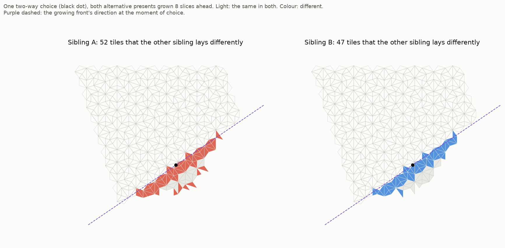

# Fragility: what can a choice un-make?

*A pre-registered study. The pre-registration was committed before any code:
[`PREREGISTRATION.md`](PREREGISTRATION.md).*

**Katie's question (2026-10-08).** *"Once, I was a piece of stuff that got remade over many slices.
Now I find I cannot be remade in the next slice of now... Nothing is ever gone, but it will no longer
be reconstructed."*

What could stop something being re-made? In our worlds, forced moves re-make things without fail.
The only place re-making can go another way is at a **two-way choice**. So this study maps what a
single choice un-makes.

**The method.**

- 12 ordinary worlds (1,500 half-tiles, patient scheduler).
- At every choice, grow **both** alternative presents (siblings) 8 slices ahead with forced moves
  only, and compare them.

## Scorecard

| | prediction | result | |
|---|---|---|---|
| F0 | every choice has exactly 2 options, both legal | 14/14 distinct choices | ✅ PASS |
| F1 | a choice un-makes a **line**, not a blob (length ≥ 3× width in ≥ 70%) | **13/14** (ratios 4.6–8.9; one 2.5) | ✅ HELD |
| F2 | ("what") corner types with more flip sites are more fragile | only 3 types had enough exposures; ρ = 0.00 | ❌ FAILED (essentially untestable) |
| F3 | ("where") ≥ 80% of changed corners lie within 1.5 edges of the front line, in ≥ 70% | **11/14** (shares 0.85–0.91; three at 0.65–0.70) | ✅ HELD |
| F4 | where beats what (η² by distance band > η² by type) | **0.81 vs 0.09** | ✅ HELD |

*One choice (black dot), both alternative presents 8 slices later ([`make_figure.py`](make_figure.py),
exploratory).*

## What it means (plainly)

- **A choice is not a local event. It decides a whole strip lying *along the now*.**
  - Within 8 slices, the two alternative presents differ in 28–89 tiles.
  - Those tiles form a long, thin strip (4.6–8.9 times longer than wide), running within 2–11° of the
    direction of the growing front.
  - The strip reaches out **both ways** from the choice point, like a zipper along the present. This
    fits the earlier finding that news runs along the now about 3 times faster than the front
    advances (`../speed_of_light/`).
  - Off the strip, both presents are **identical**.
- **No dead ends.** Neither sibling ever jammed (0 of 14). Both options always carry on. The
  knife-edge is perfectly balanced: a choice never destroys the possibility of going on, it only
  decides *which* present continues.
- **Where, not what.** What gets un-made is fixed by **where** a place is (on the strip being
  decided), not by **what kind** of corner it is. Distance from the front line explains 81% of it;
  corner type explains 9%. This is the same rule as in `../window_cells/`.
  - Caveat: most exposed corners lie on the strip itself (81% changed), which flatters the "where"
    side. The "what" side was weak in any case.
- **For Katie's decay question, this changes the picture.**
  - Un-making doesn't pick off individual things. It happens to **whole strips of the present at
    once**.
  - A thing stops being re-made if it lies across a strip whose way is being decided, and that
    strip's other version doesn't contain it.
  - So a persisting thing (a thread crossing slice after slice) would face a risk each time a
    decided strip crosses its path. Its "half-life" would be set by how often undecided strips
    cross it.
  - Choices came about every 34 slices (3–5 per world, at slices such as 2, 31, 72 and 114 in
    world 0). Whether those crossings come at memoryless, coin-toss-like intervals is the next
    question. It would decide whether anything here could have a true half-life.

## Limits

- Only **14 distinct choices**. The 12 worlds share most of their histories (48 choices in all).
- 8 slices of look-ahead. The strips may keep growing beyond that.
- "Un-made" compares two alternative presents at one choice. It is not yet a thing fading over time.
  Decay curves are the next study.
- F2 couldn't really be tested: only 3 corner types were exposed often enough.

## Files

- `fragility.py`: the study (`python3 fragility.py`)
- `make_figure.py`: the exploratory picture (`python3 make_figure.py [world] [nth choice]`)
- `results/fragility_report.txt`, `results/run.log`, `results/worlds.json`
- `figures/one_choice.png`
