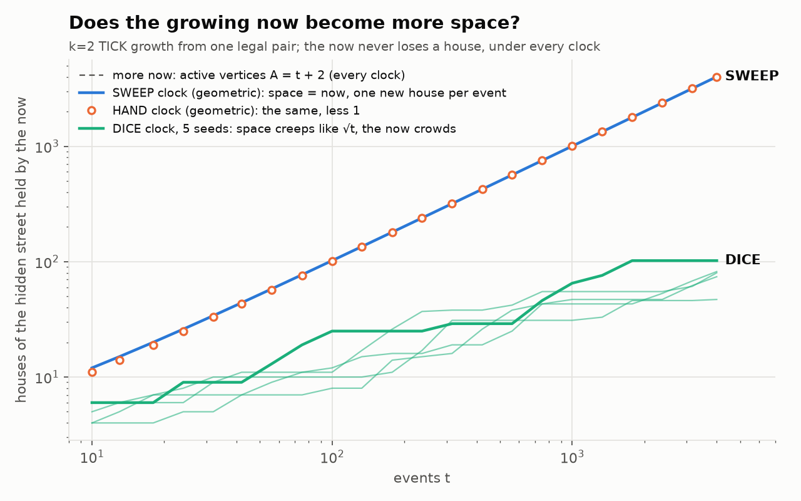

# Geometric clock — can the *when* come from the geometry, and can the *now* grow?

**Two bounded experiments on Katie's "more now" picture.** Isolated, with prior studies
preserved. It follows [`../tick_forward/`](../tick_forward/), where the TICK rule (a newborn's
hidden address is its parent's, stepped forward) made *what* the universe writes cost nothing,
but *when* still came from a dice-roll scheduler. The picture, in Katie's words, is in the
addendum to [`../../../THREE_COMMANDMENTS.md`](../../../THREE_COMMANDMENTS.md): the timing is
the geometry; the track is laid as it is ridden; a momentum-like falling forward into the next
slice of now; and "the embiggening is the spacetime".

**Street coordinates.** Every TICK address lies on one orbit of the window map, so every
postcode is a house number `j` on a single hidden street. The next house is `j+1`, the previous
house is `j−1`, and the tile type of each house is computed exactly.



## Part A: the clock (`k=1`, the collapsed universe of 20 lone pairs)

| clock | how the next event is chosen | random bits imported per event | whole-universe history: patterns of length 12 | fair? |
|---|---|---|---|---|
| DICE | weighted dice, then a coin: stutter or advance | **5.29** | 2,160 (noise) | yes, statistically |
| **SWEEP** | the pair whose postcode comes **next around the window**; it always falls forward | **0** | **24** | **exactly**: 199–201 advances each, and no two pairs ever share a house |
| HAND | a clock hand that is itself a TICK walker points at the circle | **0** | 13 | **no, it phase-locks** |

- **The when can come from the geometry.** SWEEP imports nothing: every choice is fixed by the
  hidden geometry. Each pair still writes the minimal never-repeating record, with `n+1`
  patterns of length `n`. The **whole universe's history** also never repeats, and its variety
  grows only *linearly*: `2n` patterns of length `n` up to `n=12`, and 145 at `n=40`, against
  thousands under the dice. That is ordered novelty, not noise, for the universe as a whole.
- **HAND phase-locks. This is a finding, and a first-draft fairness gate failed on it.** The hand
  steps exactly as the pair just ahead of it does, so after the first event the two co-rotate
  forever. One pair takes 3,999 of 4,000 events, and every other pair freezes. A clock that is
  itself one of the walkers captures a single lineage. That is a warning about resonance: a
  lock-in can starve everything else.

## Part B: embiggening (`k=2`, so the now can grow)

At `k=1` the audit's exact invariant, `ΔA = k−1 = 0`, means the now can never grow. It is a
fixed-size window sliding along the street, and only the past accretes. At `k=2` a bud sprouts
two tips. Under TICK the only choice that keeps every bond a legal tile without cloning is the
**keeper's next house and previous house**. Grow from one legal pair for 4,000 events:

| | SWEEP | HAND | DICE (5 seeds) |
|---|---|---|---|
| active vertices, the "more now" | `t+2` exactly | `t+2` exactly | `t+2` exactly |
| houses held, the space | **`t+2`: one new house every event** | `t+1` | 47–102 at `t=4000` |
| growth law of the space | `t^0.995` | `t^0.998` | `t^0.49` on average (0.40–0.61) |
| does the now ever lose a house? | never | never | never |
| one unbroken stretch of street? | always | always | always |

- **Nothing unbecomes, under every clock.** The depositor is always the keeper's next or
  previous house, so one of the two new tips re-creates its house. The set of houses held by the
  now never loses a member. This is structural (a one-line proof), not an accident. It is also
  checked at every event.
- **With a geometric clock, more now is exactly more space.** Under SWEEP each event claims a
  brand-new house: 4,002 vertices on 4,002 houses. None of the growth is wasted on crowding.
  "The embiggening *is* the spacetime" holds here, one for one.
- **With the dice, the now crowds.** It still grows by one vertex per event, but new houses appear
  only at the two ends of the stretch, so its extent creeps outward like `√t`, the way diffusion
  spreads. At `t=4000`, about 80 houses carry 4,000 vertices.

## Honest scope

- **One street, one dimension, one rule family.** "Expansion" here means the held stretch of a
  1-D hidden street growing linearly. It is an analogy to test further, not a cosmological claim.
- **Proven versus observed.**
  - Proven: "nothing unbecomes" and `A = t+2`.
  - Observed exactly for 4,000 events but **not proven**: SWEEP claiming a new house at every
    event, SWEEP's `2n` global complexity, and HAND's lock-in mechanism (argued, not proven in
    general).
  - Seeded Monte Carlo: the DICE `√t` law, with a heuristic argument only.
- **Choices.** SWEEP and HAND always fall forward: the keeper is the right-hand end. That is the
  "momentum" choice. Other deterministic geometric clocks exist, and these are two natural ones,
  not a search.

## Reproduce

```bash
python3 geometric_clock.py   # ~3 s; exit 0 iff all checks pass
python3 make_figure.py       # figures/embiggening.png
```
