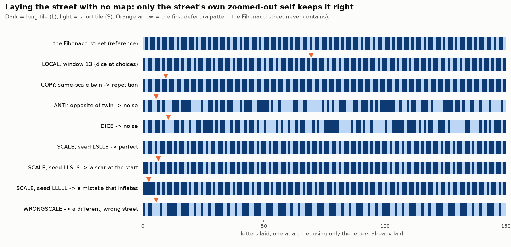

# Laying the street — a quasicrystal built letter by letter, with no map

**Wallace and Gromit: the track is laid as it is ridden.** Isolated, with prior studies
untouched.

**Why this study exists.** Every earlier growth study ran on a *pre-laid* tiling:
cut-and-project decides every tile in advance. That is why seeds had nothing to teach in
[`../seed_dynamics/`](../seed_dynamics/). Here the Fibonacci street is **laid letter by letter
using only the letters already laid.** There are no hidden addresses and no window: no peeking at
the map. The question: which kind of non-local likeness lets a quasicrystal build itself
correctly?



## Results (`laying_the_street.py`, exit 0; all 32 five-letter seeds, 3,000 letters each)

| rule for the next letter | what it builds |
|---|---|
| **LOCAL**: allow anything that keeps the last `k` letters a legal pattern | **always a defect eventually**, 20/20 runs for every `k` up to 21. A wider window only delays it (median first defect 10 → 17 → 23 → 49 → 104). 1-D theory requires this: local rules cannot force a quasicrystal. |
| **COPY**: same-scale twin (do what came next last time the lead-up looked like this) | **repetition from 32/32 seeds.** Resonant lock-in: `LSLLSLLSLL…`, `LLLLL…`, `LSLSLS…` |
| **ANTI**: the opposite of what the twin did | noise, with a defect almost at once |
| **DICE** | noise |
| **SCALE**: consult the street's own zoomed-out self (`L→LS, S→L`) | **never repeats, from every seed** (one seed stuck, see below); 2 seeds lay the **perfect** street; the rest carry their starting mistake as a scar or an inflating defect |
| **WRONGSCALE**: a zoom rule that isn't the street's own (`L→LSS`) | a different, wrong street, from the start |
| **DUSTSCALE**: the zoomed-out street read at a random place | noise |

**What SCALE does with a mistake in its starting letters.** It never *heals* it. It either:
- leaves a **scar**: the mistake stays at the start, and far from it the street is legal at every
  scale checked, up to patterns of 160 letters (14 seeds); or
- **inflates** it: the mistake is copied to ever larger scales, reappearing about 34, 144 and 377
  letters out (Fibonacci numbers), always legal at every scale smaller than the mistake's current
  size (15 seeds).

Either way, **nothing is lost and nothing repeats.** The one exception, `SSSSS`, gets **stuck**:
zooming out an all-short street never reaches past the present, so there is no self-similarity to
consult.

## In plain words

- **Same-scale likeness collapses into repetition.** Copying your lookalike is the resonant
  lock-in, the "1, 1, 1 forever".
- **Likeness across scales builds the quasicrystal.** When the street consults its own
  zoomed-out self, it lays a never-repeating, legal Fibonacci street forever, from its own past
  and a two-letter rule about itself. It is local in *scale-space*: every process is local in
  some space. "The thing tracks itself."
- **Mistakes are remembered, not erased.** A wrong start stays as a scar or grows with the
  structure. It is never forgotten, and it never takes over.

## Honest scope

- **The rule is the street's own.** SCALE knows the self-similarity `L→LS, S→L`. The claim is not
  that it *discovers* Fibonacci. The claim is that **a two-letter rule about itself, plus its
  own past, suffices where no local rule and no same-scale copying can.** WRONGSCALE and
  DUSTSCALE show it must be the street's *own* zoom, read at the *right* place.
- **v1 overclaimed healing.** It gated "the last defect is within 40 letters" and failed at 148.
  Widening the checking window showed the "healed" streets were scars or inflating defects that
  had simply outgrown the 40-letter check. The claim is now "never healed; scarred or inflated".
- **Legality is checked on patterns up to 40 letters** (160 for the scar/inflate
  classification), against a 4,855-letter reference street. One-dimensional only. 2-D Penrose
  (which has local matching rules but jams when grown locally) is the next step.

## Reproduce

```bash
python3 laying_the_street.py   # ~1.5 min; exit 0 iff all checks pass
python3 make_figure.py         # figures/barcodes.png
```
