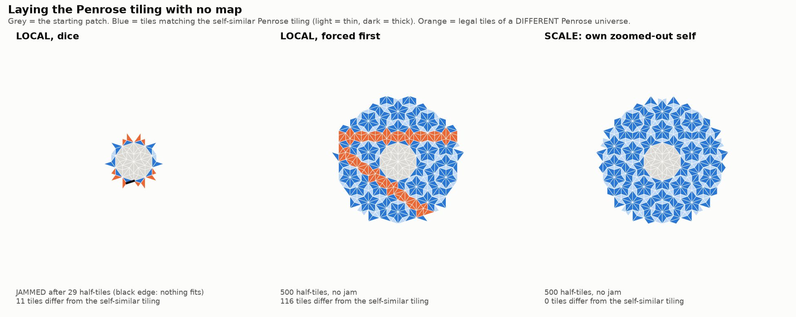

# Laying the tiling — Penrose laid half-tile by half-tile, with no map

**The 2-D sequel to [`../laying_the_street/`](../laying_the_street/).** Isolated, with prior
studies untouched.

The Penrose tiling is laid **one half-rhombus at a time**, always at the edge nearest the centre,
using **only the tiles already laid**. There is no cut-and-project map and no hidden window. From
a reference tiling we learn only its **atlas of vertex stars** (which corner-meetings are legal).
That atlas is exactly the **8 classic Penrose vertex types**. A tile is legal if it doesn't
overlap anything and every corner it touches is part of an atlas star. Checked: re-laying
4,570 genuine Penrose tiles in order, the legality test rejects none.



## Results (`laying_the_tiling.py`, exit 0)

| how the next tile is chosen | outcome |
|---|---|
| **LOCAL, dice**: any legal tile at the nearest edge | **jams in 30/30 runs** (median after 14 half-tiles, longest 249): an edge where nothing fits |
| **LOCAL, forced first**: place a tile where exactly one fits; otherwise guess | **never jams** (30/30 reach 500 half-tiles), with **3–4 guesses per run**, but builds a **different Penrose universe** every time (never exactly the self-similar tiling; 79–100% agreement) |
| **COPY**: same-scale twin (copy what's across a matching laid edge) | lays an **illegal** tile after 14 |
| **SCALE**: the patch consults its own zoomed-out self (τ², mirrored; verified exact) | **500 half-tiles, no jam, zero guesses, 100% the self-similar tiling** |
| WRONG-SCALE: one zoom step, not the tiling's own symmetry | proposes nothing |
| SCALE from 12 **off-centre** starting patches | proposes nothing, every time |

## In plain words

- **Pure local fitting jams**, just as the 1988 physics found (Onoda, Steinhardt, DiVincenzo and
  Socolar).
- **Not predicted: in 2-D a *smarter* local strategy does not jam**, at least to 500 tiles, unlike
  1-D, where no local rule can work. But it has to **guess** a few times. Each guess **chooses
  which Penrose universe gets built**, and the guesses are imported randomness.
- **Consulting its own zoomed-out self builds the tiling exactly, with no guesses.** It imports
  nothing: commandment 2. The same lesson as 1-D: likeness **across scales** lays the
  quasicrystal, while same-scale copying fails.
- **Where two universes differ, they differ along bands** (orange in the picture). The bands have
  the shape of the ribbons of [`../least_resistance_paths/`](../least_resistance_paths/). This
  matches known theory (Penrose tilings differ by flips along Conway worms), but here it is
  **seen, not tested**.

## Honest scope

- **SCALE is strict in 2-D.** It works only from a patch that is genuinely self-similar about the
  growth centre. Off-centre starts give it nothing to read. That is stricter than 1-D, where
  misaligned starts still grew (with scars or inflating defects).
- **WRONG-SCALE's failure is trivial**: one zoom step lines up no edges at all. A sharper wrong
  zoom control would be worth adding.
- **Sizes.** 500 half-tiles per run and 30 runs per local rule. Forced growth might meet a jam
  beyond 500; the literature says forced growth from ordinary seeds can eventually need guesses
  that go wrong.
- **Numerical tolerance.** Geometry is floating point with a 10⁻⁶ tolerance. Legality is checked
  combinatorially against the learned atlas.

## Reproduce

```bash
python3 laying_the_tiling.py   # ~4.5 min; exit 0 iff all checks pass
python3 make_figure.py         # figures/patches.png
```
