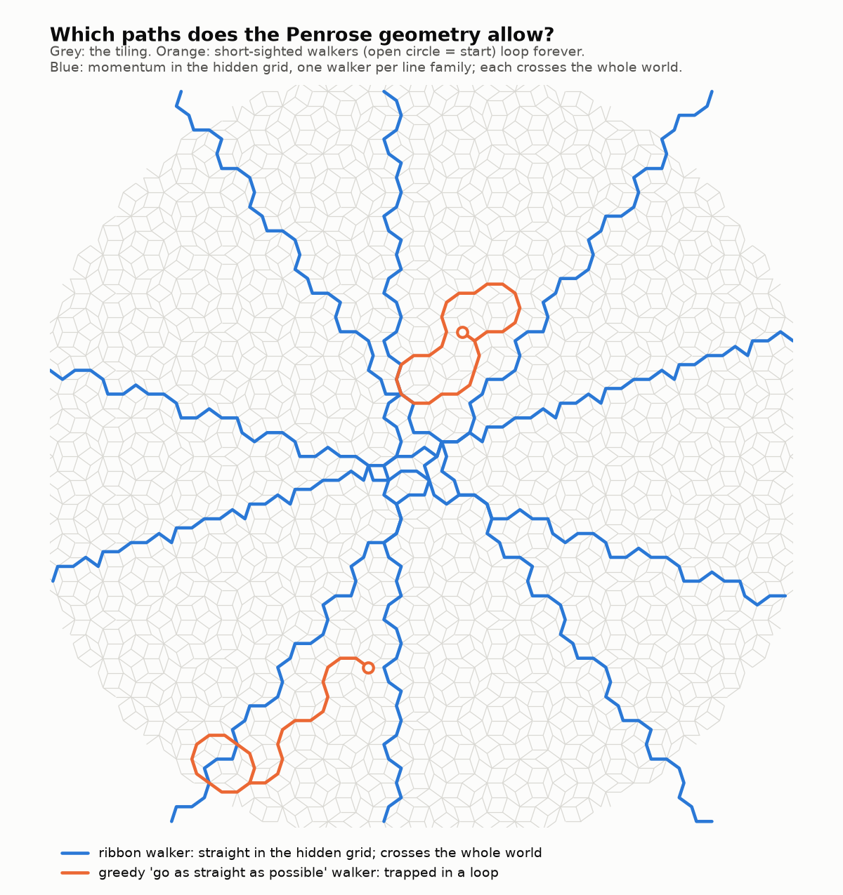

# Least-resistance paths — what the Penrose geometry allows, and where momentum takes you

**Katie and Gemini's question:** is there a path of least resistance, and does the geometry
dictate it? What does the projection allow? And if there is a momentum-like bias, does it feed
toward one path when there is more than one?

It is isolated, with prior studies untouched. It reuses the exact integer pentagrid of
[`../penrose_address_environment/`](../penrose_address_environment/): every vertex is a
`K ∈ ℤ⁵`, so every step is an exact unit step.



## Results (`paths.py`, exit 0; patch radius 70, 18,906 vertices)

**A. What the projection allows.**
- Only **3 to 7 of the 10** step directions exist at any vertex.
- Every world step along `eⱼ` is also a hidden step along `e₂ⱼ` (the twist) and moves the
  layer by ±1. So every move in the world is also a move inside the bounded hidden window.

**B. Straight-line momentum is almost forbidden.**
- Of 65,580 directed steps, the same step can be repeated just **7.3%** of the time.
- It is **never repeated three times in a row.**
- The bounded window forces constant turning.

**C. Greedy "least resistance" traps you.** From 300 random starts, two short-sighted walkers
were tried:

| walker | rule | fate | how far it gets |
|---|---|---|---|
| STRAIGHT | take the step most aligned with the last one | **300 / 300 trapped in loops**, of period 12, 14, 16 or 26, after a median of 24 steps | ≤ 18 from the start |
| CENTRAL | take the step landing most centrally in the hidden window | **300 / 300 trapped** in 2-step bounces | ≤ 2 |

Taking the easiest next step is not a path of least resistance. It is a trap.

**D. Momentum in the hidden grid always works.**
- **The rule.** The tiling is built from five families of *straight* lines. A **ribbon walker**
  keeps one grid coordinate `Kⱼ` exactly fixed and always steps forward along its line family.
- **It always crosses.** All **4,500 / 4,500** walks crossed to the edge of the world (300
  starts × 5 families × 3 choice rules). None got stuck, none revisited a vertex, and they gain
  about 0.81 units along the line per step. They are wiggly in the world and straight in hidden
  space.
- **There is a menu.** Each step offers 1–3 ways forward: `{1: 150,787, 2: 147,397, 3: 57,475}`.
  On **58%** of steps there is more than one way forward.
- **The bias picks the route.** "Most forward" and "least forward" choices take **different
  routes in 1,500 / 1,500** walks, yet all of them cross.

## Answering the question

- **Does the geometry dictate the path of least resistance?** It dictates the **menu**: which
  steps exist, and a set of **five families of straight roads through hidden space**, the
  ribbons. Least resistance is **staying on a road**, not grabbing the easiest next step.
  Short-sightedness traps. Commandment 3 at work: we tried what we expected, the thing pushed
  back, and that told us what it is.
- **What does the projection allow?** Only steps that keep your hidden postcode inside the
  window. So straight motion in the world is impossible, but straight motion in the hidden grid
  is always possible.
- **Does momentum feed toward one path when there is more than one?** Yes, literally. On more
  than half of the steps the geometry offers 2–3 ways forward, and the momentum rule chooses
  among them. The road guarantees progress; the bias chooses the way.

## What this gives 2-D growth

It gives a principled meaning to "the next house" on a 2-D hidden window: **the next vertex
along the ribbon you are travelling.** It is effortless, because it is the grid's own straight
line. It never returns, because every step goes forward. It still leaves a choice at the forks.
That choice is where momentum, and perhaps later resonance, can act.

## Honest scope

- **Proven versus observed.** "Never revisits" is guaranteed: every step moves strictly forward
  along a straight line. "A forward step is always available" is observed on every one of 4,500
  walks, with a geometric reason (the band of vertices with fixed `Kⱼ` is crossed by every other
  line family), but it is **not proven** here.
- **Walker choice.** The two greedy walkers are two natural short-sighted rules, not a search
  over all of them. "Greedy traps" is shown for these two rules only.
- **Exact versus float.** Integer `K` steps and "`Kⱼ` fixed" are exact. The forward component
  and distances are floats, with a margin of `10⁻⁹`.

## Reproduce

```bash
python3 paths.py         # ~7 s; exit 0 iff all checks pass
python3 make_figure.py   # figures/paths.png
```
