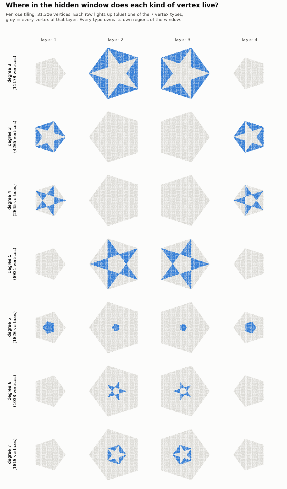
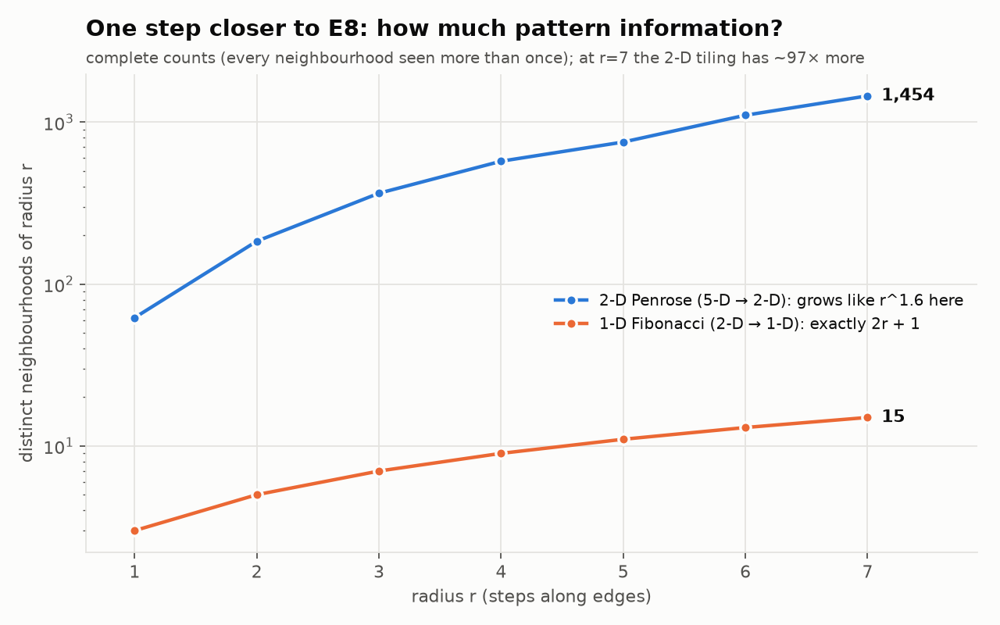

# Penrose address → environment — the Fibonacci foundation, one step closer to E8

**The foundation check before building anything on 2-D.** Isolated, and prior studies are
untouched. This includes v10's pentagrid code: we rebuilt the generator here so it keeps each
vertex's integer identity.

**Where this sits.** The Fibonacci chain ([`../fibonacci_address_environment/`](../fibonacci_address_environment/))
is the smallest member of the cut-and-project family: a 2-D grid projected to 1-D, with the
golden ratio `τ`. The Penrose tiling is the next member: a 5-D grid projected to 2-D, with the
**same `τ`**. E8's famous 4-D quasicrystal, reached via H4, is built on that same number field.
So this is a step along E8's own family line. Before letting anything grow on Penrose, we
re-establish the two foundations that everything in 1-D rested on.

## Construction (exact)

This uses the de Bruijn pentagrid with v10's Penrose offsets. **Every vertex is an integer
vector `K ∈ ℤ⁵`**, and all positions come from it:

- physical position `Σ Kⱼ eⱼ`;
- hidden address `Σ Kⱼ e₂ⱼ`, the same 5-D point seen through the "twisted" projection (the 2-D
  version of the Fibonacci postcode);
- layer `Σ Kⱼ`.

A radius-`r` neighbourhood is the exact set of integer offsets of the vertices and edges within
`r` steps, so no floats are involved. The patch has radius 90, with 31,306 vertices.



## Results (`penrose_address.py`, exit 0)

**It's a genuine Penrose tiling.**
- Every edge is a unit step, and the thick:thin rhombus ratio is ≈ `τ`.
- Hidden addresses fall in **four layers**. Two are small pentagons (circumradius 1) and two
  are large ones (circumradius `τ`), exactly as de Bruijn's theory says.
- Up to symmetry there are **exactly 7 vertex-star types**, with degrees 3, 3, 4, 5, 5, 6, 7.
  These are the classic Penrose vertices. S and S5 share one star of edges, so they appear as a
  single type: the one seen in all four layers.

**Foundation 1: address → environment holds in 2-D.**
- The picture above shows that **each kind of vertex owns its own region of the hidden window**:
  stars, star-points and small pentagons.
- The deeper two vertices' neighbourhoods agree, the closer their hidden addresses must be. The
  largest hidden distance between pairs that agree through radius `r` shrinks from **1.80** at
  `r=1` to **0.23** at `r=7`.
- **Twins live far apart.** 7,622 same-layer pairs agree through radius 7 at physical distances
  up to 60.

**Foundation 2: more information per step up the family.**



| radius | 1 | 2 | 3 | 4 | 5 | 6 | 7 |
|---|---|---|---|---|---|---|---|
| 1-D Fibonacci (exactly `2r+1`) | 3 | 5 | 7 | 9 | 11 | 13 | 15 |
| 2-D Penrose (complete counts) | 62 | 184 | 364 | 574 | 754 | 1,104 | 1,454 |

The 2-D tiling carries far more pattern information, and the gap widens at every radius: from
21× to **97×**. It grows **faster than linearly**, fitting `r^1.62` over `r = 3…7`.

## Honest record

- **I predicted `r²` and it is not confirmed.** The measured growth is about `r^1.6`, and the
  step-to-step slopes wobble (1.6, 1.2, 2.1, 1.8). That wobble fits the tiling's self-similar,
  inflation structure. `r²` may be the long-run law, but these radii can't show it, so it is not
  claimed.
- **Three gates failed on the way. Each was fixed by measuring, not by loosening the claim.**
  - v1's patch (radius 34) was **undersampled**: 465 neighbourhoods at `r=7` were seen only once,
    so the counts were lower bounds. At radius 90 there are zero singletons, so the counts are
    complete.
  - v1 capped every window radius at 1.3. That was wrong, because the large pentagons have
    radius `τ`.
  - v2 capped the radius at `τ` exactly. That was also wrong: the windows are centred at the
    offsets' hidden image, 0.016 from the origin.
- **What is exact and what is float.** Integer identities, layers, neighbourhoods, counts and
  agreement radii are exact. Hidden distances and window sizes use floats, with tolerances
  stated in the checks.

## What this sets up

The same toolkit (tick-forward newborns, geometric clocks, "more now") can now run on a 2-D
hidden window. In 2-D the window map is a **rotation in two directions at once**. The open
question is what "the next house" means there, and which of the five directions a newborn
steps. That is the first design choice for 2-D growth.

## Reproduce

```bash
python3 penrose_address.py   # ~2 min; exit 0 iff all checks pass
python3 make_figure.py       # figures/window_by_type.png, figures/information.png
```
