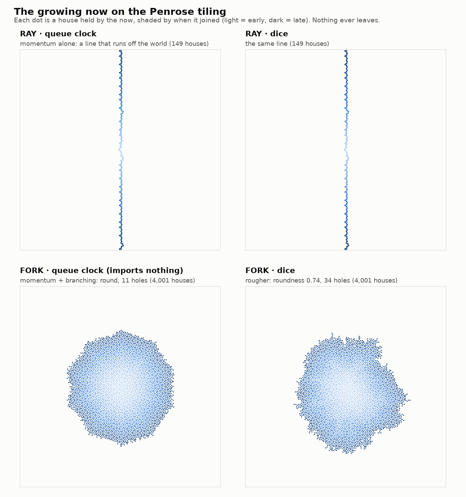

# Penrose growth — does the growing now fill space in every direction?

**First 2-D growth: "more now" on the Penrose tiling.** Isolated, with prior studies untouched.

This brings together three earlier studies:
- [`../penrose_address_environment/`](../penrose_address_environment/): the exact integer
  tiling, with hidden postcodes;
- [`../least_resistance_paths/`](../least_resistance_paths/): the **roads**. A road keeps one
  grid coordinate fixed and always steps forward, taking the most forward option at a fork;
- [`../geometric_clock/`](../geometric_clock/) Part B: in 1-D, growth with two tips per bud
  reduced to "each event adds the next house, and nothing ever leaves".

**The design fork, and why it is the experiment.** In 1-D the next house could only be along the
street. In 2-D a newborn can continue along its own road (**RAY**), or also branch onto other
roads (**FORK**: continue if the way ahead is free, otherwise take the gentlest free turn). Each
runs under a deterministic **queue** clock (walkers act in birth order, importing nothing) and
under **dice**. As everywhere in the pilot, the clock only chooses among *eligible* moves.



## Results (`penrose_growth.py`, exit 0; one seed vertex, up to 4,000 events)

| | RAY · queue | RAY · dice | **FORK · queue** | FORK · dice (5 seeds) |
|---|---|---|---|---|
| houses per event | exactly 1 | exactly 1 | **exactly 1** | exactly 1 |
| shape | a **line** along one road | the same line | **round blob, ten-sided** | lumpier blob |
| extent | runs off the world, then freezes at 149 houses | the same | radius grows like `t^0.46` | `t^0.40–0.44` |
| roundness (min/max extent over 20 directions) | 0.01 | 0.01 | **0.91** | 0.67–0.81 |
| holes (houses the now encloses but never takes) | 0 | 0 | **11** | 34–42 |
| does anything ever leave the now? | never | never | never | never |

- **More now is more space, one for one, in 2-D too.** Every event adds exactly one new house,
  and nothing ever leaves.
- **Momentum alone gives a line, not an expanding space.** RAY races along its road in both
  directions until it runs off the world. The now grows, but only in one dimension.
- **Momentum plus branching fills space in every direction.** FORK grows a round now whose area
  keeps pace with time (radius roughly `√t`). That is the branching Katie and Gemini said, from
  the very first conversation, was needed to get past "1, 1, 1 forever". It is also her childhood
  picture of space expanding in all directions with time.
- **The geometric clock grows a rounder, more complete now than dice**, beating every one of 5
  dice seeds on both roundness and holes. It shows the tiling's ten-fold symmetry: the blob is
  close to a decagon.
- **A new 2-D wrinkle: holes.** A few houses (11 of 4,000 under the queue clock) are enclosed by
  the now but never taken, because no road leads into them from their held neighbours. In 1-D
  the now was always one unbroken stretch. In 2-D the roads occasionally skip a house. Whether
  a later rule, perhaps resonance, should reach them is an open design question.

## Honest scope

- **A held-set model.** It tracks the houses held by the now, the level at which 1-D k=2 growth
  was fully described. It does not yet run full BUD bookkeeping (quiet vertices and bonds) in
  2-D.
- **Choices that matter.**
  - The seed: one vertex with two walkers on family 0's road.
  - FORK's turn rule: the gentlest free turn, with ties broken by index. That tie-break
    slightly breaks mirror symmetry.
  - The queue clock.

  They are natural choices, not a search. Other turn rules could shape the now differently.
- **Measured, not proven.** The radius exponents are fits. Dice exponents of 0.40–0.44 (below
  0.5) point to the shape still settling; area is exactly `t+1` by construction.
- **Patch.** The tiling has radius 60. RAY's freeze is where its road leaves the finite patch;
  on a bigger tiling the line would simply keep going.

## Reproduce

```bash
python3 penrose_growth.py   # ~2 s; exit 0 iff all checks pass
python3 make_figure.py      # figures/growth.png
```
