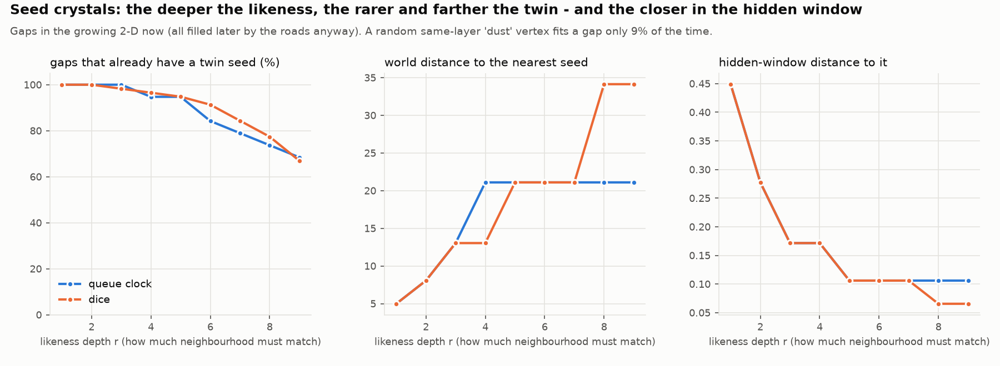

# Seed crystal — would twins fill the now's gaps sooner than the roads do?

**A first, gentle resonance study: a census, not yet a dynamics.** Isolated, with prior studies
untouched. It also carries a **correction** to [`../penrose_growth/`](../penrose_growth/).

**The picture** comes from Katie's cheese-wheel chat. A supersaturated syrup waits until a seed of
the *right shape* drops in, and wrong-shaped dust does nothing. Every process is local in *some*
space: seeds are local in "shape space", which here is the hidden window.

- **Syrup:** the gaps in the growing 2-D now. These are tiling houses enclosed by the now but not
  yet held (FORK growth, queue clock and dice).
- **Seed:** a **twin** of the gap already held by the now. It must share the gap's layer and have
  the same radius-`r` neighbourhood (exact integer offsets). It can be anywhere, often far away.
- **Dust:** a random held house of the same layer, with no likeness required.



## Results (`seed_crystal.py`, exit 0; gaps at snapshots of 1,000–4,000 events)

**1. Correction: gaps are *lag*, not skips.** Every gap under both clocks (19 under the queue
clock, 115 under dice) has a road leading in, and the roads fill every one later. The median
wait is 146 more events under the queue clock (range 12–317) and 113 under dice (range 2–990).
The syrup would crystallise by itself. The Penrose growth write-up had said "no road leads in";
it is now corrected.

**2. A seed is already waiting, so resonance could be a shortcut.** At likeness depth 1–2,
**every gap under both clocks** already has a twin somewhere in the now (every queue-clock gap up
to depth 3). A seed rule at that depth would fill gaps at once instead of about 110–150 events
later.

**3. Deeper likeness means rarer twins, farther away in the world, closer in the hidden window.**

| likeness depth `r` | 1 | 2 | 3 | 4 | 6 | 8 | 9 |
|---|---|---|---|---|---|---|---|
| gaps with a seed (queue clock) | 19/19 | 19/19 | 19/19 | 18/19 | 16/19 | 14/19 | 13/19 |
| gaps with a seed (dice) | 115/115 | 115/115 | 113/115 | 111/115 | 105/115 | 89/115 | 77/115 |
| nearest seed: world distance (median) | 5.0 | 8.1 | 13.0 | 13–21 | 21.1 | 21–34 | 21–34 |
| nearest seed: window distance (median) | 0.45 | 0.28 | 0.17 | 0.17 | 0.11 | 0.07–0.11 | 0.07–0.11 |

The **nothing-happens case** appears at depth 3–4: some gaps have no twin in the now yet. The
more alike two places must be, the farther apart they live. That is the tuning fork across the
room, and the more exact the pitch, the farther the room.

**4. Wrong-shaped dust fails.** A random same-layer house fits a gap's star of edges only **9%**
of the time; a true twin fits 100%, by definition. Likeness is what makes a seed work, not merely
*something* arriving.

**5. The two clocks.** Dice leaves far **more** gaps (115 against 19) and a **longer tail** of
waiting (990 against 317 events). Its median wait is *not* longer, though. v1 predicted a longer
median and was wrong.

## Honest scope

- **A census, not a dynamics.** It shows seeds exist and how far away they are. It does not yet
  run a resonance rule and watch its consequences, such as lock-in, runaway filling, or effects
  on the shape of the now. That is the next step, with random-seed and fake-twin controls.
- **"Fits by definition."** A true twin has the same neighbourhood as the gap, so it fits. What
  is measured is *availability*, *distance* and *depth*, not whether twins fit.
- **Scale.** One QUEUE run and one DICE run, snapshots up to 4,000 events, match depth up to 9,
  on a tiling of radius 60.

## Reproduce

```bash
python3 seed_crystal.py   # ~75 s; exit 0 iff all checks pass
python3 make_figure.py    # figures/seeds.png
```
