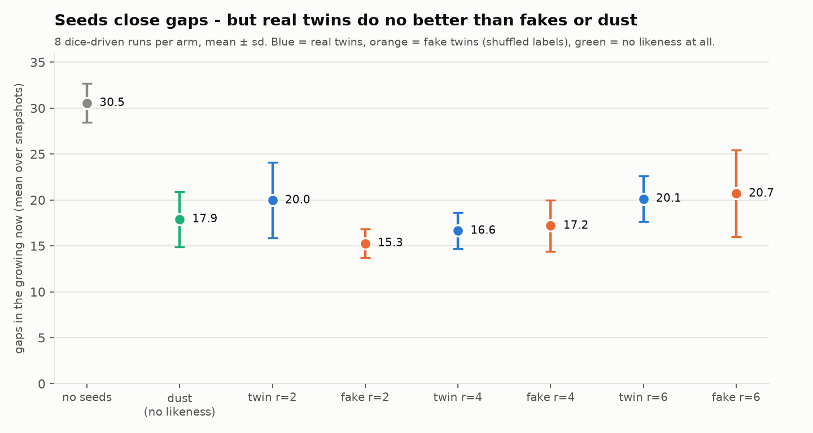

# Seed dynamics — the seed rule running, and why likeness did nothing (yet)

**The first resonance dynamics.** Isolated, with prior studies untouched. It follows the census
in [`../seed_crystal/`](../seed_crystal/), which found that for every gap in the growing 2-D now
a twin seed is already waiting.

**The rule.** Road growth continues as in [`../penrose_growth/`](../penrose_growth/): FORK, with
a queue clock or dice. Every fifth event is a **seed slot**:
- A house that touches the now but isn't held yet can join **if the now already holds a twin of
  it**: same layer, same exact neighbourhood out to depth `r`.
- The **most enclosed** eligible house joins first.
- If nothing is eligible, the slot falls back to a road event. That is the nothing-happens case.

Controls on the same schedule: **no seeds**; **dust** (the most enclosed house joins, with no
likeness required); **fake twins** (likeness judged by shuffled labels, with the same class sizes
but no real shape).



## Results (`seed_dynamics.py`, exit 0)

Pre-registered predictions and what happened:

| prediction | outcome |
|---|---|
| **P1** real seeds leave fewer gaps than no seeds | ✓, but **so do dust and fake twins, just as much** (see below) |
| **P2** deeper likeness makes seeds rarer | ✓: empty seed slots per run average 4 / 18 / 38 at `r` = 2 / 4 / 6 (dice) |
| **P3** no lock-in | ✓: seeds come from 600+ different twins; the busiest supplies 0.5% |

**Replicates** (8 dice-driven runs per arm; mean gaps over snapshots, ± sd):

| no seeds | dust | twin r=2 | fake r=2 | twin r=4 | fake r=4 | twin r=6 | fake r=6 |
|---|---|---|---|---|---|---|---|
| **30.6 ± 2.1** | 17.9 ± 3.0 | 20.0 ± 4.1 | 15.3 ± 1.5 | 16.6 ± 2.0 | 17.2 ± 2.8 | 20.1 ± 2.5 | 20.7 ± 4.7 |

- **Any seeding roughly halves the gaps**, and **nothing ever leaves the now**: every event adds
  one house that touches it.
- **Real likeness adds nothing.** Real and fake twins are indistinguishable at `r=4` and `r=6`
  (0.5 and 0.3 standard errors apart). At `r=2` the fakes are *better*, by 3 standard errors.
  What closes gaps is simply "fill the most enclosed place first".

## Why, and what it points to

In a **fixed tiling the shape is already decided**. Every house belongs where it is, whoever
fills it and whenever. A seed has **nothing to teach**: it can only change *when* a house joins,
and any gap-filler does that equally well. The real seed crystal matters because a syrup could
crystallise **wrongly**. For likeness to matter, growth must be able to make mistakes.

So the next resonance experiment should grow the tiling itself, tile by tile, where local
choices can go wrong. There is literature on exactly that: Onoda, Steinhardt, DiVincenzo and
Socolar (1988) on growing perfect Penrose tilings, where purely local growth tends to jam or make
defects. That is where a far-away twin could carry information the local rules lack. It would be
the fair test of Katie's "similars and sames informing one another".

## Honest record

- **v1 bias.** v1 gave each seeded house a walker with a fixed heading. That stretched every
  seeded now in one direction (roundness 0.91 → about 0.65, dust included). Seeded houses now
  fill without walking, in every arm.
- **v1 single runs** looked as if real twins beat fakes at depth 4–6. Replicates showed it was
  noise.
- **All three predictions "passed"**, yet the controls show P1 is not evidence for resonance.
  That is why the controls are there.
- **Scope.** One seed schedule (every fifth event), one selection rule (most enclosed first),
  depths 2, 4 and 6, 4,000 events, 8 replicates per arm.

## Reproduce

```bash
python3 seed_dynamics.py   # ~7.5 min; exit 0 iff all checks pass
python3 make_figure.py     # figures/arms.png
```
