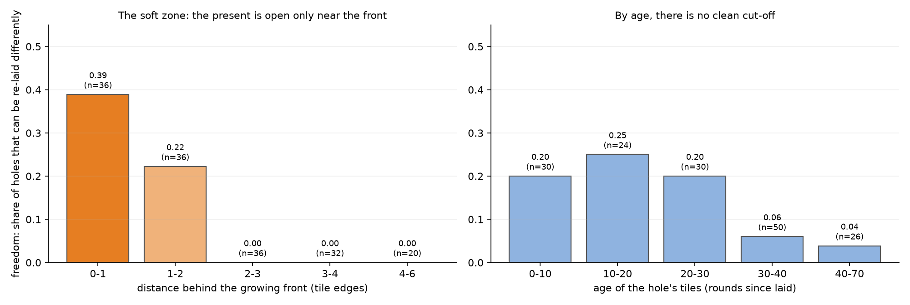

# The soft zone: how wide is the now at a growing front?

> **Correction (2026-09-28, from [`../quiet_lasts_longer/`](../quiet_lasts_longer/), "Astra's checks"):** re-testing with a footprint check found that every "soft" hole was soft only because the refill could place tiles *outside the removed region*, into the open growth edge within reach. No hole was ever re-laid differently over the same region. So the "width of the now" measured here is mainly how far the hole's reach extends toward the open edge, and is tied to the hole size. What stands: enclosed regions have exactly one legal filling, and alternatives exist only at the open edge.

Pre-registered in [`PREREGISTRATION.md`](PREREGISTRATION.md) before any code existed. The design came
out of a conversation with Katie:
- the now is laid by a branching crowd of Gromits at an expanding front;
- the width of the now is local;
- quiet places keep things open longer (her January 2026 *Temporal Echo* idea).

This study asks the *plasticity* side of that question: **how far behind the front can the present
still change?**



## How it works

1. **Growth by a ring of Gromits.** The Penrose tiling is grown with the full matching rules
   (Robinson half-tiles, from [`../laying_the_tiling/`](../laying_the_tiling/)). Each round,
   **every** spot on the front with exactly one legal tile gets it simultaneously; if nothing is
   forced, one Gromit guesses. There are 6 runs, each growing 450 half-tiles in 43–76 rounds, with
   2–5 guesses per run.
2. **Holes.** 160 small holes (6–10 half-tiles each) are poked at different distances behind the
   front.
3. **Refills.** Each hole is re-laid 8 times, with different guesses. A hole is **soft** if it can
   be re-laid *differently* and still legally. Otherwise it is **hardened**: only the original fits.

## Scorecard

| | prediction | result |
|---|---|---|
| Z1, Z2 | checks: growth is legal throughout; the original refill is always legal | **pass** (after a bug fix, below) |
| S1 | freedom ≥ 0.5 at the front and ≤ 0.1 deepest | **failed** on the first half: the front is 0.39, the deepest 0.00 |
| S2 | freedom narrows with depth | **held**: 0.39 → 0.22 → **0** → 0 → 0 |
| S3 | quiet places stay open longer (lower happening density in soft holes) | **failed**: no difference (p = 0.59), with only 2 usable depth bins |

## What it means

- **The now has a measurable width: about 2 tile-edges.** Within one edge of the front, 39% of
  holes can be re-laid differently. Between one and two edges, 22% can. Beyond two edges, **none
  of 88 holes** could be. Behind that line the present has hardened into the past: only one filling
  fits, as with the decagon.
- **The now is a *place*, not a *time*** *(exploratory, after the fact:
  `results/age_vs_distance_EXPLORATORY.txt`)*:

  | | laid < 30 rounds ago | laid ≥ 30 rounds ago |
  |---|---|---|
  | near the front (< 2 edges) | 32% soft | **27% soft** |
  | deeper (≥ 2 edges) | **0% soft** | 0% soft |

  Tiles laid long ago but still at the edge of becoming stay open. Tiles laid recently but already
  surrounded are closed. What decides it is not *how long ago* something happened, but whether the
  front has moved on around it.
- **Katie's quiet-places prediction was not supported here.** Happening density (tiles per round,
  locally) did not differ between soft and hardened holes, and old near-front tiles are not in
  quieter spots (2.33 against 2.22 tiles per round). The test was weak, with only two depth bins
  containing both kinds, so this is "not seen here", not "refuted". In this model, what keeps
  something open is **not being surrounded yet**, rather than quiet.

## A bug found on the way (and a clean bill for older work)

The first attempt stopped on check Z2: putting a hole's *own original tiles* back was judged
illegal. The cause was a bug in the older `laying_the_tiling` vertex check. A gap wider than half
a circle between corners at a vertex was misread as an overlap. Holes make such gaps constantly;
outward growth almost never does.
- Here it is fixed (`vertex_ok_fixed`).
- One run's apparent "jam" under the ring of Gromits **was this bug**, and disappeared with the
  fix.
- The older study's main arms were re-run with the fix (`../laying_the_tiling/recheck_fixed_vertex_ok.py`)
  and came out **identical in every number**, so its results stand.

## Honest limits

- One tiling family (Penrose) and small holes.
- Softness is judged from 8 sampled refills, not an exhaustive enumeration.
- The ring-of-Gromits rule is one of several reasonable parallel rules.
- Happening density is a crude local measure.
- At the front, a "different" refill may lie partly outside the original hole's footprint (inside
  the allowed radius), since the outer side is open.

## Reproduce

```bash
python3 soft_zone.py            # ~15 s on 4 cores; results/holes.jsonl, results/soft_zone_report.txt
python3 soft_zone.py --summary
python3 make_figure.py          # figures/soft_zone.png
```
