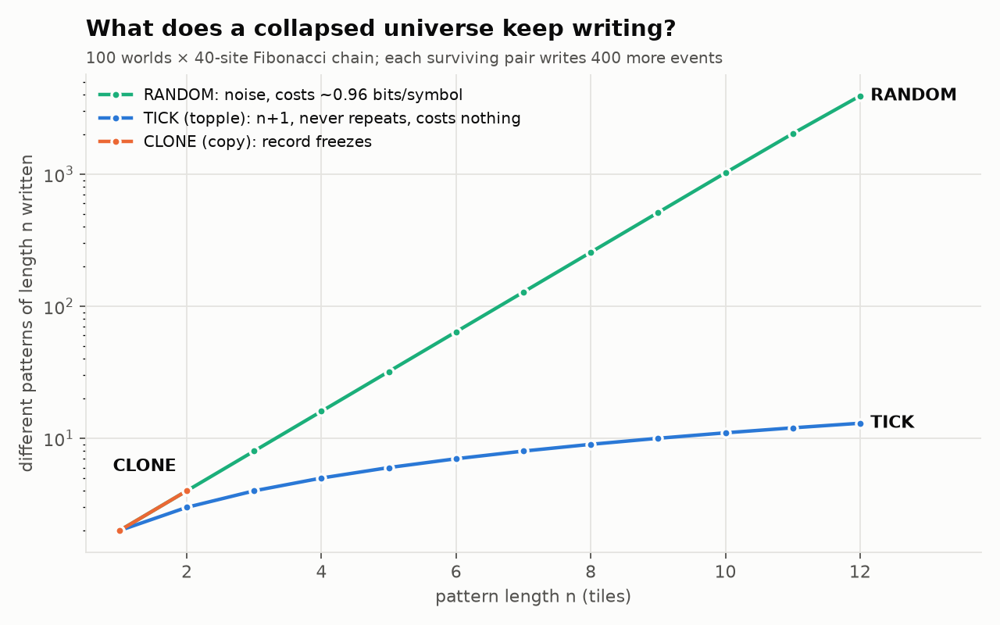

# Tick-forward — what postcode does a newborn get?

**One bounded experiment on Katie's "topple" idea.** Isolated, with prior studies preserved.
It follows on from [`../twins_mirror/`](../twins_mirror/). The growth runs *on* the Fibonacci
chain of [`../fibonacci_address_environment/`](../fibonacci_address_environment/). The new
question is: when the universe buds a brand-new vertex, which isn't on the original chain, what
hidden address (postcode) does it get?

| rule | the newborn's postcode | in Katie's words |
|---|---|---|
| **TICK** | the keeper's postcode moved one step along the window's own "next house" map `f` (a rotation that never returns to a previous point) | "in the topple it cannot be the same as what came before" |
| CLONE | a copy of the keeper's postcode | the same as what came before |
| RANDOM | a fresh, uniformly random postcode | unrelated; new randomness shipped in at every birth |

**Setup.** BUD at `k=1` on a 40-site chain, rate `1/ℓ`, BUD-only, 100 worlds per rule (seeded).
The shape always collapses to lone pairs, in about 68 events. That is the downhill lemma of
[`../pair_collision_toy/`](../pair_collision_toy/). Each surviving pair then keeps budding. We
watch what it writes over 400 more events.



## Result (`tick_forward.py`, exit 0)

| | TICK | CLONE | RANDOM |
|---|---|---|---|
| new content per event, forever | **≈ 1/2** (0.499) | **0**: the record freezes | 1 |
| ever repeats an earlier pair | **never** | n/a | never |
| builds illegal (non-Fibonacci) tiles | **never**, before or after collapse | always | almost always |
| different patterns of length `n` | **exactly `n+1`** (n = 1…12) | stops at `n = 2` | `≈ 2ⁿ` (3,919 at `n=12`) |
| long windows that are legal Fibonacci words | **100 %** | n/a | 0 % at `n=12` |
| randomness spent on *what* is written | **0 bits** (fixed by the start) | 0 bits (nothing written) | ≈ 0.96 bits per symbol |
| separate lineages meet at an identical postcode | **always** (10,178 / 10,178 pairs) | never | never |

**In plain words.**

- **TICK never leaves the quasicrystal.** Every bond it grows is a legal Fibonacci tile.
- **It never repeats.** After the collapse it keeps writing new content forever.
- **It spends no randomness on content.** What it writes is fully determined by where it started.
- **Its variety is the smallest possible for something that never repeats**: `n+1` patterns of
  length `n`, the Sturmian minimum (Morse–Hedlund).

It sits exactly between CLONE, which freezes, and RANDOM, which costs information at every step
and writes noise.

**The dice decide when, the geometry decides what.** About half of TICK's events are *stutters*:
they re-lay the same tile. The scheduler's coin decides which events stutter and which advance.
It never decides what the next piece of content is.

**Meetings.** Every TICK lineage walks the same hidden street, the one orbit of `f`, so separate
lineages keep arriving at identical postcodes. These are *perfect twins*: the same point in the
hidden window, reached by different histories. They are structural, not lucky, and they are the
natural trigger for the resonance idea parked in [`../twins_mirror/DESIGN.md`](../twins_mirror/DESIGN.md).

## Honest scope

- **Known mathematics.** The content results are known: the TICK record is a Sturmian word. What
  this experiment adds is that the growth model, under a random scheduler and the collapse,
  **actually produces** that word, and that the two alternative rules do not.
- **Monte Carlo.** The randomness is in the scheduler only. The structural claims (legality, no
  repeats, determinism, `n+1`) are asserted exactly, using `ℤ[τ]` arithmetic, on every run.
- **The timing is still imported.** The "when" comes from a coin, not from the geometry. Katie's
  "more now" picture says it should come from the geometry: the track is laid as it is ridden.
  That is the next question; see [`../../../THREE_COMMANDMENTS.md`](../../../THREE_COMMANDMENTS.md).
  One step is already free: measure time by the **amount of new content written** ("accretion
  time") instead of by events. Then stutters don't advance the clock, and each TICK lineage's
  state at accretion-time `t` is exactly `fᵗ(start)`, with no dice at all. What stays random is
  only *which* lineage advances next, the branching.
- **Correction, v1.** The first run's RANDOM control drew postcodes on a `10⁻⁶` grid. Birthday
  collisions on that grid faked 957 "meetings", so the gate failed. The grid is now `10⁻¹⁵`, and
  RANDOM has 0 meetings. Commit `3b7211b` holds the fixed code but the v1 report. Its message
  wrongly says the fix was not applied.

## Reproduce

```bash
python3 tick_forward.py   # ~2 min; exit 0 iff all checks pass
python3 make_figure.py    # figures/complexity.png
```
