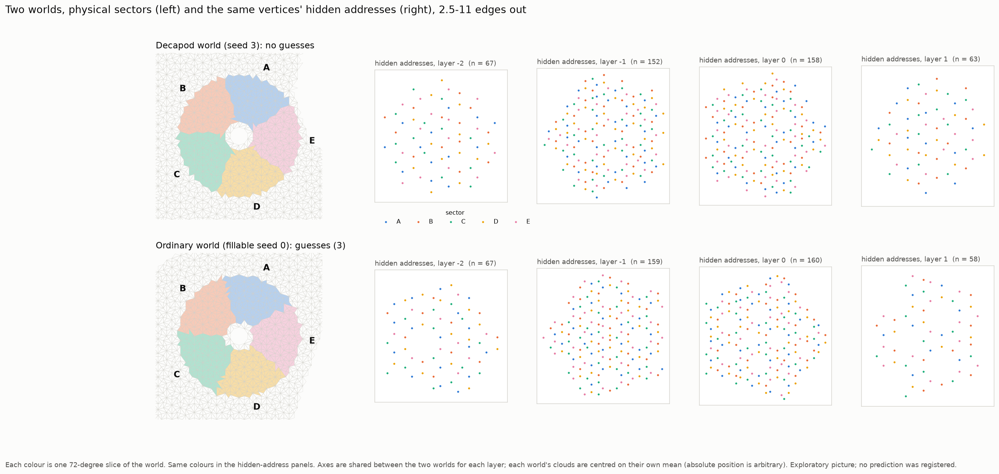

# Two worlds, seen side by side (exploratory picture)

*No prediction was registered; this is a picture to look at, suggested by Astra (2026-10-03).*

**What it shows.**

- **Rows:** one decapod world (seed 3, grown with no guesses) and one ordinary world (fillable seed
  0, grown with 3 guesses). Both have 4,000 half-tiles.
- **Region:** both use the same matched region, the vertices 2.5–11 edges from the centre.
- **Left:** the physical tiling, cut into five 72° slices (A–E).
- **Right:** the same vertices' hidden (perp-space) addresses, one panel per layer, in the same
  colours. Vertex counts per slice and layer are in `figures/two_worlds_counts.txt`: 9–36 per cell,
  similar across the two worlds.
- **Centring:** the lift starts from an arbitrary corner, so a world's absolute position in hidden
  space means nothing. Each world's clouds are centred on their own mean, and only **shapes** are
  compared.

**Astra's question: are the coloured clouds similar shapes in different places, or different
shapes?**

- **Within a world, the slices are not separate clouds.** In both worlds and every layer, the five
  colours are mixed through the whole cloud. No slice occupies its own shifted region of the window.
  So the "each sector sits in its own shifted window" picture is **not** visible here.
- The larger sector offsets in `../decapod_memory/` (D1) are therefore better read as **sampling and
  overall shape** effects than as translated windows. This is by eye only.
- **Between the worlds, the shapes may differ.** The decapod world's clouds look a little rounder
  (more ten-fold); the ordinary world's look more pentagonal, as a genuine Penrose window should.
  That would fit `../perp_map/` M2 (a larger hull). It is an impression from one pair of worlds, not
  a measurement.

**Next, if wanted:** Astra's quantitative version (matched radii and counts; fit a translation on
part of each sector and test whether it aligns the rest), plus a window-**shape** comparison.

## Files

- `make_visual.py`
- `figures/two_worlds.png`
- `figures/two_worlds_counts.txt`
