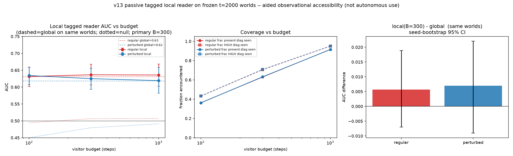

# Report — v13 bounded local-reader pilot

*Register: speculative exploration; not a confirmatory study, not cosmology. Chain
v1 `cc514ee` → … → v12 `7a342c5` → v13. Isolated under
`exploratory/accretion_pilot/v13_local_reader/`. v1–v12 preserved. No merges,
publishing, sealed-study access, new substrates, trained decoder, or alternative
movement policies were used. Frozen spec in
[`PRE_ANALYSIS_NOTE_v13.md`](PRE_ANALYSIS_NOTE_v13.md), fixed before execution.*

## Question

The v11 result showed that an imposed history (A vs B) leaves a distinction in the
frozen t=2000 world that a **global, coordinate-aided** reader can detect (AUC ≈ 0.62).
v13 asks a narrower, more physical question:

> Is that distinction still recoverable by a **bounded local visitor** — one that
> starts at the shared history start `S`, moves read-only through the world by the
> rounded edge weights it can sense, and only ever sees the diagonals it happens to
> encounter along a finite walk?

If yes, the memory is not merely *globally present* in the weight field; it is
*locally accessible* — reachable by finite local traversal without a god's-eye view of
the whole graph.

## What the visitor is (and is not)

- **Passive & read-only.** It never reinforces, grows, or mutates the frozen world.
- **Tagged / aided.** The reader coefficient `c(d)` depends on graph distances over the
  full *original* substrate and is **not** locally computable. We therefore supply it as
  a precomputed **tag revealed only when a present diagonal is encountered**. Tags are
  identical between the A- and B-world of a pair and independent of the realised history.
  This is explicitly an **aided** reader — it demonstrates *observational accessibility*,
  not autonomous local computation or transmission.
- **Bounded.** It walks from `S`, choosing the next edge ∝ the **rounded** weights
  `q(w)=floor(w+0.5)` it senses, and scores
  `S_local(B) = Σ_{d encountered ≤ B steps} c(d)·1[q(w_d)=6]` over distinct encountered
  diagonals (counted once). 5 independent visitor replicates × 1000 steps per world;
  scores read at nested budgets {100, 300, 1000}; **B=300 primary**. Visitor RNG is
  separate from all evolution RNG.

## Worlds & gates

- Replayed v11 seeds 0–49, all 18 cells (3 offsets × 3 history-pairs, both A and B) × 2
  arms (regular / perturbed) → 1800 main worlds; plus one no-history world per
  (patch, seed) reused across the three pair-readers → 300 null worlds.
- **All pre-registered gates passed** (`results/validation_v13.txt`):
  - Replay scalar agreement vs v11 `raw_main.csv`: `max|Δ| = 5.0e-6` over 12600 values
    (tol 1e-4) → **PASS**.
  - Full-observation fixture (`S_local` over *all* present diagonals `== S_high`) →
    **PASS**.
  - Round-trip immutability (snapshot-reconstructed global == world `S_high`) → **PASS**.
- Aligned snapshots retained per patch under `results/snapshots/` (~2.1 MB): original +
  candidate edge identities, presence, per-world weight vectors, geometry, histories,
  coefficients, seed metadata.

## Primary result

Per-cell ordinary AUC at B=300 for a **single** visitor (AUC computed per replicate,
then averaged over the 5 replicates — *not* by averaging scores first). Aggregated 3
pairs within a patch, then 3 patches equally; seed-block bootstrap shared across cells.

| arm | local B=100 | local B=300 | local B=1000 | global (same worlds) | local − global @300 |
|---|---|---|---|---|---|
| regular   | 0.631 [0.602, 0.659] | **0.637 [0.607, 0.668]** | 0.636 [0.603, 0.668] | 0.631 | **+0.006 [−0.007, +0.019]** |
| perturbed | 0.634 [0.607, 0.659] | **0.625 [0.593, 0.655]** | 0.619 [0.582, 0.658] | 0.618 | **+0.007 [−0.009, +0.022]** |

No-history null (random A/B labels fixed per world): regular 0.51, perturbed 0.48 at
B=300 — indistinguishable from chance, as expected.

Coverage at B=300: ~63% of present diagonals and ~71% of globally-high (`q(w)=6`)
diagonals encountered (B=100: ~36%/~43%; B=1000: ~92%/~95%).



## Reading of the result

1. **The memory is locally accessible, not just globally present.** The bounded local
   tagged reader recovers essentially the *entire* discriminative signal of the global
   reader: `local − global @ B=300` is `+0.006`/`+0.007` with a 95% CI straddling zero
   in both arms. Partial observation loses no detectable discrimination here.

2. **It is accessible cheaply and early.** AUC is already ~0.63 at B=100 (only ~36% of
   present diagonals seen) and does not improve with more steps — if anything perturbed
   drifts slightly *down* toward its global value as coverage completes. The signal is
   not concentrated in a few far-flung diagonals that require exhaustive traversal; it is
   redundantly reachable near the shared start. (Global AUC is not an upper bound on
   local AUC — partial observation can omit cancelling contributions, which is why local
   sits marginally above global at small budgets.)

3. **Regular and perturbed remain indistinguishable — in accessibility too.** Just as
   v11 found no regular-vs-perturbed gap in *global* memory, v13 finds none in *local
   accessibility*: both arms land at AUC ≈ 0.62–0.64 with overlapping intervals. The
   quasiperiodic Penrose substrate confers no measurable local-readability advantage
   over the perturbed pentagrid for this reader/score/budget.

4. **Per-cell variation dominates the mean.** Individual cells range from AUC ≈ 0.51 to
   ≈ 0.76 (`results/local_cells.csv`), and local tracks global cell-by-cell. The
   arm-level number is an average over heterogeneous patches, not a uniform effect.

## Limitations (pre-stated and observed)

- **Aided, not autonomous.** `c(d)` is supplied as a tag. This establishes aided
  *observational accessibility* only — not that an unaided local agent could compute the
  score, nor that the distinction is *transmissible* or *usable* by anything in the
  world. A coordinate-free / self-computing reader is explicitly out of scope here.
- **Modest effect.** AUC ≈ 0.62–0.64 is weak discrimination. A weak result bounds only
  *this* visitor, score, budget, and sample; it does not show all local readers succeed
  or fail.
- **Perturbed ≠ disordered.** The perturbed pentagrid is a jittered pentagrid, not a
  generic amorphous tiling; local geometry is uncontrolled across arms. "No difference"
  is descriptive of these two families, not an equivalence claim over substrate classes.
- **Six fixed patches.** Bootstrap resamples evolution seeds within these six patches;
  the CIs are conditional-simulation uncertainty, not generalisation over substrates.
- **Replay validated by scalar agreement**, which supports consistency but is not by
  itself proof of per-edge identity (the round-trip and full-obs fixtures add per-edge
  and reader-level checks).

## Files

- [`PRE_ANALYSIS_NOTE_v13.md`](PRE_ANALYSIS_NOTE_v13.md) — frozen spec + gates.
- [`v13_lib.py`](v13_lib.py) — replay, aligned snapshot, `FrozenWorld`, passive visitor.
- [`v13_run.py`](v13_run.py) — replay + snapshot + validate + round-trip + visit driver.
- [`v13_analyze.py`](v13_analyze.py) — per-cell/arm AUC, global comparator, null, coverage, figure.
- `results/validation_v13.txt`, `results/run_config.json`, `results/V13_DONE` — gate/run metadata.
- `results/visitor_scores.csv` (main), `results/visitor_null.csv` — raw visitor output.
- `results/local_cells.csv`, `results/local_arms.csv`, `results/local_null.csv`,
  `results/local_coverage.csv` — analysis tables.
- `results/snapshots/{arm}_{i}.npz` — aligned per-patch archives (geometry, weights,
  histories, coefficients, seed metadata).
- `figures/local_reader_v13.png` — AUC-vs-budget, coverage, local−global.

## Reproduce

```bash
cd exploratory/accretion_pilot/v13_local_reader
python3 v13_run.py       # ~5 min: replay + snapshots + gates + visitor (background if timing out)
python3 v13_analyze.py   # ~seconds: reads results/*.csv, writes tables + figure
```
