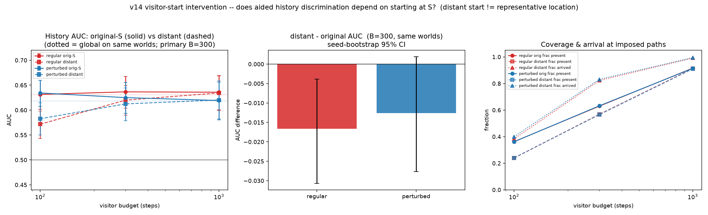

# Report — v14 visitor-start intervention

*Register: speculative exploration; not a confirmatory study, not cosmology. Chain
v1 `cc514ee` → … → v13 → v14. Isolated under
`exploratory/accretion_pilot/v14_visitor_start/`. v1–v13 preserved. No evolution replay,
new substrate construction, merges, publishing, sealed-study access, decoder training, or
movement-rule changes. Distant-start selection frozen and saved before any visitor
outcome.*

## Question

v13 showed the bounded tagged visitor recovers the global reader's history
discrimination when it **starts at the shared history start `S`**. v14 asks the obvious
next question:

> Does that discrimination **depend on starting at `S`**? If we drop the same visitor
> far from the imposed history, on the far side of the world, can it still tell A from B?

## The "distant start" (frozen from original geometry only)

For each (patch, history-pair), over the **original** substrate graph (base edges only):

- `U` = the set of vertices of the two imposed paths; `d_U(v)` = hop distance to `U`;
  `d_bd(v)` = hop distance to the nearest boundary vertex.
- **Eligible** iff `d_bd(v) ≥ 2` (not hard against the boundary) and `d_U(v) > 0`
  (strictly off the paths).
- Choose the eligible vertex **maximising `d_U(v)`**; canonical tie-break fixed in
  advance: smallest rounded coordinate `(x, then y)`, then vertex id.

This rule is a function of geometry alone, evaluated and saved
(`results/distant_starts.csv`, `.json`) **before** any visitor was run. The **same**
distant start is used for the A- and B-world, all 50 evolution seeds, and the null world
of that cell. All 18 cells had eligible vertices (**0 ineligible**); each had ~227–237
candidates. The selected starts sit **~10 hops** from the imposed paths and from `S`,
near the far boundary (`boundary_dist = 2`, degree 3–5). It is a **specified far
location, not a representative sample of all locations.**

## Gates (all PASS, `results/validation_v14.txt`)

- **Geometry reconstruction == v13 snapshot:** max coordinate deviation `0.0`; candidate
  edge order and coefficient tags aligned. (Confirms we rebuilt the exact frozen
  substrate; frozen evolved weights are read from the v13 snapshots — **no replay.**)
- **Original-S visitor reproduces v13 scores exactly:** `max|Δ| = 0.0` over **27,000**
  values (same seed protocol, same worlds). The v14 visitor is byte-for-byte the v13
  reader when started at `S`.
- **Frozen-state immutability:** round-trip global unchanged after visitor runs → PASS.

## Result

Per-cell ordinary AUC (AUC per replicate, then averaged over 5), 3 pairs per patch then
3 patches per arm; seed-block bootstrap **shared across cells and starts** (paired
dependence preserved).

| arm | start | B=100 | B=300 (primary) | B=1000 |
|---|---|---|---|---|
| regular | orig-S | 0.631 [0.602, 0.659] | 0.637 [0.604, 0.667] | 0.636 [0.601, 0.669] |
| regular | distant | 0.572 [0.543, 0.598] | 0.620 [0.589, 0.649] | 0.634 [0.600, 0.669] |
| perturbed | orig-S | 0.634 [0.608, 0.660] | 0.625 [0.593, 0.655] | 0.619 [0.581, 0.656] |
| perturbed | distant | 0.583 [0.550, 0.614] | 0.612 [0.578, 0.644] | 0.620 [0.582, 0.659] |

**distant − original AUC** (shared seed bootstrap, 95% CI):

| arm | B=100 | B=300 (primary) | B=1000 |
|---|---|---|---|
| regular | **−0.060 [−0.086, −0.035]** | **−0.017 [−0.031, −0.004]** | −0.001 [−0.005, +0.002] |
| perturbed | **−0.052 [−0.074, −0.028]** | −0.013 [−0.028, +0.002] | +0.001 [−0.003, +0.005] |

Null (fixed random labels): distant ≈ 0.51–0.52 at all budgets, both arms — chance, as
expected. Global comparator unchanged from v13 (regular 0.631, perturbed 0.618).

**Coverage & arrival at the imposed paths** (descriptive; the primary comparison is
**not** conditioned on arrival):

| arm | start | budget | frac present seen | frac arrived at paths |
|---|---|---|---|---|
| regular | distant | 100 | 0.24 | 0.38 |
| regular | distant | 300 | 0.57 | 0.82 |
| regular | distant | 1000 | 0.91 | 0.99 |
| regular | orig | (any) | 0.36 / 0.63 / 0.92 | 1.00 (starts on `S`) |

Perturbed is nearly identical (distant arrival 0.40 / 0.83 / 0.99). Median arrival step
among those that reach the paths ≈ **128–132**.



## Reading of the result

1. **History discrimination does not fundamentally depend on starting at `S`.** Dropped
   ~10 hops away near the far boundary, the visitor **fully recovers** the original-start
   discrimination once it has budget to reach and sample the history region:
   `distant − orig` is `−0.001`/`+0.001` at B=1000, CI through zero, matching the global
   reader in both arms. The memory is accessible from this specified distant location too.

2. **The cost of a distant start is travel + sampling, not lost information.** At B=100
   the distant reader is clearly worse (`−0.060`/`−0.052`), and this tracks arrival: only
   ~38–40% have reached the imposed paths by 100 steps (median arrival ≈ 130), and they
   have seen far fewer present diagonals (0.24 vs 0.36). As the budget lets them arrive
   (82–83% by B=300, 99% by B=1000) the gap closes monotonically. This is exactly the
   pre-stated caution: *a weaker score can reflect travel cost and changed sampling; it
   does not establish memory absence.*

3. **A small but real residual at the primary budget.** At B=300 the deficit is
   `−0.017 [−0.031, −0.004]` (regular; CI excludes 0) and `−0.013 [−0.028, +0.002]`
   (perturbed; CI touches 0) — a modest penalty consistent with the ~17–18% of runs that
   have not yet arrived and the lower coverage (0.57 vs 0.63). It is a budget/arrival
   effect, not evidence of a different amount of stored memory: it is gone by B=1000.

4. **Regular and perturbed behave the same.** The start-dependence pattern — large B=100
   deficit, small B=300 deficit, none by B=1000 — is quantitatively the same in both
   arms. As in v11/v13, the quasiperiodic substrate confers no distinguishable advantage,
   here in *start-robustness* of accessibility.

## Limitations (pre-stated and observed)

- **One specified far location, not arbitrary locations.** The distant start is the
  geometry-defined max-distance, near-boundary vertex. Success extends **aided
  observational accessibility to this arrival location** — it does **not** show access
  from arbitrary or typical locations, nor that most starts would work, nor redundant
  storage, nor transmission or autonomous use.
- **Still an aided reader.** `c(d)` remains a supplied encounter-revealed tag (identical
  A/B, history-independent). Everything inherits v13's aided caveat.
- **Budget = encounter budget, not physical/energetic cost.** The ~130-step travel to
  arrival is a count of read-only rounded-weight moves, not a demonstrated time or energy.
- **Six fixed patches; conditional uncertainty.** Bootstrap resamples evolution seeds
  within these six patches (shared across cells/starts); CIs are conditional-simulation
  uncertainty on the existing worlds/geometries, not generalisation over substrates.
- **Perturbed ≠ disordered** (jittered pentagrid, not a generic amorphous tiling).

## Files

- `PRE_ANALYSIS_NOTE` equivalent is inline above and in the frozen selection rule.
- [`v14_lib.py`](v14_lib.py) — distant-start selection, snapshot loading + geometry
  verification, visitor reproducing v13 movement with arrival tracking.
- [`v14_run.py`](v14_run.py) — freeze starts, reproduce v13 (gate), matched distant runs,
  null runs, validation.
- [`v14_analyze.py`](v14_analyze.py) — per-cell/arm AUC, distant−orig, coverage/arrival,
  null, figure.
- `results/distant_starts.csv`, `.json` — frozen selections + diagnostics (distance to
  each path, to `S`, boundary distance, degree, #eligible).
- `results/scores_main.csv` (54,000 rows), `results/scores_null.csv` (27,000 rows) — raw
  visitor output for both starts, with coverage + arrival columns.
- `results/cells.csv`, `results/arms.csv`, `results/coverage_arrival.csv`,
  `results/null.csv` — analysis tables.
- `results/validation_v14.txt`, `results/run_config.json`, `results/V14_DONE`.
- `figures/visitor_start_v14.png` — AUC vs budget (orig vs distant), distant−orig @300,
  coverage & arrival.

## Reproduce

```bash
cd exploratory/accretion_pilot/v14_visitor_start
python3 v14_run.py       # ~13 min: freeze starts, gate vs v13, visitor runs (background)
python3 v14_analyze.py   # bootstrap + tables + figure (run in background; a few min)
```
