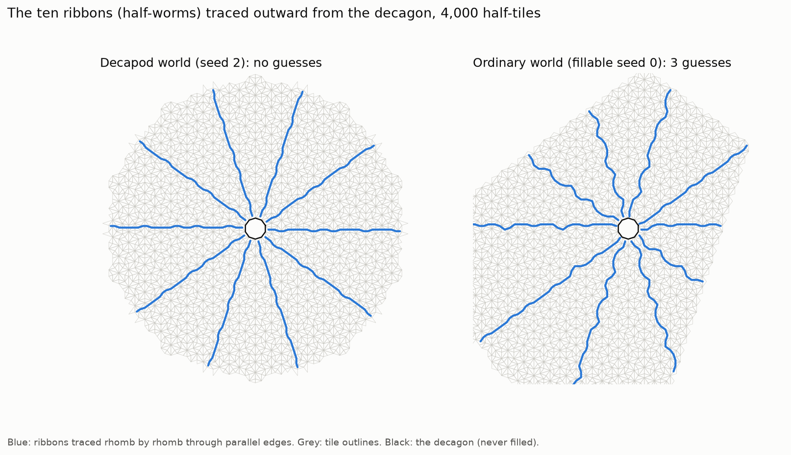

# Following the worm lines: does a decapod keep its memory on its ten ribbons?

*A pre-registered study. The pre-registration was committed before any code:
[`PREREGISTRATION.md`](PREREGISTRATION.md). The first run (1,500 tiles) couldn't test the idea, so
a follow-up with the same analysis at 4,000 tiles was registered before it was run.*

**The question.** [`../decapod_memory/`](../decapod_memory/) found that slices of a decapod world sit
in shifted perp-space windows (D1 held). The textbook picture says the shifts happen **across the
ten half-worms**: ribbons of rhombs running out from the decagon's edges. Here we traced the ten
ribbons tile by tile, split each world into the wedges between them, and asked whether the window
jumps more **across** a ribbon than **within** a wedge.

## Scorecard

| | prediction | first run (1,500 tiles) | follow-up (4,000 tiles) |
|---|---|---|---|
| T0 | all ten ribbons traceable ≥ 4 edges | ✅ PASS | ✅ PASS |
| T1 | DECAPOD across/within ratio > 1.2 in ≥ 7/8 worlds | ❌ untestable (ragged fronts, cells too small) | ❌ **1/8** (ratios 0.92–1.41, median 1.12) |
| T2 | FILLABLE median ratio below DECAPOD median | ❌ untestable | ❌ **the opposite**: FILLABLE 1.37 > DECAPOD 1.12 |

## What it means (plainly)

- **The window does not jump specifically across the decapod's ten ribbons.**
  - In decapod worlds, the halves either side of a ribbon differ only slightly more than the two
    halves of the same wedge (ratio ~1.1).
  - In ordinary worlds the ratio is *higher* (~1.4). Crossing any ribbon shifts which hidden
    addresses you meet (crossing a pentagrid line steps one coordinate of `K`), and that generic
    effect is bigger than anything special about a decapod's ribbons.
- So the decapod's memory (the shifted windows of D1) is real, but **it is not concentrated on its
  ten ribbons, as measured this way.** Two readings remain open:
  - the shift is spread more evenly through the wedges;
  - this window-mean measure is the wrong tool for seeing it.
- **Something we didn't predict, visible in the picture.** A decapod world's ten ribbons are almost
  perfectly straight spokes. *(Correction, prompted by Astra: the first measure quoted here, 0.1–0.3° per
  edge, was only the net angle change between a ribbon's ends, so bends that cancel were invisible.
  A fuller measure, the deviation from a best-fit straight line between 2.5 and 12 edges out
  ([`results/straightness_EXPLORATORY.txt`](results/straightness_EXPLORATORY.txt)), confirms the
  difference. Decapod ribbons deviate by 0.12 edges RMS (at most 0.16), and **identically for all
  80 ribbons in all 8 worlds**. Ordinary worlds' ribbons deviate by 0.25–0.28 RMS, up to 0.61.)*
  An ordinary world's ribbons wander, especially near the centre. One decapod world (seed 2) is grown
  almost perfectly round and ten-fold symmetric. It's only a description, but it hints that the
  decapod imposes a **rigid, radial order** on the world it seeds. Choices (the guesses in ordinary
  worlds) seem to make the lines wander.

## Limits

- Window means per wedge-half are coarse and noisy.
- 8 + 4 worlds.
- The analysis radius is set by the shortest ribbon (11.8–17.6 edges).
- Ribbons and Conway's worms are assumed to coincide.

## Files

- `worm_lines.py`
- `make_figure.py`
- `straightness_EXPLORATORY.py`
- `figures/worm_lines.png`
- `results/worlds.json`
- `results/worm_lines_report.txt` (follow-up)
- `results/straightness_EXPLORATORY.txt`
- `results/run1_1500/` (first run)
