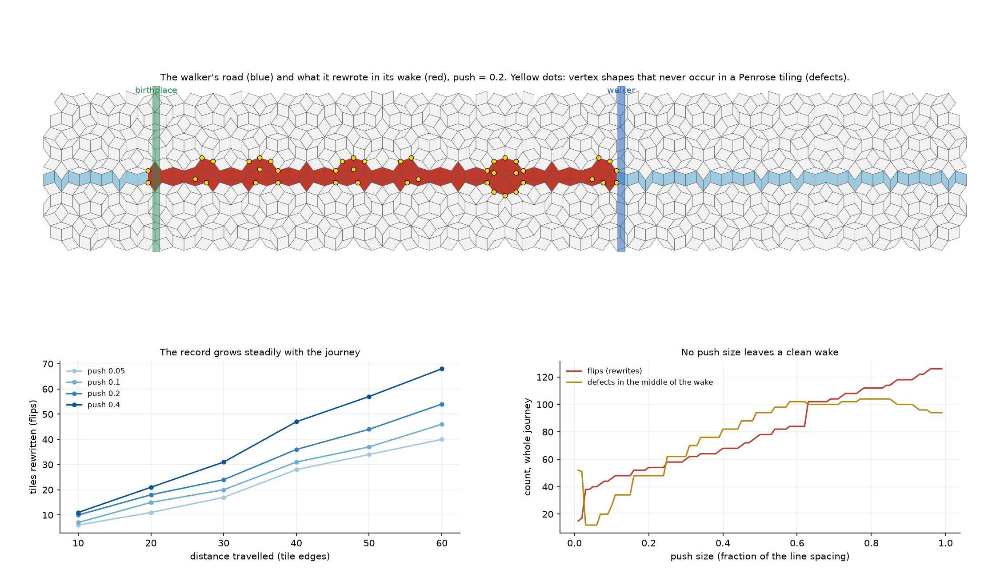

# The writing walker: can a traveller rewrite the tiling behind it? (Gemini's "writing memory" test)

Pre-registered in [`PREREGISTRATION.md`](PREREGISTRATION.md) before any code existed. Gemini asked:
*"Let a momentum walker travel down a ribbon and see if it can physically trigger a worm flip in
its wake: does travelling energy rewrite the universe's memory as it moves?"*



## How it works

The Penrose tiling is built from five families of straight grid lines (the de Bruijn pentagrid).
Every tile is one crossing of two lines, and a **ribbon** (a road) is all the tiles along one line.
The walker travels along its own line. **Behind it, it nudges that line sideways by a push `δ`.**
Wherever the nudged line slips past a crossing of two other lines, three tiles rearrange (a
**hexagon flip**). The tiling is rebuilt exactly (integer addresses in Z⁵) after every step.

## Scorecard

| | prediction | result |
|---|---|---|
| W1 | structure (asserted) | **all pass**: δ = 0 reproduces the tiling exactly; every rewritten patch is a valid rhombus tiling; exactly one off-road tile changes per crossing passed *(check corrected after the first run; see below)* |
| W2 | the writing stays on the road | **held**: every changed tile touches the walker's own ribbon |
| W3 | changes happen only in the wake | **held**: nothing changes ahead of the walker or behind its birthplace |
| W4 | the record grows linearly with the journey, **and** doubles when the push doubles | **failed** on the second half: it grows linearly with distance (R² 0.99), but doubling the push adds only 15–26% |
| W5 | the wake is a legal sibling universe, with defects only at its two ends | **failed**: defects all along the wake (581 in the middle across all runs) |

## What it means

- **Yes, a traveller can rewrite the universe behind it.** The rewriting is confined to its own
  road and to the stretch it has actually travelled, and it grows steadily with the journey. The
  wake is a **record of the walk**: you could read off where the walker started and how far it
  went.
- **The rewriting comes in rows, not smoothly.** The crossings that a nudged line can pass are
  not spread evenly. Many sit in rows at exactly the same distance from the line (families mirrored
  about it cross along lines parallel to it). A bigger push crosses only a few more rows, so the
  record is lumpy, "quantised", rather than proportional to effort.
- **But what it writes is a scar, not a sibling universe.** Across all 99 push sizes from 0.01
  to 0.99 *(exploratory scan, `push_scan.py`)*, **no push leaves a clean wake**. There are always
  vertex shapes that never occur in any Penrose tiling, clustered in knots along the road. A lone
  traveller nudging its own line cannot write a legal alternative history.
- **The contrast with forced growth is the interesting part.** In
  [`../laying_the_tiling/`](../laying_the_tiling/), guesses during growth produced **legal**
  sibling universes that differed along bands on the roads. So legal rewriting along a road *is*
  possible, but not by one line moving alone. *Open question:* what extra coordination turns a
  scar into a sibling universe? Several lines moving together (a genuine phason shift)? The
  matching rules acting as they grow?

## Honest notes

- **Bug in the first run, fixed.** The walker's path was set in *grid* units, while tiles sit
  at **5/2** times grid positions, so the walker ran 2.5 times too far and off the patch. Its
  output is kept as `results/writing_walker_report_v1_BUG_grid_vs_tile_units.txt`. The path is
  now measured along the tiling, as the pre-registration intended.
- **One structural check was too naive.** I asserted "3 tiles out and 3 in per flip".
  Neighbouring flips share their on-road tiles, so that count double-counts. The exact relation,
  verified across all 24 runs, is: *one off-road tile changes per crossing passed, and removed =
  added.* The check was replaced after the first run, and is labelled as such in the code.
- **"Legal" means the star shape is in the atlas.** The atlas is the 7 star shapes found in the
  unperturbed patch, without matching arrows. A vertex outside the atlas is certainly a defect;
  one inside it is not proven legal.
- One road, one patch (`R = 40`), one walker.

## Reproduce

```bash
python3 writing_walker.py   # ~20 s, exit 0 iff the structural checks pass; results/writing_walker_report.txt
python3 push_scan.py        # exploratory scan of push sizes; results/push_scan.txt
python3 make_figure.py      # figures/writing_walker.png
```
