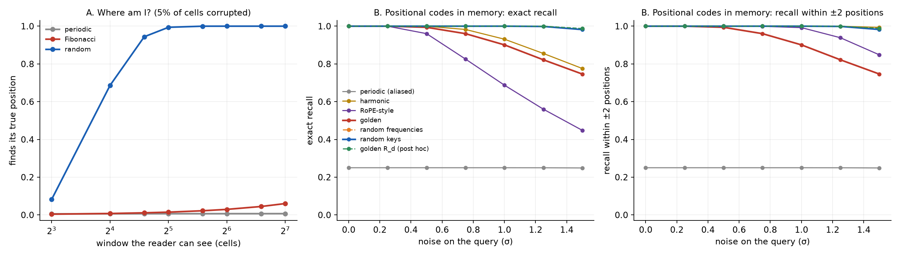

# Address codes under corruption

**Do quasiperiodic addresses resist corruption better than periodic or random ones?** Two small
tests of the horizon note's memory claims ([`../../HORIZON_NOTE_machines_that_remember.md`](../../HORIZON_NOTE_machines_that_remember.md)),
each with boring baselines. Predictions were committed before any code existed:
[`PREREGISTRATION.md`](PREREGISTRATION.md) (commit `5368c0f`).



## Scorecard against the pre-registration

| | prediction | outcome |
|---|---|---|
| A1 | only a random track self-locates with short windows | **held**: shortest unique window is 22 cells (random), 1062 (Fibonacci), 2036 = N−12 (periodic; "never" in the pre-registration, strictly "only trivially") |
| A2 | 5% corruption, 64-cell window: random > 90%, Fibonacci < 5% | **held**: 100% vs 2.9% |
| B0 | sanity row | **held** (after a float fix: see below) |
| B1 | random keys are the most accurate | **failed**, narrowly: random *frequencies* edge them at the highest noise |
| B2 | sinusoidal codes miss *near* the target | **failed** for golden and random frequencies. Only the low-frequency codes (harmonic, RoPE-style) miss near the target. |
| B3 | RoPE-style is the worst non-aliased sinusoidal code | **held** |
| B4 | golden ≈ random frequencies (predicted null) | **failed, against us**: golden is up to 48 points *worse* |
| B5 | both corruptions rank the codes alike | **failed**: stored-key corruption hits the low-frequency codes much harder |

## What was learned

1. **A quasicrystal is a bad street address.** Looking around locally tells you *what kind* of
   place you are in, never *which* place. Fibonacci has only `w+1` different windows of length
   `w`, so every local view recurs. That is exactly why aperiodic tilings are good error-correcting
   codes (Li–Boyle: a patch reveals nothing about where it is), and exactly why they cannot locate
   themselves. It is the same property seen from two sides. The horizon note's "self-addressing
   memory fabric" idea does not survive in its naive form.
2. **A single golden phase is a 1-D hidden address, and its mistakes are perp-space
   neighbours.** The pre-registered golden code uses frequencies `2π·frac(k/φ)`. These are all
   multiples of one irrational, so each key encodes one number: the perpendicular-space
   coordinate `frac(i/φ)`. When noise makes it miss, it misses by **144, 233 or 89 positions**,
   always a Fibonacci number (checked: every miss). Those are the positions that sit next to the
   true one in the hidden space. Cut-and-project geometry made visible inside a memory.
3. **Order without repetition helps, a little (post hoc, needs its own pre-registration).**
   Spreading 32 incommensurate frequencies evenly (Roberts' generalised golden ratio `R_d`, a
   quasiperiodic code with a 32-dimensional hidden space) beats random frequencies and random keys
   at high noise, by about 1–2 points (3–5 standard errors), most under silent stored-key
   corruption. Stratified random recovers part of that edge. The same even spread *without*
   irrationality, a crystal, collapses to 43–49%, because it repeats. Even is good, repeating is
   fatal, and the best code is both even and non-repeating. One fixed `R_d` code was tested, so
   this could be that code's luck: it is a lead, not a result.
4. **The transformer point.** RoPE-style frequencies (base 10000) waste most channels at this
   length: they barely rotate. It is the least accurate non-aliased code, although it misses
   *near* the target. Real models use far longer contexts, where this trade-off differs. We make no
   claim about real models.

## Honest notes

- **B0 fix.** The aliased periodic keys are mathematically identical but differed by ~10⁻¹⁵ in
  floating point, which broke the ties at random (33% instead of 25%). Keys are now rounded to 12
  decimals. No other result changed.
- **Hard-attention retrieval** (argmax), `N = 256`, `d = 64`, 20 seeds (60 in the post-hoc
  section). A toy memory, not a trained model.
- **The post-hoc section** (the `R_d` code, stratified random, crystal) was added after seeing
  the golden failure. It is labelled as post hoc in the code and in the report.

## Reproduce

```bash
python3 address_codes.py   # ~15 s; results/address_codes_report.txt, figures/address_codes.png
```
