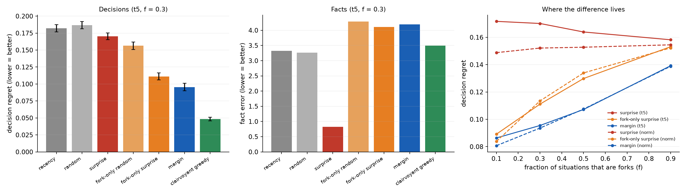
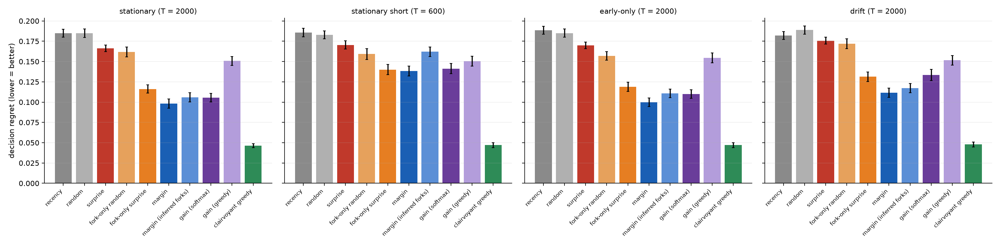

# Surprise versus consequence: what should a learning memory keep? (Part A)

A memory with room for only 5% of what it sees has to choose what to keep. Some designs keep what
is **surprising**. The alternative tested here keeps what can **change a decision**, a heuristic
inspired by the transmission paper's fork law (inspiration, not consequence). Pre-registered
([`PREREGISTRATION.md`](PREREGISTRATION.md)): drafted, revised after Astra's review, and frozen
with Katie's approval at commit `e110a11` before any code existed. One interpretation was logged
before the first run.



## Scorecard (primary condition: `t5`, `f = 0.3`; 100 paired worlds; paired bootstrap)

| | prediction | result | |
|---|---|---|---|
| **P1** *(decisive)* | margin beats **fork-only surprise** by ≥ 10% | **+14.1%** (CI +10.4% to +17.7%) | **held**, and the CI's lower end also clears 10% |
| P2a | fork-only random beats surprise by ≥ 20% | +8.1% (CI +4.4% to +11.5%) | **failed**: better, but not by 20% |
| P2b | fork-only surprise beats surprise by ≥ 20% | +34.7% | held |
| P3 | margin beats surprise by ≥ 20% | **+43.9%** | held |
| P4 | surprise has lower **fact** error than margin | 0.82 vs 4.19 | held |
| P5 | margin's edge shrinks as forks become common, and is smaller with matched tails | t5: 50 → 44 → 35 → 12%; norm: 46 → 39 → 30 → 10% | held |
| P6 | margin beats random by ≥ 10% | +48.8% | held |
| P7 | recency ≈ random (stationary stream: no cliff test) | +2.4% | held |

**7 of 8 held.** The decisive one, P1, held. That means outcome **(i)**: the decision-margin
score adds real value **beyond** the relevance filter.

## What it means

- **Keeping what can change a decision beats keeping what is surprising**, by 44% less regret in
  the primary condition. It also beats the fairer control that is told where the forks are, by
  14%. It is not just "don't waste room on forced situations".
- **The gain comes in layers** *(exploratory reading of the primary condition, not
  pre-registered)*. Regret goes from 0.170 (surprise) to:
  - 0.156 with the relevance filter alone;
  - 0.111 with the filter plus surprise inside forks;
  - 0.096 with the margin score;
  - 0.048 for the clairvoyant comparator, which shows how much room is left.

  All three ingredients contribute, and P2a failing shows that the filter alone is the smallest.
- **With almost everything a fork (`f = 0.9`), the filter is useless**, but margin still beats
  fork-only surprise: 0.139 against 0.153, about 9%. That is the margin effect on its own.
  *(Exploratory.)*
- **Facts and decisions come apart** (P4). Plain surprise knows the most facts (fact error 0.82,
  the lowest of all), and makes worse decisions than the margin rule. A memory can be well
  informed and still choose badly: strongly marked but no fork to hold it, the (22,26) story in a
  different setting.
- **Outcome (iii) did not occur for surprise.** Its selective retention did not wreck its
  estimates: its fact error is far *below* random's (0.82 against 3.27). The rules that store
  only forks have the worst fact error, by design.
- **Recency ≈ random**, as expected for a stationary stream. The context-window cliff needs its
  own experiment (parked).

## Prior art: found after the run, and important

The core idea, prioritising memories by how much they would improve **decisions** rather than by
surprise, is **not new**:

- **Mattar & Daw (2018)**, *Prioritized memory access explains planning and hippocampal replay*
  (Nature Neuroscience). A normative theory in which the brain replays memories by
  **gain × need**. *Gain* is how much better the resulting choices would be, which is close kin to
  our margin score. That work is about which memory to *replay*, not which to *keep* under a
  capacity limit, but it is the paper this work must cite first.
- **Value of experience / expected value of backup.** The RL literature on prioritized replay
  defines the ideal priority as the increase in reward from an update, with TD error (surprise)
  as a proxy for it.
- **Selective experience replay**, which chooses what a limited buffer keeps (by surprise,
  reward, coverage and so on), is an active line of work. Surprise-driven retention is current
  in LLM continual learning (for example SuRe, 2025), and in Titans-style memory.

**What is (modestly) ours:** a pre-registered, controlled comparison **for retention under a
capacity limit**. It includes controls that separate relevance filtering from decision-margin
weighting (P1), and it shows the fact-versus-decision dissociation (P4). The result supports the
Mattar–Daw view in a setting (what to *keep*) where surprise-based rules are currently popular.
The next honest step is to compare our margin heuristic with a principled Mattar–Daw-style
**gain** score.

## Honest limits

- A **designed toy world**, in which surprise and consequence were built to be able to come
  apart. The results show *how large* the gap is and that an online, belief-based score captures
  it. They do not show how often real data looks like this.
- The margin rule is **told** which situations are forks, and uses the agent's own estimator.
  Real systems have to estimate both.
- The **surprise comparator** is only *inspired by* Titans and prioritized replay; it implements
  neither.
- The **clairvoyant comparator** was best everywhere, but it is not a proven bound.
- Parked for their own pre-registrations: **Part B** (a fast-weight memory), **sleep** (replay and
  consolidation), and a **cliff test** (a non-stationary stream).

## Reproduce

```bash
python3 svc.py   # ~2.5 min on 4 cores; results/svc_report.txt, results/svc_raw.json, figures/svc.png
```

---

# Round 2: the principled rival, inferred forks, and the cliff

Pre-registered in [`PREREGISTRATION_ROUND2.md`](PREREGISTRATION_ROUND2.md), frozen at `f45fa98`
before any round-2 code existed. Katie approved going ahead in advance, and the design was
self-reviewed against Astra's round-1 checklist. Fresh seeds throughout. Code: `svc2.py`.



| | prediction | result | |
|---|---|---|---|
| R1a | replication: margin beats surprise by ≥ 20% | **+41.0%** | held |
| R1b | replication: margin beats fork-only surprise by ≥ 10% | **+15.5%** (CI +11.3% to +19.4%) | held |
| R2 | margin and the Mattar–Daw-style **gain** (softmax, β = 5) within ±10% | gain's regret is 7.3% higher | held |
| R3a | margin with **inferred** forks within 5% of margin (T = 2000) | 7.9% worse | **failed** |
| R3b | inferred-fork margin beats surprise by ≥ 10% on a short stream (T = 600) | +4.9% | **failed** |
| R4a | the **cliff**: recency worst, and ≥ 30% worse than random | worst, but only 1.9% worse (and the paired CI includes zero) | **failed** |
| R4b | margin beats surprise by ≥ 20% (early-only stream) | +41.4% | held |
| R5a | changing world: recency beats random | +3.6% (CI excludes 0) | held |
| R5b | changing world: margin beats surprise by ≥ 10% | +36.4% | held |
| R6 | surprise knows the most facts; margin decides better | yes | held |

**7 of 10 held.**

## What round 2 adds

- **The round-1 result replicates** on fresh seeds: 41% against surprise and 15.5% beyond the
  relevance filter.
- **The quick heuristic holds its own against the principled rival.** A Mattar–Daw-style gain
  score (β = 5, untuned) met the pre-registered ±10% test on its point estimate: gain's regret is
  7.3% higher (CI 2.7% to 12.0% higher). That is not a formal proof of equivalence. *Reported
  without prediction:* margin was better in every stream (+2% to +16%, all CIs above zero). The
  greedy version of gain does badly: it only values an item if it flips a choice outright, so
  almost everything ties. One untuned temperature, so this is no verdict on gain in general.
- **Having to discover the forks costs real performance** (R3 failed both ways). Part of it is
  plain **discovery failure**, which Astra measured and I confirmed: 1.45% of true forks are
  never recognised at `T = 2000`, but **39%** at `T = 600`. A second, proposed mechanism, not yet
  separated from the first (see round 2b): until a situation is recognised as a fork, its observations score
  lowest and are evicted, so the evidence is gone by the time it would have mattered. It hurts
  most on short streams. *You throw things away before you know they matter.* This is the
  realistic weakness of the approach, and the obvious next thing to fix.
- **We predicted a big context-window cliff. It didn't show up** (R4a failed): recency is 1.9%
  worse than random, and the paired CI includes zero. Recency *does* lose every early-only
  observation, but that did not turn into a measurable regret penalty at this memory size. *Exploratory, after seeing the
  result* (`early-only`, 40 seeds): recency is 0%, 4% and 10% worse than random at memory sizes
  of 5%, 20% and 40% of the stream. When memory is tiny, every rule has already forgotten most of
  the early material, so there is little cliff to fall off. My 30% prediction misjudged this.
- **Memory accounting:** the inferred rules use 100 reward-observation slots **plus** a
  persistent table of which actions have ever been seen. The discovery history is never
  forgotten.
- **In a changing world**, keeping the latest helps a little (+3.6%), but margin still wins by a
  wide margin (+36%), even with no mechanism for forgetting stale beliefs.

---

# Round 2b: *not finding* a fork versus *throwing away the evidence* too soon

Pre-registered in [`PREREGISTRATION_ROUND2B.md`](PREREGISTRATION_ROUND2B.md), frozen at `5fe1b74`
before any code. It follows Astra's review of round 2. The worlds are the same as round 2, and
the re-run round-2 rules reproduce the saved results exactly, so every comparison is paired.
Code: `svc2b.py`.

| | prediction | result | |
|---|---|---|---|
| B1a | with the **same** discovery problem, margin beats surprise by ≥ 10% (T = 2000) | **+10.5%** (CI +6.4% to +14.6%) | held |
| B1b | the same on the short stream (T = 600): margin better | −0.5% (CI −1.8% to +0.8%) | **failed**: no difference |
| B2a | at T = 2000, premature eviction costs more than discovery failure | **0.0077 vs 0.0001** | held |
| B2b | at T = 600, discovery failure costs more than premature eviction | 0.0107 vs **0.0132** | **failed** |
| B3 | an allowance for unresolved situations helps at T = 600 | −1.0% (CI includes 0) | **failed** |

**2 of 5 held.**

## What round 2b shows

- **The margin weighting survives having to discover the forks**, on the long stream: +10.5%
  over surprise facing the identical discovery problem. On the short stream, where 39% of forks
  are never found, the advantage disappears.
- **The main cost of learning what matters is throwing evidence away before you know it
  matters.** Regret added on top of the fully informed margin rule:

  | stream | (D) forks never discovered | (E) evidence evicted before discovery |
  |---|---|---|
  | T = 2000 | +0.0001 | **+0.0077**: essentially the whole loss |
  | T = 600 | +0.0107 | **+0.0132**: still the larger part |

  My guessed mechanism is now measured, and it is the bigger effect in both streams. I predicted
  discovery failure would dominate on the short stream; it didn't.
- **Simply refusing to throw away "unknown" things doesn't fix it.** Treating every unresolved
  situation as a possible fork does nothing on the short stream and is **50% worse** on the long
  one: forced situations are also "unknown" for ever, and they flood the memory.
- **So the problem is timing.** Evidence needs somewhere to wait until its relevance can be
  judged. That points straight at a **short-term holding buffer**, keeping things briefly before
  deciding: the fast store of Complementary Learning Systems. It is the natural design for the
  next paper, together with sleep and replay.

---

# Exploratory: Katie's puzzle questions (not pre-registered)

*Prompted by Katie ("could the cheater's secret be the wisdom of crowds?", and "could the short
stream be a self-reinforcing bias?"). Code: `diag_puzzles.py`; output:
`results/diag_puzzles.txt`. Round-2 worlds, 40 seeds. Descriptive only.*

| stream T = 2000 | noise in kept fork memories, `|r − μ|` | forks decided right | estimated margin when wrong / when right |
|---|---|---|---|
| fork-only surprise | 1.59 | 53% | 0.36 / 0.82 |
| margin | 1.43 | 65% | **0.91** / 1.13 |
| clairvoyant | **0.78** | 76% | 0.00 / 0.61 |

- **Wisdom of crowds: supported.** The clairvoyant keeps memories whose noise is *typical*
  (0.78; the average size of one unit of Gaussian noise is 0.80). It keeps a representative crowd.
  Margin and surprise keep memories with nearly **twice** the typical noise: the loud, extreme
  ones. Rules that reward "moves my estimate a lot" select for unreliable evidence.
- **Lock-in: present, but not specific to short streams.** When margin decides a fork wrongly, it
  is usually *confident* (estimated margin 0.91 on the long stream): extreme evidence made the
  wrong answer look settled, so the situation stops counting as a close call and stops attracting
  correction. The clairvoyant is only wrong where it has no evidence at all (margin 0). The same
  pattern is weaker on the short stream (0.50 against 0.75).
- **A testable consequence for a future pre-registered round:** a *crowd-aware* margin rule, one
  that prefers decision-relevant memories of *typical* size to extreme ones, should close part of
  the gap to the clairvoyant.
