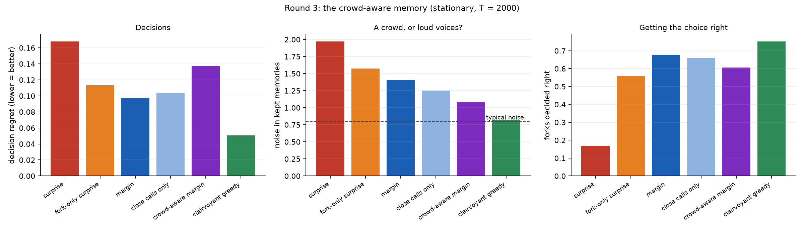

# What should a memory keep? Consequence beats surprise, and a crowd needs an independent judge

**K. T. Niedzwiecki** 
Independent Researcher, South Australia 
26 September 2026

---

## Abstract

A memory that cannot keep everything must choose what to keep. Several recent designs for
learning memories keep what is **surprising**: observations with a large prediction error. We
test an alternative: keep what can still **change a decision**. We use a controlled toy world with
a capacity-limited memory (5% of the stream). Every prediction was pre-registered and frozen
before the code that tested it existed, across four rounds, two of them revised after external
review.

- **Consequence beats surprise.** A decision-margin rule has **44% lower decision regret** than a
  surprise rule. It beats a surprise rule *told the same relevance information* by **14%**
  (95% CI 10–18%), so the gain is not merely a relevance filter. Both results replicate on fresh
  worlds (41%, 15.5%).
- **Facts and decisions come apart.** The surprise rule remembers the most facts and makes worse
  decisions.
- **A principled rival.** The quick rule met a pre-registered ±10% test against a principled gain
  score in the style of Mattar & Daw (2018).
- **Learning what matters.** When the memory must discover for itself which situations offer a
  choice, the dominant cost is **premature eviction**: evidence discarded before its relevance is
  knowable.
- **The ideal memory's secret.** A clairvoyant comparator keeps a **representative crowd** of
  memories, with typical rather than extreme noise.
- **The echo chamber.** A pre-registered attempt to imitate that failed: the crowd-aware rule was
  **42% worse**. Judged against the truth, the same rule nearly matches the clairvoyant.
  Judged against the agent's own beliefs, it becomes an **echo chamber**: where it chooses wrongly,
  87% of its kept memories support the wrong choice.

The result is a practical lesson and an open question. What a memory should keep is set by what
can still change its decisions, and a crowd of memories is wise only if its judge is independent.

---

## 1. Introduction

Every learning system with finite memory faces the same question: *what should stay?* Brains face
it continually. Machine-learning systems face it in replay buffers, in continual learning, and
increasingly in the long-term memory of language models. One recent design, Titans (Behrouz et
al., 2025), updates a neural memory in proportion to **surprise**. Surprise-driven retention has
also been proposed for continual learning of language models (SuRe, 2025). Surprise is attractive:
it is cheap, local, and resembles the way surprising events are remembered well.

Surprise measures how *unexpected* an observation is, not how much it *matters*. A startling fact
about a situation in which there is nothing to decide changes nothing downstream. A quiet fact
about a close call can change everything. This distinction has a long history in decision theory
as the value of information (Howard, 1966). In neuroscience, Mattar & Daw (2018) proposed that the
hippocampus prioritises which memories to **replay** by their *gain*: how much they would improve
future choices. In reinforcement learning, the ideal priority of a stored experience is its value
for improving the policy, and the TD error (surprise) is a proxy for it.

This study asks the retention version of that question in the most controlled setting we could
build. When space is tight, should a memory **keep** what is surprising or what can change a
decision? By how much does it matter, and why? The work began from an intuition in earlier work by
the author on how differences survive in growing structures: a difference lasts only where the
future can still split (the "fork law"). This is inspiration, not derivation. The forks here are
simply situations with more than one available action.

A note on method. Every prediction was written down and committed to a public repository *before*
the code that tests it existed. Two rounds of design review by an independent AI reviewer led to
revisions before freezing. Failed predictions are reported with the same prominence as successful
ones: 17 of 28 held.

## 2. The setting

**World.** There are `S = 200` situations. Each is **forced** (one action) with probability `1 − f`,
or a **fork** (two actions) with probability `f`, with `f = 0.3` unless stated.
- Forced values are heavy-tailed: `μ ~ 2·t₅`. They are often startling, and truly irrelevant to any
  decision.
- Fork values are close calls: `μ₁ ~ N(0, 1)`, `μ₂ = μ₁ + δ`, `δ ~ N(0, 0.5²)`.

**Stream.** `T = 2000` observations. Each is a uniformly drawn situation, a uniformly drawn available
action, and a reward `r = μ + ε`, `ε ~ N(0, 1)`.

**Agent.** Beliefs come only from memory: `Q = Σr / (n + 1)` for each situation and action (a
normal–normal posterior mean, prior `N(0, 1)`).

**Memory.** Capacity `K = 100` observations (5% of the stream). Once full, the `K` stored items and
the newcomer form a pool. Each item is scored **leave-one-out**, using beliefs from the pool without
it. The lowest score is evicted, and ties are broken at random.

**Measures.**
- **Decision regret:** the mean over forks of the value lost by choosing with the agent's beliefs.
- **Fact error:** the mean squared error of all beliefs.
- All comparisons are **paired**: every rule sees the same worlds and streams. Uncertainty comes
  from a paired bootstrap over worlds (100 per condition, 10,000 resamples). "Improves by ≥ X%"
  means the point estimate is at least X% *and* the paired-difference 95% CI excludes zero.

**Rules.** Every rule gets the same budget. The scores use the leave-one-out residual
`z = |r − Q_a|` and the fork margin `m = |Q₁ − Q₂|`.

| rule | keeps |
|---|---|
| recency | the latest `K` (a context window) |
| random | a uniform reservoir sample |
| **surprise** | the largest `z` *(inspired by Titans and prioritized replay; an implementation of neither)* |
| fork-only random / fork-only **surprise** | as random / surprise, but forced situations are never kept. These are *relevance-filter controls*. |
| **margin** | forks only, scored `(z / (n_a + 2)) / (m + 0.1)`: how far the memory moves its action's estimate, relative to how close the call is. It is "decision-sensitive surprise". |
| gain (softmax, β = 5) | a Mattar–Daw-style gain: the improvement in the agent's own softmax policy value from keeping the memory |
| clairvoyant greedy | evicts the memory whose removal least increases the *true* regret. It is a comparator that sees the truth, not a proven bound. |

## 3. Procedure

| round | question | pre-registration frozen at | review |
|---|---|---|---|
| 1 | consequence vs surprise, with relevance-filter controls | `e110a11` | revised after Astra's design review |
| 2 | replication; the principled gain rival; inferred forks; the cliff; drift | `f45fa98` | self-review against the round-1 checklist |
| 2b | discovery failure vs premature eviction | `5fe1b74` | follows Astra's review of the round-2 results |
| 3 | a crowd-aware memory | `5d83910` | follows an exploratory diagnostic (§4.4) |

## 4. Results

### 4.1 Consequence beats surprise, beyond relevance filtering (round 1)

**Figure 1.** Round 1, primary condition (`t5`, `f = 0.3`). *Left:* decision regret. *Middle:*
fact error. *Right:* regret against the fraction of situations that are forks, for heavy-tailed
(`t5`) and matched-normal forced values.

- **Margin has 44% lower regret than surprise** (0.096 vs 0.170; 95% CI 41–47%).
- **Margin has 14% lower regret than fork-only surprise** (95% CI 10–18%). This control is told the
  same relevance information, so the decision-margin score adds value **beyond** discarding
  irrelevant situations.
- **Relevance filtering alone** (fork-only random) improves on surprise by only 8% (CI 4–12%), below
  the pre-registered 20%. The gain comes in layers: the relevance filter (smallest), surprise
  within forks, then margin weighting.
- **Facts and decisions come apart.** Surprise has by far the lowest fact error (0.82, against 4.19
  for margin and 3.27 for random), yet it makes worse decisions. It knows more and chooses worse.
- **Where the advantage lives.** Margin's advantage over surprise shrinks as forks become common
  (`t5`: 50% → 44% → 35% → 12% for `f` = 0.1 → 0.9), and is smaller when forced values are not
  heavy-tailed. Where every situation is a fork, the relevance filter is worthless, yet margin still
  beats fork-only surprise by about 9%.

Round 1: 7 of 8 predictions held.

### 4.2 Replication, a principled rival, and harder conditions (round 2)

**Figure 2.** Round 2 on fresh worlds. Regret for every rule in four streams.

- **Replication.** Margin beats surprise by 41.0% and fork-only surprise by 15.5%
  (CI 11.3–19.4%).
- **The principled rival.** The Mattar–Daw-style gain score met the pre-registered ±10% test on its
  point estimate: its regret is 7.3% higher than margin's (CI 2.7–12.0% higher). This is not a
  demonstration of equivalence. Margin was lower in all four streams. A greedy version of gain,
  which values a memory only if it flips a choice, performs poorly.
- **Inferred forks.** A margin rule that must discover for itself which situations are forks is
  7.9% worse than the informed rule at `T = 2000` (the pre-registered tolerance was 5%). On a short
  stream (`T = 600`) it beats surprise by only 4.9% (the prediction was ≥ 10%).
- **The context-window cliff.** In a stream where half the situations appear only early, recency
  was the worst rule but only 1.9% worse than random, and the paired CI includes zero. The
  pre-registered large penalty (≥ 30%) was not detected. An exploratory check shows the recency
  penalty growing with memory size (0%, 4% and 10% at memory sizes of 5%, 20% and 40% of the
  stream). A tiny memory has forgotten most early material under every rule.
- **A changing world.** When the better action changes halfway through, recency beats random
  slightly (+3.6%, CI excludes zero), and margin still beats surprise by 36%.

Round 2: 7 of 10 predictions held.

### 4.3 The cost of learning what matters is premature eviction (round 2b)

A fork can be recognised only once both of its actions have been seen. The inferred rule's
shortfall mixes two problems:
- **(D)** forks never discovered: 1.45% of forks at `T = 2000`, **39%** at `T = 600`;
- **(E)** evidence evicted before discovery.

An "eventual-discovery oracle", which knows from the start which forks *will* be discovered,
separates them. The added regret, on paired worlds:

| stream | (D) never discovered | (E) evicted before discovery |
|---|---|---|
| `T = 2000` | +0.0001 | **+0.0077** |
| `T = 600` | +0.0107 | **+0.0132** |

- **Premature eviction is the larger cost in both streams.** The main price of learning relevance
  is discarding evidence before its relevance can be known.
- **The margin weighting survives the discovery problem** on the long stream: it beats surprise
  facing identical discovery by 10.5% (CI 6.4–14.6%). It does not on the short stream (−0.5%).
- **Keeping all unresolved situations does not fix it.** Treating every unresolved situation as a
  possible fork does not help on the short stream and is 50% worse on the long one: forced
  situations stay unresolved for ever and flood the memory.

Round 2b: 2 of 5 predictions held.

### 4.4 The ideal memory keeps a representative crowd (exploratory)

What does the clairvoyant comparator, with half of margin's regret, know? Following a question
from the author, whether its secret resembles the *wisdom of crowds*, we measured the noise
`|r − μ|` in each rule's kept fork memories (round-2 worlds, 40 seeds):

| | noise in kept memories | forks decided right | estimated margin when wrong |
|---|---|---|---|
| fork-only surprise | 1.59 | 53% | 0.36 |
| margin | 1.43 | 65% | 0.91 |
| clairvoyant | **0.78** | 76% | 0.00 |

- The clairvoyant keeps memories with **typical** noise: 0.78, against 0.80 for one unit of
  Gaussian noise. It keeps a representative crowd.
- Margin and surprise keep memories with nearly twice the typical noise. Rules that reward
  "moves my estimate a lot" select for unreliable evidence.
- Margin's wrong decisions are *confident* (estimated margin 0.91). Extreme evidence makes the
  wrong answer look settled, so the situation stops attracting correction.

### 4.5 A crowd judged by its own beliefs becomes an echo chamber (round 3)

**Figure 3.** Round 3 on fresh worlds. *Left:* regret. *Middle:* noise in kept memories; the dashed
line is typical noise. *Right:* forks decided right.

The pre-registered **crowd-aware margin** rule keeps margin's relevance, but replaces the residual
`z` with `z·exp(−z²/2v)`. That term peaks at *typical* size under the agent's own predictive
variance `v`.

- It kept less noisy memories, as predicted (1.08 vs 1.41).
- It made decisions **42% worse** (4 of the 5 predictions failed).

An exploratory twin identifies the cause. The same rule, judging typicality against the **truth**,
nearly matches the clairvoyant:

| | regret | in wrongly decided forks, share of kept memories supporting the wrong choice |
|---|---|---|
| crowd vs own belief | 0.137 | **87%** |
| crowd vs truth *(cheating)* | **0.058** | 71% |
| clairvoyant | 0.051 | — |

- **The representative crowd is nearly the whole secret of the ideal memory.**
- **Judged against the agent's own beliefs, it becomes an echo chamber.** When a belief is wrong,
  the memories that look typical are the ones that agree with it, and the dissenting memories that
  would correct it are discarded.

Round 3: 1 of 5 predictions held.

## 5. Discussion

**What is established here, and what is not.**
- The central idea, prioritising memory by consequence for decisions, is **not new**. It is the
  value of information, and in the brain it is Mattar & Daw's gain.
- What this study adds is a pre-registered, controlled demonstration **for retention under a
  capacity limit**, a setting where surprise-based rules are currently popular. It includes:
  - controls that separate relevance filtering from decision-margin weighting;
  - a measured split between factual accuracy and decision quality;
  - a decomposition showing that the cost of *learning* relevance is mostly premature eviction;
  - the finding that the ideal memory's advantage is largely representativeness, which cannot be
    obtained naively from the agent's own beliefs.

**Implications for learning memories.**
1. A memory built to keep what is surprising can be well informed and still choose badly.
2. Evidence needs somewhere to **wait** until its relevance can be judged. That points to a
   short-term holding buffer ahead of a selective long-term store, in the spirit of Complementary
   Learning Systems (McClelland, McNaughton & O'Reilly, 1995).
3. A memory that judges what is "typical" against its own beliefs will entrench its errors.

The last point is not special to machines. Confirmation bias and group echo chambers have the same
structure: a crowd whose only judge of "normal" is itself.

**The open question: where can a memory find an independent judge?** Candidates include:
- a separate sample of memories never used for the decision itself (in the spirit of
  cross-validation);
- a slower, older estimate;
- two memory systems that check each other, as the fast hippocampal and slow cortical systems
  might.

We think this is the most important question the study raises.

**Limitations.**
- This is a designed toy world, in which surprise and consequence were built to be able to come
  apart. The results show *how large* the difference can be and how the mechanisms behave, not how
  often real data looks like this.
- Most rules were told which situations offer a choice. Section 4.3 measures the cost of removing
  that knowledge.
- The gain rival used one untuned temperature.
- The surprise comparator implements neither Titans nor prioritized replay.
- The clairvoyant comparator is not a proven bound.
- Sections 4.4 and the echo-chamber twin are exploratory, and are labelled as such.

## 6. All pre-registered predictions

| round | held | failed |
|---|---|---|
| 1 | P1 (margin > fork-only surprise ≥ 10%), P2b, P3, P4, P5, P6, P7 | P2a (relevance filter alone ≥ 20%) |
| 2 | R1a, R1b, R2 (gain within ±10%, point estimate), R4b, R5a, R5b, R6 | R3a, R3b (inferred forks), R4a (cliff ≥ 30%) |
| 2b | B1a, B2a | B1b, B2b, B3 |
| 3 | C2 (less noisy memories) | C1, C3, C4, C5 |

**17 of 28 held.** The full pre-registrations, with the commits at which each was frozen and the
logged pre-run changes, are in the repository.

## Reproducibility

Everything is in `github.com/kekekatie/geometric-impedance`, under
`exploratory/surprise_vs_consequence/`. The scripts are self-contained NumPy and run in minutes on
a laptop.

| result | script | pre-registration |
|---|---|---|
| round 1 | `svc.py` | `PREREGISTRATION.md` |
| round 2 | `svc2.py` | `PREREGISTRATION_ROUND2.md` |
| round 2b | `svc2b.py` | `PREREGISTRATION_ROUND2B.md` |
| §4.4 diagnostics | `diag_puzzles.py` | exploratory |
| round 3 | `svc3.py` | `PREREGISTRATION_ROUND3.md` |
| echo-chamber twin | `diag_echo.py` | exploratory |

## Acknowledgements **[draft for Katie to confirm or rewrite]**

The study was designed, coded, analysed and drafted by Claude (Anthropic) in conversation with the
author. The wisdom-of-crowds hypothesis (§4.4–4.5) was the author's. Astra reviewed the round-1
pre-registration and the round-2 results; that review led to the relevance-filter controls, the
common leave-one-out scoring, the discovery decomposition (§4.3), and several corrections.

## References

- Behrouz, A., Zhong, P., & Mirrokni, V. (2025). *Titans: Learning to memorize at test time.*
  arXiv:2501.00663.
- Howard, R. A. (1966). Information value theory. *IEEE Transactions on Systems Science and
  Cybernetics*, 2(1), 22–26.
- Mattar, M. G., & Daw, N. D. (2018). Prioritized memory access explains planning and hippocampal
  replay. *Nature Neuroscience*, 21, 1609–1617.
- McClelland, J. L., McNaughton, B. L., & O'Reilly, R. C. (1995). Why there are complementary
  learning systems in the hippocampus and neocortex. *Psychological Review*, 102(3), 419–457.
- Schaul, T., Quan, J., Antonoglou, I., & Silver, D. (2016). Prioritized experience replay.
  *ICLR 2016.*
- SuRe: Surprise-driven prioritised replay for continual LLM learning (2025). arXiv:2511.22367.
- Niedzwiecki, K. T. (2026). *When the past matters, II: The fate of an expressed difference.*
  Zenodo.
